# Lesson1 
## Android Min and Target Versions

Android 1.0 launched in 2008, and in just the 8 years since - there have been 13 new major platform releases. By convention, each release is named off of a sugary treat, and the releases are named alphabetically.

On the [Android Developer site](https://developer.android.com/about/dashboards/index.html#Platform), we show the relative percentage of active Android devices running a given platform version, also presented in this cool pie chart. Because pie charts are awesome.

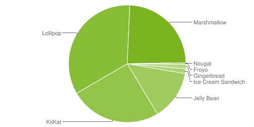

For our purposes though, you're really better off looking at it as a histogram.

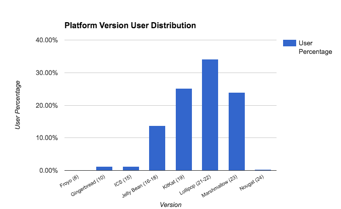

If you squint, you can almost see a vaguely bell shaped curve, with the oldest releases on the left, their popularity dropping off as devices are upgraded or replaced. The largest proportion of devices are in the middle, representing devices about 2 years old. The newest platforms, which gain in popularity as new phones are released or updates go out, are on the right.

### Setting minSDK

The minSDK is the lowest SDK level that your app can run on. You can choose what level of devices to support. Setting the minSDK acts as a filter -- Google Play won’t show your app on devices running an Android platform version lower than your minimum SDK version.

So why not just set the minSDK to 1 and support everyone? Generally, you’ll want to target as many users as you can, but there's a cost associated with supporting older versions - things like creating different execution paths around deprecated or updated APIs, or presenting a different UX to devices with different features. You need to balance the opportunity of expanding your audience, with the cost of supporting those users.

Also remember that each release introduced new APIs and hardware support, so it may not make sense to make your app available to devices that don’t support your minimum feature set. Here are some examples of hardware support and features, tied to releases.

- Home screen widgets (Cupcake)
- Multiple finger tracking (Froyo)
- Tablet (Honeycomb)
- Android Beam (Jellybean)
- Android TV, Auto, Wear (Lollipop)
- Pro Audio (Marshmallow)

### Setting targetSDK

By comparison, the targetSDK is NOT a high pass filter -- it’s used only to declare which platform version you've tested your app on. An app targeted to a certain API or Android version will continue to be forward compatible on future releases -- the platform uses the target SDK values in case a future release makes a significant change to expected behavior, ensuring your app doesn’t break when a user’s phone gets upgraded. `

Android Studio by-default targets the latest release. If you’re developing a new app, there’s really no reason to target anything but the latest Android version, and once your app has been released, make it a point to update your target SDK and test as soon as possible when new platform releases roll out, so your app can take advantage of every new platform optimization and improvement.

## Advanced Build Options
### Gradle in Android Studio

Gradle is the build system of choice for Android Studio. Because of that, there's various functionality available within the platform. When you make a project, there are a few gradle build scripts automatically generated for you, shown below:

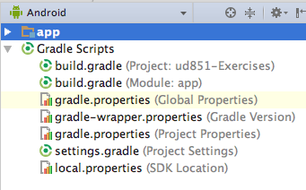

When you press the green **Run** button, if the project has changed, the build scripts will run.

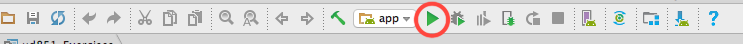

To explicitly run the build scripts, you can press the **Make Project** button:

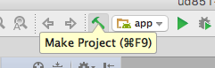

To observe logs and build errors for gradle, Android Studio includes a **Gradle Console**.

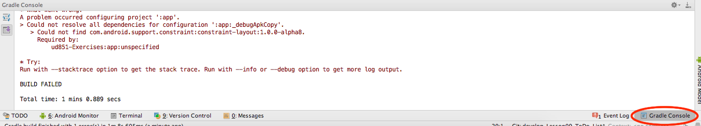

A gradle task represents a single, atomic piece of work for a build. To see a list of tasks, you can open the tasks window in Android Studio by clicking on the gradle button on the far right. Clicking on the name of the task runs that task.

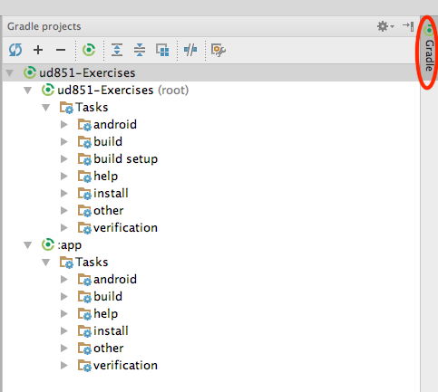

### Gradle from the Command Line

You can also run gradle build tasks from the command line if you prefer. To start, you should navigate to the root of your project folder. From there you can run:

```android
./gradlew tasks
```

This will give you a full list of runnable tasks. You may need to run chmod +x on gradlew before you can run it. See this [link](https://developer.android.com/studio/build/index.html#buildCmd) for more detailed instructions. To learn more, you can check out [Udacity's Gradle course](https://classroom.udacity.com/courses/ud867/lessons/3968239469/concepts/42836685960923).

### Android Debug Bridge

The other tool that Dan mentioned is **adb** which is short for Android Debug Bridge. ADB is a command line utility included with Android's SDK. You do not need to use adb for this course, but if you enjoy using the command line, you can read up on [adb](https://developer.android.com/studio/command-line/adb.html?utm_source=udacity&utm_medium=mooc&utm_term=android&utm_content=adb&utm_campaign=training) and other command line tools.

When you type adb into a terminal, you'll also get a helpful list of everything **adb** can do for you:

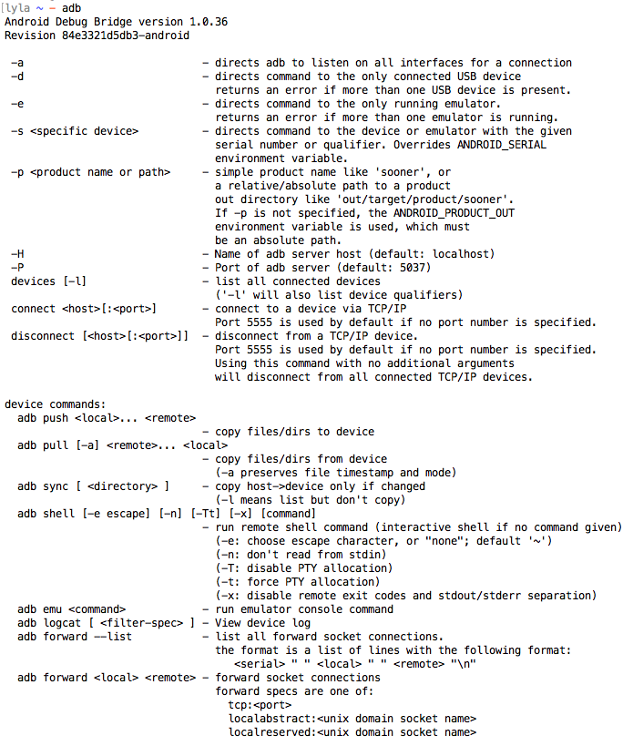

For example, to start your android app from the command line, you could type:

```android
adb shell am start -n com.package.name/com.package.name.ActivityName
```
## Activities, package, layout
App are...
...Collections of connected components

- Activity is responsible for most app user interaction/ responsible for creating the window that your application uses to draw and receuve events from the system
- Service
- Content Provider
- Broadcast Receiver

Registered in **Android Manifest**


## Android Layouts Primer

You've learned about a lot of new terms that have to do with the Android UI. Here is a quick reference of these important concepts and how they work together. If you have never worked with a language like XML or HTML before and feel confused, you should head over to the [Android Basics class on Android Layouts class](https://eu.udacity.com/course/android-development-for-beginners--ud837) and take the first lesson.

### Activities and Layouts

An **activity** is a single focused thing that the user can do. Activities are responsible for creating the window that your application uses to draw and receive events from the system. Activities are written in Java, extending from the Activity class.

An activity creates **views** to show the user information, and to let the user interact with the activity. Views are a class in the Android UI framework. They occupy a rectangular area on the screen and are responsible for drawing and handling events. An activity determines what views to create (and where to put them), by reading an XML layout file. These XML files, as Dan mentioned, are stored in the **res folder** inside the folder labeled **layouts**.

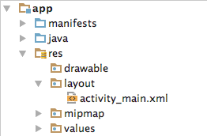

### Layout XML

So what does this XML look like? Here's an example:
```xml
<?xml version="1.0" encoding="utf-8"?>
<LinearLayout xmlns:android="http://schemas.android.com/apk/res/android"
   xmlns:tools="http://schemas.android.com/tools"
   android:layout_width="match_parent"
   android:layout_height="match_parent"
   android:orientation="vertical"
   android:padding="16dp"
   tools:context="com.example.android.exampleapp.MainActivity">

   <EditText
       android:id="@+id/edit_text_name_input"
       android:layout_width="match_parent"
       android:layout_height="wrap_content"
       android:background="@color/colorAccent"
       android:hint="Enter your name"
       android:padding="4dp"
       android:textSize="24sp" />

   <TextView
       android:id="@+id/text_view_name_display"
       android:layout_width="wrap_content"
       android:layout_height="wrap_content"
       android:layout_gravity="center"
       android:layout_marginTop="8dp"
       android:text="Your name appears here"
       android:textSize="30sp" />
</LinearLayout>
```
This looks like the following on a phone screen:

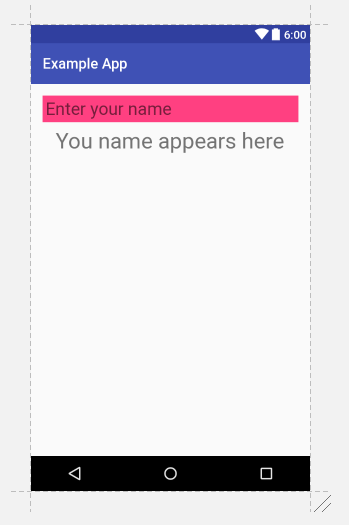

Oops! The subtitle should read "Your name appears here"

### Type of View : UI Components

There are two major categories of views. The first type are UI components that are often interactive. Here are a few examples:

| Class Name  | Description                                                 |
| ----------- | :---------------------------------------------------------: |
| TextView    | Creates text on the screen; generally non interactive text. |
| EditText    | Creates a text input on the screen                          |
| ImageView   | Creates an image on the screen                              |
| Button      | Creates a button on the screen                              |
| Chronometer | Create a simple timer on screen                             |

The [android.widget](https://developer.android.com/reference/android/widget/package-summary.html) package contains a list of most of the UI view classes available to you.

### Type of View : Container View

The second are views called "Layout" or "Container" views. They extend from a class called **ViewGroup.** They are primarily responsible for containing a group of views and determining where they are on screen. What do I mean by "containing a group of views?". I mean that a view will be nested inside the tag of another view, like below:
```xml
<?xml version="1.0" encoding="utf-8"?>
<LinearLayout xmlns:android="http://schemas.android.com/apk/res/android"
   xmlns:tools="http://schemas.android.com/tools"
   android:layout_width="match_parent"
   android:layout_height="match_parent"
   android:orientation="vertical"
   tools:context="com.example.android.exampleapp.MainActivity">
   <TextView
       android:layout_width="wrap_content"
       android:layout_height="wrap_content"
       android:layout_gravity="center"
       android:text="A"
       android:textSize="30sp" />
   <TextView
       android:layout_width="wrap_content"
       android:layout_height="wrap_content"
       android:layout_gravity="center"
       android:text="B"
       android:textSize="30sp" />
   <TextView
       android:layout_width="wrap_content"
       android:layout_height="wrap_content"
       android:layout_gravity="center"
       android:text="C"
       android:textSize="30sp" />
</LinearLayout>
```
This will look like:

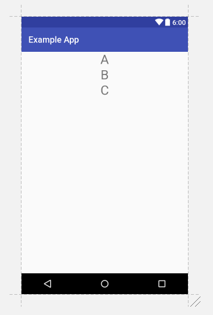

A few examples of common container views are:
| Class Name       | Description                                                                                                                 |
| ---------------- | :-------------------------------------------------------------------------------------------------------------------------: |
| LinearLayout     | Displays views in a single column or row.                                                                                   |
| RelativeLayout   | Displays views positioned relative to each other and this view.                                                             |
| FrameLayout      | A ViewGroup meant to contain a single child view.                                                                           |
| ScrollView       | A FrameLayout that is designed to let the user scroll through the content in the view.                                      |
| ConstraintLayout | This is a newer viewgroup; it positions views in a flexible way. We’ll be exploring constraint layout later in the lesson. |

Note that layout views can be nested in one another, so you can nest a LinearLayout inside of a LinearLayout if you so choose.

### XML Attributes

Views have attributes in XML which control the **properties** of the view. Here’s an example from before:
```xml
<?xml version="1.0" encoding="utf-8"?>
<LinearLayout xmlns:android="http://schemas.android.com/apk/res/android"
   xmlns:tools="http://schemas.android.com/tools"
   android:layout_width="match_parent"
   android:layout_height="match_parent"
   android:orientation="vertical"
   android:padding="16dp"
   tools:context="com.example.android.exampleapp.MainActivity">


   <EditText
       android:id="@+id/edit_text_name_input"
       android:layout_width="match_parent"
       android:layout_height="wrap_content"
       android:background="@color/colorAccent"
       android:hint="Enter your name"
       android:padding="4dp"
       android:textSize="24sp" />


   <TextView
       android:id="@+id/text_view_name_display"
       android:layout_width="wrap_content"
       android:layout_height="wrap_content"
       android:layout_gravity="center"
       android:layout_marginTop="8dp"
       android:text="Your name appears here"
       android:textSize="30sp" />
</LinearLayout>
```
The properties are things like **textSize** and **padding**. Every view has a handful of properties associated with them, which can be found on their documentation pages. These properties can be set to different values. Properties determine the specifics of how a view looks and interacts. Let's look at a few examples of properties you’ll be using shortly.

#### Text

The `android:text` attribute is an example of a very simple property that can be modified with the xml. In the code above, the portion that says

`android:text="Your name appears here"`

makes the TextView show the words:


#### Width and Height

Some of the most important properties are the width property and height property - those must be defined for every view. Remember that all views occupy a rectangular area on the screen - the width and height are the width and height of that area. You can define this in pixels, or better yet dp (stands for density-independent pixels, we’ll talk a lot more about this in later lessons):

```xml
android:layout_width="200dp"
android:layout_height="300dp"
```

For the sake of having a layout be responsive and adjust to different devices, two common values are not numbers at all, but `wrap_content` and `match_parent` used as shown here:

```xml
android:layout_width="wrap_content"
android:layout_height="match_parent"
```

**wrap_content** will shrink the view to wrap whatever is displayed inside the view. For example, if the view is filled with the text “Hello world” then `wrap_content` for the width will set the width of the view to be the exact width that the text “Hello world” takes up on the screen.

**match_parent** will expand the size of the view to be as large as the parent view which it is nested inside of.

#### Padding and Margin

`padding` and `layout_margin` are two very similar attributes. Both determine the space around a View. The difference is that `padding` determines space within the boundaries of the view, and `layout_margin` determines the space outside the boundaries of the view. For a thorough example, check out this [video about Padding and Margin](https://classroom.udacity.com/courses/ud837/lessons/4330701752/concepts/42402386170923#)

### How do the XML Layouts relate to the Java Activites?

After you create your XML Layout you need to associate it with your activity. This is done in the `onCreate` method of the `Activity` using the method `setContentView`. You pass a reference to the layout file as `R.layout.name_of_layout`. For example, if your layout were named **activity_main.xml** this would look like:

```java
public class MainActivity extends AppCompatActivity {
    @Override
    protected void onCreate(Bundle savedInstanceState) {
       super.onCreate(savedInstanceState);
       setContentView(R.layout.activity_main);
       // other code to setup the activity
    }
    // other code
}
```

At this point, you might have two questions, first, what is this R.layout business and second, what is setContentView actually doing?

### The R Class

When your application is compiled the **R** class is generated. It creates constants that allow you to dynamically identify the various contents of the `res` folder, including layouts. To learn more, check out the documentation about [resources(https://developer.android.com/guide/topics/resources/accessing-resources.html)].

### setContentView

So what is the `setContentView` method doing? It **inflates the layout**. Essentially what happens is that Android reads your XML file and generates Java objects for each of the tags in your layout file. You can then edit these objects in the Java code by calling methods on the Java objects. We’ll go over what these methods look like and how to access view in your layout files later in the course.

### Additional resources

This was a very quick introduction to the basics of Android layouts. You’ll be learning more about leveraging resources and responsive design in the course. If you’d like a more in-depth introduction to creating XML layouts in Android, check out the first lesson in [Android for Beginners](https://eu.udacity.com/course/android-development-for-beginners--ud837).

## Handling Different Screen
[Constraint Layout codelab](https://codelabs.developers.google.com/codelabs/constraint-layout/#0)

Using layout **inference** to make our layout more responsive.

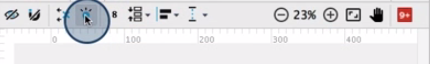

## Responsive design

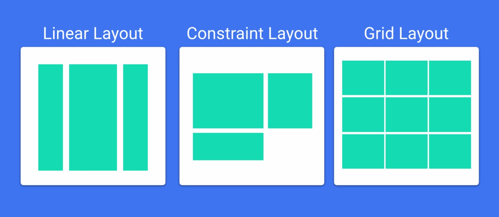

## Layout Manager
- **FrameLayout** for simple layout with **one child view** like a list view that fills the entire content area.
- **LinearLayout** for stacking views **vertically** or **horizontally** one after another. Il also has powerful features to breakup the **display proportionnally**.
- **ConstraintLayout** is more complicated. Throw bunch of views inside then you can **figure view's position relative to** the parent, the constraint layout or the sibling views...

## Add scrolling
In this exercise, you added a list of scrolling weather data.

Perhaps the trickiest part of this exercise was using `findViewById`. `findViewById` does exactly as the name implies: It gets a view from your XML layout by its ID, and stores it for you in a Java object, like this:

```java
 mWeatherTextView = (TextView) findViewById(R.id.tv_weather_data);
 ```

Once you have this view, you can add everything in your weather array using the **append** method of the `TextView` class.

Another method you can use is **setText**. The difference between `setText` and `append` is that `setText` overwrites what was in the `TextView`, while `append` simply adds text onto whatever text was already there. 