# Lesson 10 - Background Tasks

https://github.com/udacity/ud851-Exercises/tree/student/Lesson10-Hydration-Reminder

## Services

Great for things like processing loading and processing of data in the background.


## Services vs Loaders

### Loaders 

If the background task is loading information that will only be used in the activity, it's good candidate for a loader.

### Service

When the task that you are doing is decoupled from the user interface.


## Starting Services

[Bound Services](https://developer.android.com/guide/components/bound-services.html)


## Running Services in the Background


## Intent Services


## Starter Code

### Pluralization in Android

Part of Android’s robust resource framework involves a mechanism for pluralizing strings called “Quantity Strings”. In the **strings.xml** file for the Hydration Reminder app, you’ll see an example of how pluralization can be used:

```xml
<plurals name="charge_notification_count">
   <item quantity="zero">Hydrate while charging reminder sent %d times</item>
   <item quantity="one">Hydrate while charging reminder sent %d time</item>
   <item quantity="other">Hydrate while charging reminder sent %d times</item>
</plurals>
```

When you use the plural in code, you specify a quantity number. This number specifies what string should be used. In this case:

- if the number is zero, use ```<item quantity="zero">```
- If the number is one, use ```<item quantity="one">```
- otherwise use ```<item quantity="other">```

Then in the **MainActivity** we have the following Java code to generate the correct String:

```java
String formattedChargingReminders = getResources().getQuantityString(R.plurals.charge_notification_count, chargingReminders, chargingReminders);
```

The first usage of chargingReminder is the quantity number. It determines which version of the pluralized string to use (you must pass in a number). The second usage of chargingReminder is the number that’s actually inserted into the formatted string.

For more detail on Quantity Strings, check out the [documentation](https://developer.android.com/guide/topics/resources/string-resource.html#Plurals)

## Plan for Adding an IntentService


Steps to Implement the **IntentService**
- Create a new class that extends IntentService
- Override onHandleIntent
- Start the service using startService()

## Add an IntentService

In ReminderTasks class: 
```java
// 1. Create a class called ReminderTasks
public class ReminderTasks {

    // 2. Create a public static constant String called ACTION_INCREMENT_WATER_COUNT
    public static final String ACTION_INCREMENT_WATER_COUNT = "increment-water-count";

    //  6. Create a public static void method called executeTask
    //  7. Add a Context called context and String parameter called action to the parameter list
    public static void executeTask(Context context, String action) {
        // 8. If the action equals ACTION_INCREMENT_WATER_COUNT, 
        // call this class's incrementWaterCount
        if (ACTION_INCREMENT_WATER_COUNT.equals(action)) {
            incrementWaterCount(context);
        }
    }

    // 3. Create a private static void method called incrementWaterCount
    // 4. Add a Context called context to the argument list
    private static void incrementWaterCount(Context context) {
    // 5. From incrementWaterCount, call the PreferenceUtility method 
    // that will ultimately update the water count
        PreferenceUtilities.incrementWaterCount(context);
    }
}
```

In WaterReminderIntentService class :
```java
/**
 * An {@link IntentService} subclass for handling asynchronous task requests in
 * a service on a separate handler thread.
 */
// 9. Create WaterReminderIntentService and extend it from IntentService
public class WaterReminderIntentService extends IntentService {

    // 10. Create a default constructor that calls super with the name of this class
    public WaterReminderIntentService() {
        super("WaterReminderIntentService");
    }

    // 11. Override onHandleIntent
    @Override
    protected void onHandleIntent(Intent intent) {
        // 12. Get the action from the Intent that started this Service
        String action = intent.getAction();

        // 13. Call ReminderTasks.executeTask and pass in the action to be performed
        ReminderTasks.executeTask(this, action);
    }
}
```

In AndroidManifest.xml : 
```xml
</activity>
    <!-- 14. Declare WaterReminderIntentService in the Manifest and set the exported
        attribute to false (it controls wether other applications can access the service)-->
    <!--This is required for immediate syncs -->
    <service
        android:name=".sync.WaterReminderIntentService"
        android:exported="false"/>
 </application>
```

In MainActivity : 
```java
/**
* Adds one to the water count and shows a toast
*/
public void incrementWater(View view) {
    if (mToast != null) mToast.cancel();
    mToast = Toast.makeText(this, R.string.water_chug_toast, Toast.LENGTH_SHORT);
    mToast.show();

    // 15. Create an explicit intent for WaterReminderIntentService
    Intent incrementWaterCountIntent = new Intent(this, WaterReminderIntentService.class);
    // 16. Set the action of the intent to ACTION_INCREMENT_WATER_COUNT
    incrementWaterCountIntent.setAction(ReminderTasks.ACTION_INCREMENT_WATER_COUNT);
    // 17. Call startService and pass the explicit intent you just created
    startService(incrementWaterCountIntent);

}
```

## Notifications


- [Material Design Guide on Notifications](https://material.io/guidelines/patterns/notifications.html)
- [Notifications on Android Developer Website](https://developer.android.com/guide/topics/ui/notifiers/notifications.html)

## Notifications Oreo

### Notifications Channels

Fine grained notification control for users, with a consistent setting UI.


[Notification channel](https://developer.android.com/guide/topics/ui/notifiers/notifications.html#ManageChannels)

[Notification badge](https://developer.android.com/guide/topics/ui/notifiers/notifications.html#Badges)


## Pending Intents


```java
PendingIntent.getService(context, ID, myIntent, FLAG_UPDATE_CURRENT);
```

## Notifications


- Here's more information on [Using Big View Styles](https://developer.android.com/training/notify-user/expanded.html)

- Another useful style is [Big Picture Style Notifications](https://developer.android.com/reference/android/app/Notification.BigPictureStyle.html)

In NotificationUtils class:
```java
// 1. Create a helper method called contentIntent with a single parameter for a Context. It
// should return a PendingIntent. This method will create the pending intent which will trigger when
// the notification is pressed. This pending intent should open up the MainActivity.
private static PendingIntent contentIntent(Context context) {
    // 2. Create an intent that opens up the MainActivity
    Intent startActivityIntent = new Intent(context, MainActivity.class);
    // 3. Create a PendingIntent using getActivity that:
    // - Take the context passed in as a parameter
    // - Takes an unique integer ID for the pending intent (you can create a constant for
    //   this integer above
    // - Takes the intent to open the MainActivity you just created; this is what is triggered
    //   when the notification is triggered
    // - Has the flag FLAG_UPDATE_CURRENT, so that if the intent is created again, keep the
    // intent but update the data
    return PendingIntent.getActivity(
            context,
            WATER_REMINDER_PENDING_INTENT_ID,
            startActivityIntent,
            PendingIntent.FLAG_UPDATE_CURRENT);
}

// 4.  Create a helper method called largeIcon which takes in a Context as a parameter and
// returns a Bitmap. This method is necessary to decode a bitmap needed for the notification.
private static Bitmap largeIcon(Context context) {
    // 5.  Get a Resources object from the context.
    Resources res = context.getResources();
    // 6.  Create and return a bitmap using BitmapFactory.decodeResource, passing in the
    // resources object and R.drawable.ic_local_drink_black_24px
    Bitmap largeIcon = BitmapFactory.decodeResource(res, R.drawable.ic_local_drink_black_24px);
    return largeIcon;
}

// 7.  Create a method called remindUserBecauseCharging which takes a Context.
// This method will create a notification for charging. It might be helpful
// to take a look at this guide to see an example of what the code in this method will look like:
// https://developer.android.com/training/notify-user/build-notification.html
public static void remindUserBecauseCharging(Context context) {
    // 8.  Get the NotificationManager using context.getSystemService
    NotificationManager notificationManager = (NotificationManager)
            context.getSystemService(Context.NOTIFICATION_SERVICE);
    // 9. Create a notification channel for Android O devices
    if (Build.VERSION.SDK_INT >= Build.VERSION_CODES.O) {
        NotificationChannel mChannel = new NotificationChannel(
                WATER_REMINDER_NOTIFICATION_CHANNEL_ID,
                context.getString(R.string.main_notification_channel_name),
                NotificationManager.IMPORTANCE_HIGH);
        notificationManager.createNotificationChannel(mChannel);
        }
    // 10.  In the remindUser method use NotificationCompat.Builder to create a notification
    // that:
    // - has a color of R.colorPrimary - use ContextCompat.getColor to get a compatible color
    // - has ic_drink_notification as the small icon
    // - uses icon returned by the largeIcon helper method as the large icon
    // - sets the title to the charging_reminder_notification_title String resource
    // - sets the text to the charging_reminder_notification_body String resource
    // - sets the style to NotificationCompat.BigTextStyle().bigText(text)
    // - sets the notification defaults to vibrate
    // - uses the content intent returned by the contentIntent helper method for the contentIntent
    // - automatically cancels the notification when the notification is clicked
    NotificationCompat.Builder notificationBuilder = new NotificationCompat.Builder(context,WATER_REMINDER_NOTIFICATION_CHANNEL_ID)
            .setColor(ContextCompat.getColor(context, R.color.colorPrimary))
            .setSmallIcon(R.drawable.ic_drink_notification)
            .setLargeIcon(largeIcon(context))
            .setContentTitle(context.getString(R.string.charging_reminder_notification_title))
            .setContentText(context.getString(R.string.charging_reminder_notification_body))
            .setStyle(new NotificationCompat.BigTextStyle().bigText(
                    context.getString(R.string.charging_reminder_notification_body)))
            .setDefaults(Notification.DEFAULT_VIBRATE)
            .setContentIntent(contentIntent(context))
            .setAutoCancel(true);

    // 11.  If the build version is greater than JELLY_BEAN and lower than OREO,
    // set the notification's priority to PRIORITY_HIGH.
    if (Build.VERSION.SDK_INT >= Build.VERSION_CODES.JELLY_BEAN
            && Build.VERSION.SDK_INT < Build.VERSION_CODES.O) {
        notificationBuilder.setPriority(NotificationCompat.PRIORITY_HIGH);
    }

    // 12. Trigger the notification by calling notify on the NotificationManager.
    // Pass in a unique ID of your choosing for the notification and notificationBuilder.build()
    notificationManager.notify(WATER_REMINDER_NOTIFICATION_ID, notificationBuilder.build());
}
```

In the AndroidManifest.xml, add the VIBRATE permission:
```xml
<uses-permission android:name="android.permission.VIBRATE" />
```

In activity_main.xml, add the button for testing notification:
```xml
<!-- 14. Add a button for testing your notification with an onClick method called testNotification -->
    <Button
        android:layout_width="wrap_content"
        android:layout_height="wrap_content"
        android:layout_gravity="center"
        android:onClick="testNotification"
android:text="Test Notification" />
```

In MainActivity:
```java
// 15. Create a method called testNotification that triggers NotificationUtils' remindUserBecauseCharging
    public void testNotification(View view) {
        NotificationUtils.remindUserBecauseCharging(this);
}
```

For performance sake, in AndroidManifest.xml, add launch mode:
```xml
<!-- 16.  Add the launch mode "single top" attribute to the MainActivity so that when you open
MainActivity using a notification, it will take you back to the already opened activity, not
generate a new one -->
<activity
    android:name=".MainActivity"
    android:launchMode="singleTop"
    android:screenOrientation="portrait">
    <intent-filter>
        <action android:name="android.intent.action.MAIN"/>

        <category android:name="android.intent.category.LAUNCHER"/>
    </intent-filter>
</activity>
``` 

## Notification Actions

To add actions to a notification, you call addAction as many as three time when creating the notification builder.


## Adding Actions to Notifications

In NotificationUtils class:
```java
//  1. Create a method to clear all notifications
    public static void clearAllNotifications(Context context) {
        NotificationManager notificationManager = (NotificationManager)
                context.getSystemService(Context.NOTIFICATION_SERVICE);
        notificationManager.cancelAll();
}
```

In ReminderTasks:
```java
//  2. Add a public static constant called ACTION_DISMISS_NOTIFICATION
public static final String ACTION_DISMISS_NOTIFICATION = "dismiss-notification";

public static void executeTask(Context context, String action) {
        if (ACTION_INCREMENT_WATER_COUNT.equals(action)) {
            incrementWaterCount(context);
        } else if (ACTION_DISMISS_NOTIFICATION.equals(action)) {
            NotificationUtils.clearAllNotifications(context);
        }
        // 3. If the user ignored the reminder, clear the notification
    }

private static void incrementWaterCount(Context context) {
    PreferenceUtilities.incrementWaterCount(context);
    // 4. If the water count was incremented, clear any notifications
    NotificationUtils.clearAllNotifications(context);
}
```

In NotificationsUtils, create two static helper methods that will create and return  the appropriate action instances for each button:
```java
//  5. Add a static method called ignoreReminderAction
    private static Action ignoreReminderAction(Context context) {
        // 6. Create an Intent to launch WaterReminderIntentService
        Intent ignoreReminderIntent = new Intent(context, WaterReminderIntentService.class);
        // 7. Set the action of the intent to designate you want to dismiss the notification
        ignoreReminderIntent.setAction(ReminderTasks.ACTION_DISMISS_NOTIFICATION);
        // 8. Create a PendingIntent from the intent to launch WaterReminderIntentService
        PendingIntent ignoreReminderPendingIntent = PendingIntent.getService(
                context,
                ACTION_IGNORE_PENDING_INTENT_ID,
                ignoreReminderIntent,
                PendingIntent.FLAG_UPDATE_CURRENT);
        // 9. Create an Action for the user to ignore the notification (and dismiss it)
        Action ignoreReminderAction = new Action(R.drawable.ic_cancel_black_24px,
                "No, thanks.",
                ignoreReminderPendingIntent);
        // 10 Return the action
        return ignoreReminderAction;
    }

    //  11. Add a static method called drinkWaterAction
    private static Action drinkWaterAction(Context context) {
        // 12. Create an Intent to launch WaterReminderIntentService
        Intent incrementWaterCountIntent = new Intent(context, WaterReminderIntentService.class);
        // 13. Set the action of the intent to designate you want to increment the water count
        incrementWaterCountIntent.setAction(ReminderTasks.ACTION_INCREMENT_WATER_COUNT);
        // 14. Create a PendingIntent from the intent to launch WaterReminderIntentService
        PendingIntent incrementWaterPendingIntent = PendingIntent.getService(
                context,
                ACTION_DRINK_PENDING_INTENT_ID,
                incrementWaterCountIntent,
                PendingIntent.FLAG_CANCEL_CURRENT);
        // 15. Create an Action for the user to tell us they've had a glass of water
        Action drinkWaterAction = new Action(R.drawable.ic_local_drink_black_24px,
                "I did it!",
                incrementWaterPendingIntent);
        // 16. Return the action
        return drinkWaterAction;
}

public static void remindUserBecauseCharging(Context context) {
        NotificationManager notificationManager = (NotificationManager)
                context.getSystemService(Context.NOTIFICATION_SERVICE);
        if (Build.VERSION.SDK_INT >= Build.VERSION_CODES.O) {
            NotificationChannel mChannel = new NotificationChannel(
                    WATER_REMINDER_NOTIFICATION_CHANNEL_ID,
                    context.getString(R.string.main_notification_channel_name),
                    NotificationManager.IMPORTANCE_HIGH);
            notificationManager.createNotificationChannel(mChannel);
            }
        NotificationCompat.Builder notificationBuilder = new NotificationCompat.Builder(context,WATER_REMINDER_NOTIFICATION_CHANNEL_ID)
                .setColor(ContextCompat.getColor(context, R.color.colorPrimary))
                .setSmallIcon(R.drawable.ic_drink_notification)
                .setLargeIcon(largeIcon(context))
                .setContentTitle(context.getString(R.string.charging_reminder_notification_title))
                .setContentText(context.getString(R.string.charging_reminder_notification_body))
                .setStyle(new NotificationCompat.BigTextStyle().bigText(
                        context.getString(R.string.charging_reminder_notification_body)))
                .setDefaults(Notification.DEFAULT_VIBRATE)
                .setContentIntent(contentIntent(context))
                // 17. Add the two new actions using the addAction method and your helper methods
                .addAction(drinkWaterAction(context))
                .addAction(ignoreReminderAction(context))
                .setAutoCancel(true);

        if (Build.VERSION.SDK_INT >= Build.VERSION_CODES.JELLY_BEAN
                && Build.VERSION.SDK_INT < Build.VERSION_CODES.O) {
            notificationBuilder.setPriority(NotificationCompat.PRIORITY_HIGH);
        }
        notificationManager.notify(WATER_REMINDER_NOTIFICATION_ID, notificationBuilder.build());
}
```

## Foreground Services

A foreground service is a service that the user is actively aware of because Android require that the service post a non-dismissible ongoig notification.

They are typically used to show the user the real time progress of long running operation.

The user can do some rudimentary interactions with your service.

Android will prioritize not shutting these services down if the system is memory constrained.

## Application priority

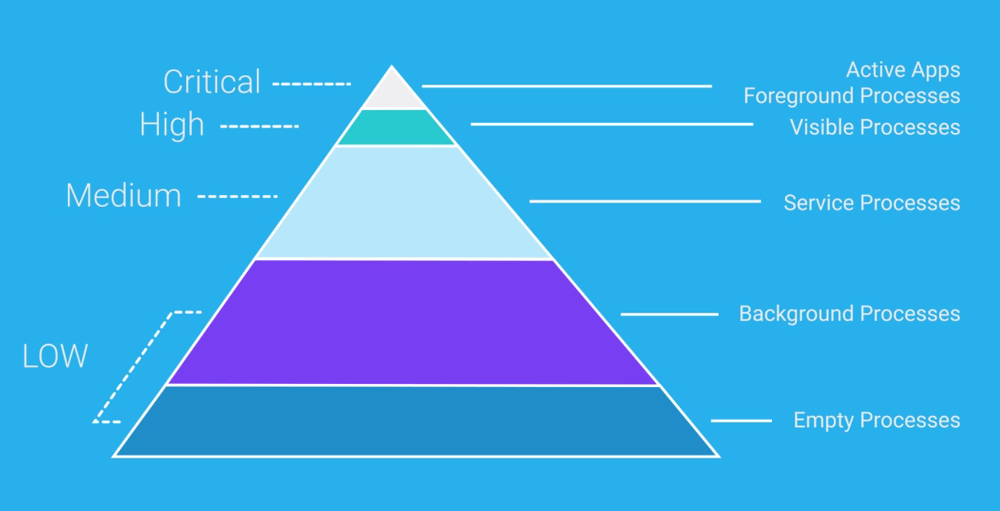

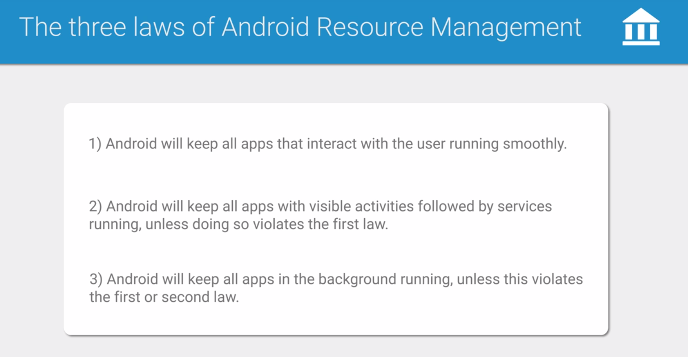

## Scheduling Jobs

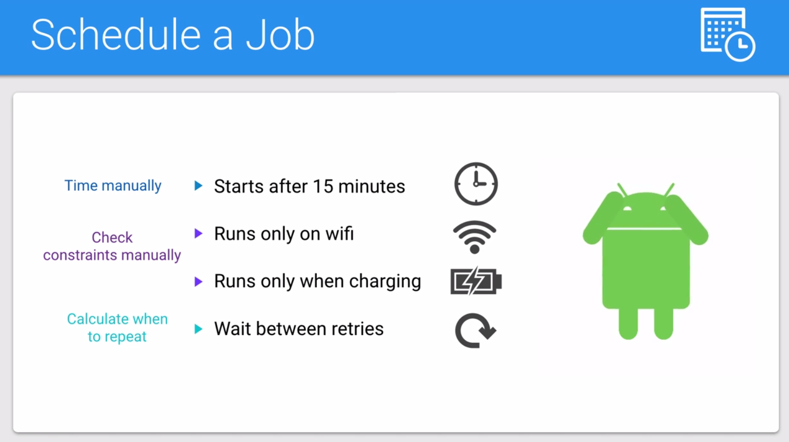


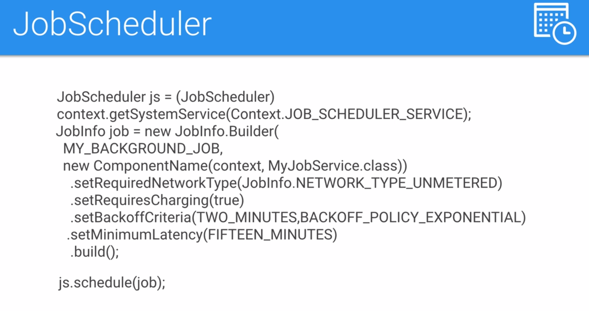
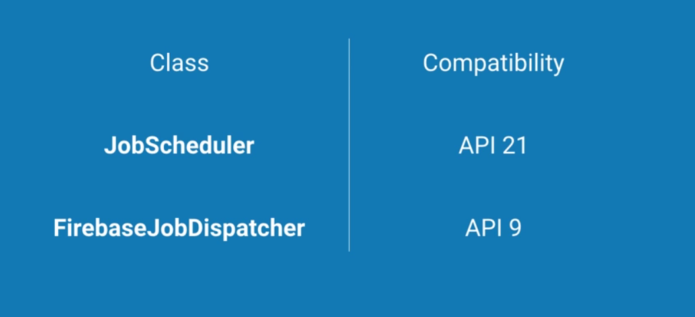
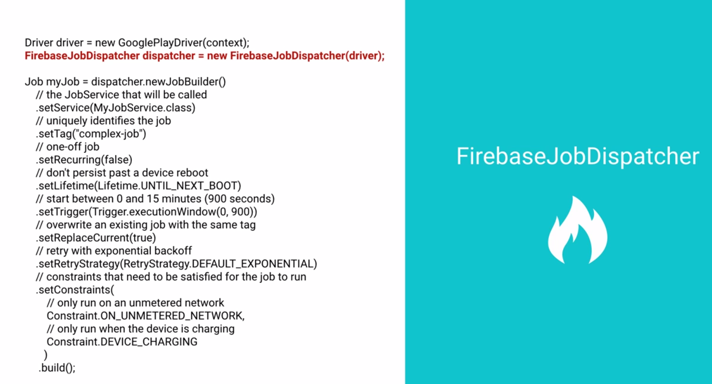
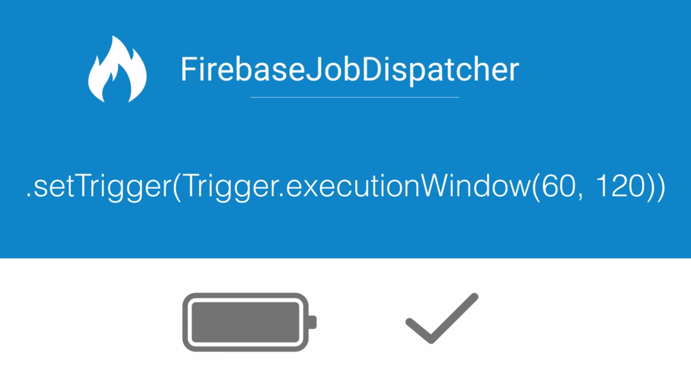

### FirebaseJobDispatcher Sample Code

```java
Driver driver = new GooglePlayDriver(context);
FirebaseJobDispatcher dispatcher = new FirebaseJobDispatcher(driver);

Job myJob = dispatcher.newJobBuilder()
    // the JobService that will be called
    .setService(MyJobService.class)
    // uniquely identifies the job
    .setTag("complex-job")
    // one-off job
    .setRecurring(false)
    // don't persist past a device reboot
    .setLifetime(Lifetime.UNTIL_NEXT_BOOT)
    // start between 0 and 15 minutes (900 seconds)     
    .setTrigger(Trigger.executionWindow(0, 900))
    // overwrite an existing job with the same tag
    .setReplaceCurrent(true)
    // retry with exponential backoff 
    .setRetryStrategy(RetryStrategy.DEFAULT_EXPONENTIAL)
    // constraints that need to be satisfied for the job to run
    .setConstraints(
        // only run on an unmetered network
        Constraint.ON_UNMETERED_NETWORK,
        // only run when the device is charging
        Constraint.DEVICE_CHARGING
    )
    .build();
```

For more information, check out the [FirebaseJobDispatcher README](https://github.com/firebase/firebase-jobdispatcher-android). This also includes more sample code.

### What is Google Play Services

You might be wondering what's up with the **GooglePlayDriver**. **FirebaseJobDispatcher** has a dependency on Google Play Services, which is why you need a **GooglePlayDriver**. So what is Google Play Services?

[Google Play Services](https://developers.google.com/android/guides/overview) is [app](https://play.google.com/store/apps/details?id=com.google.android.gms&hl=en) that Google maintains which comes pre-installed on and runs in the background on many, many phones. It is essentially a collection of Services that your app can use to leverage the power of Google products. If the user has the Google Play Services apk installed (and many do) you can use Google Play Services Libraries to easily do things like use the Places API to know where your user is or integrate Google sign in. FirebaseJobDispatcher is one of the many services you can take advantage of via Google Play Services.

Google choose to distribute these services as an installable apk so that updates to the services are not dependent on carrier or OEM system image updates. In general, devices running Android 2.3 (API level 9) or later and have the Google Play services app installed receive updates within a few days.

### Google Play Services Udacity Courses

There are several Udacity courses on how to use Google Play Services features, such as Location services and Maps.

- [Google Location Services](https://eu.udacity.com/course/google-location-services-on-android--ud876-1)
- [Google Analytics](https://eu.udacity.com/course/google-analytics-for-android--ud876-2)
- [Google AdMob](https://eu.udacity.com/course/monetize-your-android-app-with-ads--ud876-3)
- [Google Maps](https://eu.udacity.com/course/add-google-maps-to-your-android-app--ud876-4)

### Installing Google Play Services

To test your app when using the Google Play services SDK, you must use either:

- A compatible Android device that runs Android 2.3 or higher and includes Google Play Store.
- The Android emulator with an AVD that runs the Google APIs platform based on Android 4.2.2 or higher.

You can install Google Play Services on your physical device via the Google Play Store.

To get Google Play Services on an emulator, you first need to make sure you have Google Play Services installed in the SDK manager:

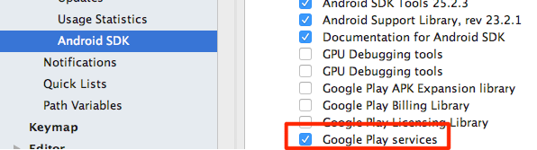

Then you need to create an emulator that uses the Google APIs:

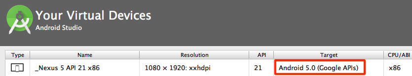

### What if Google Play Services is not Available?

In this class we are only covering **FirebaseJobDispatcher**. Depending on where you're located and who your users are, you might not have access to the Play Store to download Google Play Services. If this is the case, you can use an alternative to FirebaseJobDispatcher known as android-job. [Android-job](https://github.com/evernote/android-job) is very similar to FirebaseJobDispatcher, but it is not a Google maintained repository and it only offers compatibility back to API 14. The FirebaseJobDispatcher documentation contains a [comparison table](https://github.com/firebase/firebase-jobdispatcher-android#comparison-to-other-libraries) that you can use when making this decision.

## Adding a JobService

The end goal is to trigger a notification every 15 minutes when the device is charging.

Follow these steps : 
- add the gradle dependency for FirebaseJobDispatcher
- create a new task in the ReminderTasks
- create a new service that extends from JobService
- add the JobService to the manifest
- schedule with FirebaseJobDispatcher

The constraints are:
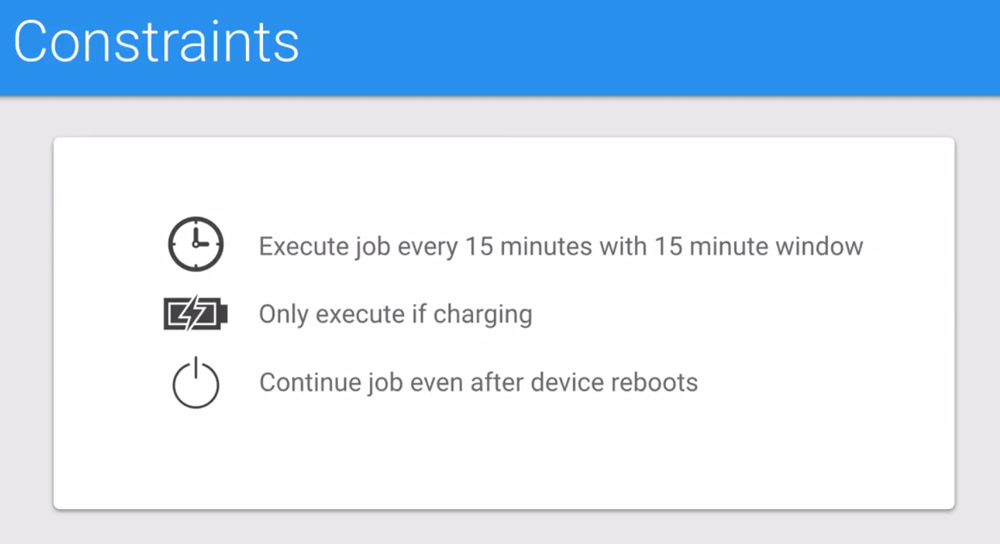

In build.gradle file:
```
dependencies {
    compile fileTree(include: ['*.jar'], dir: 'libs')
    compile 'com.android.support:appcompat-v7:26.0.1'
    // 1. Add gradle dependency for Firebase Job Dispatcher
    compile 'com.firebase:firebase-jobdispatcher:0.5.2'
}
```

In ReminderTasks class:
```java
public class ReminderTasks {

    public static final String ACTION_INCREMENT_WATER_COUNT = "increment-water-count";
    public static final String ACTION_DISMISS_NOTIFICATION = "dismiss-notification";
    // add a new action's name
    static final String ACTION_CHARGING_REMINDER = "charging-reminder";

    public static void executeTask(Context context, String action) {
        if (ACTION_INCREMENT_WATER_COUNT.equals(action)) {
            incrementWaterCount(context);
        } else if (ACTION_DISMISS_NOTIFICATION.equals(action)) {
            NotificationUtils.clearAllNotifications(context);
        } else if (ACTION_CHARGING_REMINDER.equals(action)) {
            // check for that action 
            issueChargingReminder(context);
        }
    }

    private static void incrementWaterCount(Context context) {
        PreferenceUtilities.incrementWaterCount(context);
        NotificationUtils.clearAllNotifications(context);
    }

    // COMPLETED (2) Create an additional task for issuing a charging reminder notification.
    // This should be done in a similar way to how you have an action for incrementingWaterCount
    // and dismissing notifications. This task should both create a notification AND
    // increment the charging reminder count (hint: there is a method for this in PreferenceUtilities)
    // When finished, you should be able to call executeTask with the correct parameters to execute
    // this task. Don't forget to add the code to executeTask which actually calls your new task!

    // create the new action
    private static void issueChargingReminder(Context context) {
        PreferenceUtilities.incrementChargingReminderCount(context);
        NotificationUtils.remindUserBecauseCharging(context);
    }
}
```

Create a new job service WaterReminderFirebaseJobService that actually runs the task:
```java
import com.firebase.jobdispatcher.Job;
// do not use import android.app.job.JobService !!! 
import com.firebase.jobdispatcher.JobParameters;
import com.firebase.jobdispatcher.JobService;
import com.firebase.jobdispatcher.RetryStrategy;

// 3. WaterReminderFirebaseJobService should extend from JobService
public class WaterReminderFirebaseJobService extends JobService {

    private AsyncTask mBackgroundTask;


    // 4. Override onStartJob
    /**
     * The entry point to your Job. Implementations should offload work to another thread of
     * execution as soon as possible.
     *
     * This is called by the Job Dispatcher to tell us we should start our job. Keep in mind this
     * method is run on the application's main thread, so we need to offload work to a background
     * thread.
     *
     * @return whether there is more work remaining.
     */
    @Override
    public boolean onStartJob(final JobParameters jobParameters) {

        // 5. By default, jobs are executed on the main thread, so make an anonymous class extending
        //  AsyncTask called mBackgroundTask.
        // Here's where we make an AsyncTask so that this is no longer on the main thread
        mBackgroundTask = new AsyncTask() {

            // 6. Override doInBackground
            @Override
            protected Object doInBackground(Object[] params) {
                // 7. Use ReminderTasks to execute the new charging reminder task you made, use
                // this service as the context (WaterReminderFirebaseJobService.this) and return null
                // when finished.
                Context context = WaterReminderFirebaseJobService.this;
                ReminderTasks.executeTask(context, ReminderTasks.ACTION_CHARGING_REMINDER);
                return null;
            }

            @Override
            protected void onPostExecute(Object o) {
                // 8. Override onPostExecute and called jobFinished. Pass the job parameters
                // and false to jobFinished. This will inform the JobManager that your job is done
                // and that you do not want to reschedule the job.

                /*
                 * Once the AsyncTask is finished, the job is finished. To inform JobManager that
                 * you're done, you call jobFinished with the jobParamters that were passed to your
                 * job and a boolean representing whether the job needs to be rescheduled. This is
                 * usually if something didn't work and you want the job to try running again.
                 */

                jobFinished(jobParameters, false);
            }
        };

        // 9. Execute the AsyncTask
        mBackgroundTask.execute();
        // 10. Return true
        return true;
    }

    // 11. Override onStopJob
    /**
     * Called when the scheduling engine has decided to interrupt the execution of a running job,
     * most likely because the runtime constraints associated with the job are no longer satisfied.
     *
     * @return whether the job should be retried
     * @see Job.Builder#setRetryStrategy(RetryStrategy)
     * @see RetryStrategy
     */
    @Override
    public boolean onStopJob(JobParameters jobParameters) {
        // 12. If mBackgroundTask is valid, cancel it
        // 13. Return true to signify the job should be retried
        if (mBackgroundTask != null) mBackgroundTask.cancel(true);
        return true;
    }
}
```

In the AndroidManifest.xml:
```xml
<!-- 14. Add the WaterReminderFirebaseJobService here. It should not be exported and it
should have an intent filter for the action com.firebase.jobdispatcher.ACTION_EXECUTE -->
<!-- This is the Service declaration used in conjunction with FirebaseJobDispatcher -->
<service
    android:name=".sync.WaterReminderFirebaseJobService"
    android:exported="false">
    <intent-filter>
        <action android:name="com.firebase.jobdispatcher.ACTION_EXECUTE"/>
    </intent-filter>
</service>
```

## Schedule with FirebaseJobDispatcher

In ReminderUtilities class:
```java
import com.firebase.jobdispatcher.Constraint;
import com.firebase.jobdispatcher.Driver;
import com.firebase.jobdispatcher.FirebaseJobDispatcher;
import com.firebase.jobdispatcher.GooglePlayDriver;
import com.firebase.jobdispatcher.Job;
import com.firebase.jobdispatcher.Lifetime;
import com.firebase.jobdispatcher.Trigger;

import java.util.concurrent.TimeUnit;

public class ReminderUtilities {


    // COMPLETED (15) Create three constants and one variable:
    //  - REMINDER_INTERVAL_SECONDS should be an integer constant storing the number of seconds in 15 minutes
    //  - SYNC_FLEXTIME_SECONDS should also be an integer constant storing the number of seconds in 15 minutes
    //  - REMINDER_JOB_TAG should be a String constant, storing something like "hydration_reminder_tag"
    //  - sInitialized should be a private static boolean variable which will store whether the job
    //    has been activated or not
    /*
     * Interval at which to remind the user to drink water. Use TimeUnit for convenience, rather
     * than writing out a bunch of multiplication ourselves and risk making a silly mistake.
     */
    private static final int REMINDER_INTERVAL_MINUTES = 15;
    private static final int REMINDER_INTERVAL_SECONDS = (int) (TimeUnit.MINUTES.toSeconds(REMINDER_INTERVAL_MINUTES));
    private static final int SYNC_FLEXTIME_SECONDS = REMINDER_INTERVAL_SECONDS;

    private static final String REMINDER_JOB_TAG = "hydration_reminder_tag";

    private static boolean sInitialized;

    // 16. Create a synchronized, public static method called scheduleChargingReminder that takes
    // in a context. This method will use FirebaseJobDispatcher to schedule a job that repeats roughly
    // every REMINDER_INTERVAL_SECONDS when the phone is charging. It will trigger WaterReminderFirebaseJobService
    // Checkout https://github.com/firebase/firebase-jobdispatcher-android for an example
    synchronized public static void scheduleChargingReminder(@NonNull final Context context) {


        // 17. If the job has already been initialized, return
        if (sInitialized) return;

        // 18. Create a new GooglePlayDriver
        Driver driver = new GooglePlayDriver(context);
        // 19. Create a new FirebaseJobDispatcher with the driver
        FirebaseJobDispatcher dispatcher = new FirebaseJobDispatcher(driver);

        // 20. Use FirebaseJobDispatcher's newJobBuilder method to build a job which:
        // - has WaterReminderFirebaseJobService as it's service
        // - has the tag REMINDER_JOB_TAG
        // - only triggers if the device is charging
        // - has the lifetime of the job as forever
        // - has the job recur
        // - occurs every 15 minutes with a window of 15 minutes. You can do this using a
        //   setTrigger, passing in a Trigger.executionWindow
        // - replaces the current job if it's already running
        // Finally, you should build the job.
        /* Create the Job to periodically create reminders to drink water */
        Job constraintReminderJob = dispatcher.newJobBuilder()
                /* The Service that will be used to write to preferences */
                .setService(WaterReminderFirebaseJobService.class)
                /*
                 * Set the UNIQUE tag used to identify this Job.
                 */
                .setTag(REMINDER_JOB_TAG)
                /*
                 * Network constraints on which this Job should run. In this app, we're using the
                 * device charging constraint so that the job only executes if the device is
                 * charging.
                 *
                 * In a normal app, it might be a good idea to include a preference for this,
                 * as different users may have different preferences on when you should be
                 * syncing your application's data.
                 */
                .setConstraints(Constraint.DEVICE_CHARGING)
                /*
                 * setLifetime sets how long this job should persist. The options are to keep the
                 * Job "forever" or to have it die the next time the device boots up.
                 */
                .setLifetime(Lifetime.FOREVER)
                /*
                 * We want these reminders to continuously happen, so we tell this Job to recur.
                 */
                .setRecurring(true)
                /*
                 * We want the reminders to happen every 15 minutes or so. The first argument for
                 * Trigger class's static executionWindow method is the start of the time frame
                 * when the
                 * job should be performed. The second argument is the latest point in time at
                 * which the data should be synced. Please note that this end time is not
                 * guaranteed, but is more of a guideline for FirebaseJobDispatcher to go off of.
                 */
                .setTrigger(Trigger.executionWindow(
                        REMINDER_INTERVAL_SECONDS,
                        REMINDER_INTERVAL_SECONDS + SYNC_FLEXTIME_SECONDS))
                /*
                 * If a Job with the tag with provided already exists, this new job will replace
                 * the old one.
                 */
                .setReplaceCurrent(true)
                /* Once the Job is ready, call the builder's build method to return the Job */
                .build();

        // 21. Use dispatcher's schedule method to schedule the job
        /* Schedule the Job with the dispatcher */
        dispatcher.schedule(constraintReminderJob);

        // 22. Set sInitialized to true to mark that we're done setting up the job
        /* The job has been initialized */
        sInitialized = true;
    }

}
```

In MainActivity:
```java
@Override
    protected void onCreate(Bundle savedInstanceState) {
        ...
        // 23. Schedule the charging reminder
        ReminderUtilities.scheduleChargingReminder(this);
        ...
}
```

## Broadcast Receiver

- System Broadcast Intent = a spacial intent sent by the system when events occur on the phone.

Example: 


- Broadcast Receiver = core android component that enables applications to receive intents that are bradcast by the system or by other applications.

! Even when other components of the application are not running.

Example Offline/Online files:

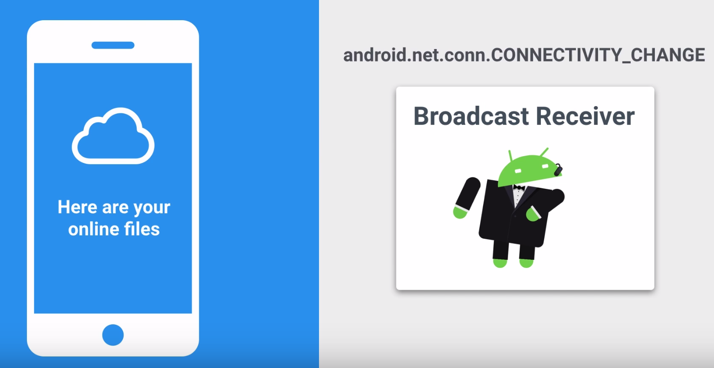

- Intent Filter = expression that says what intents should trigger your component.

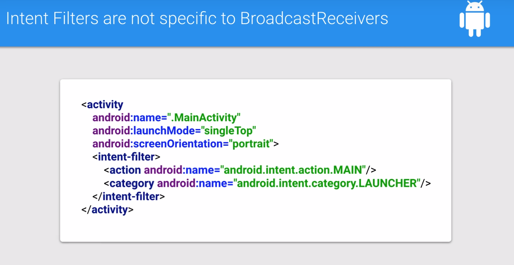

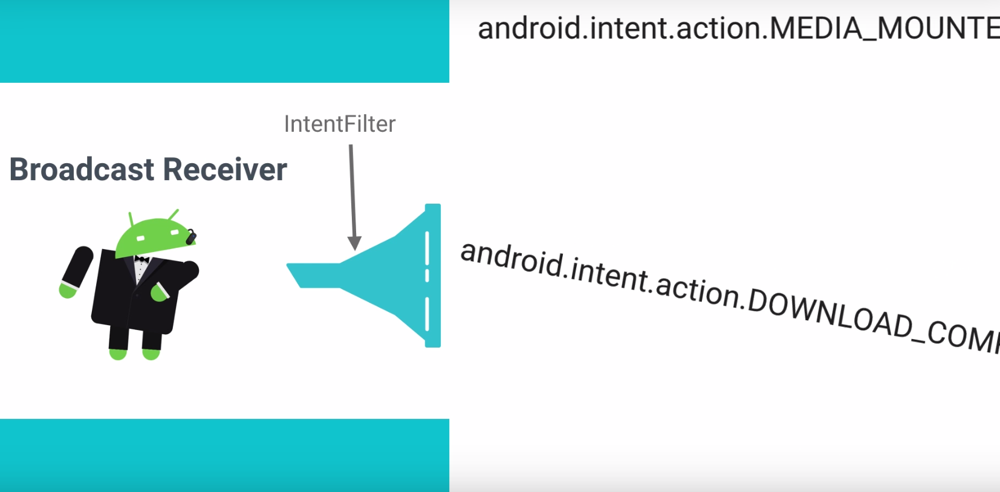

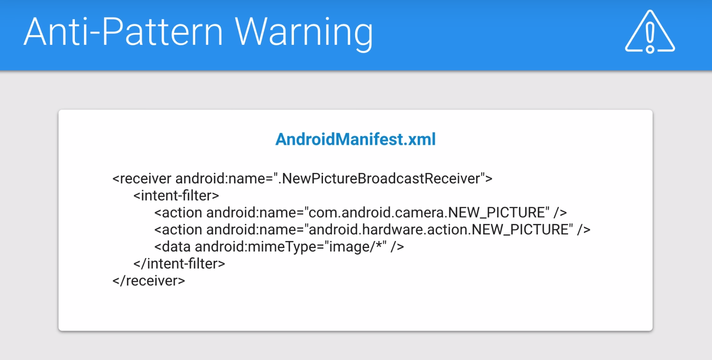

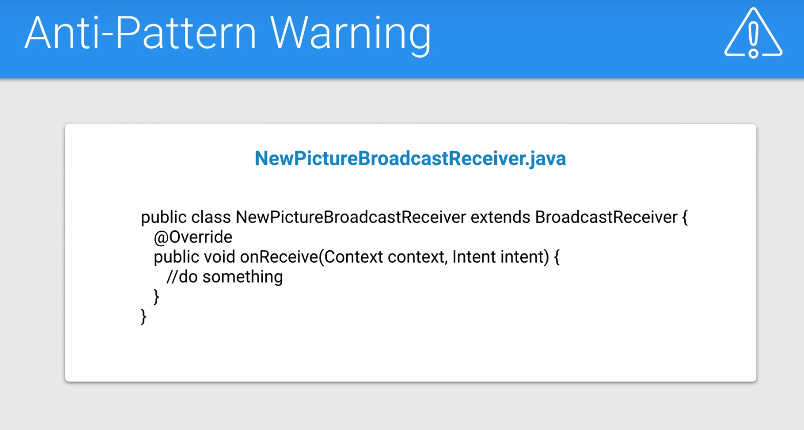

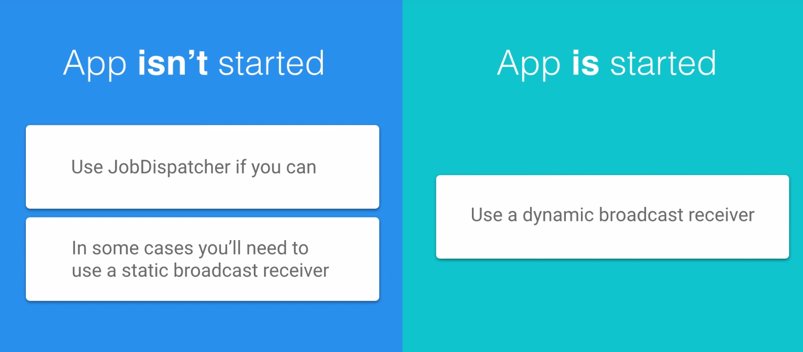

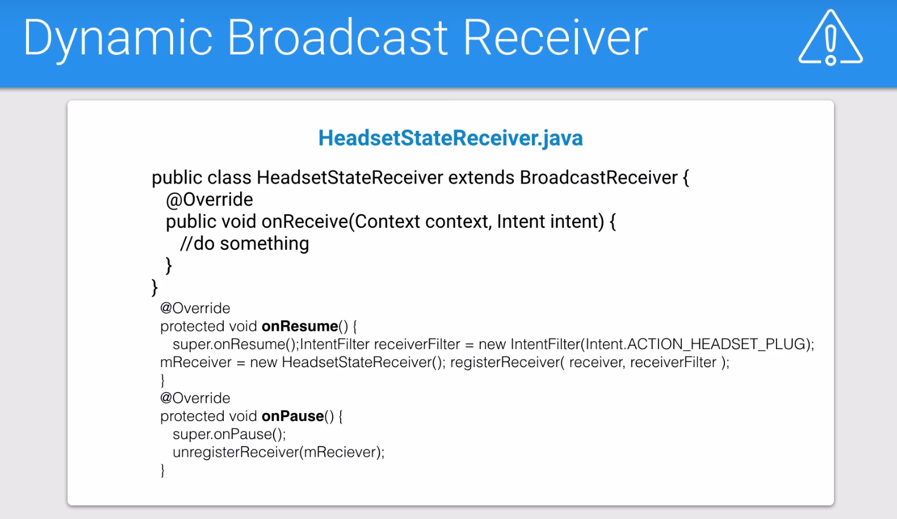

## Show when charging

The implementation steps:
- Method that change the plug from grey to pink
- Intent filter for charging status
- Broadcast receiver updates color
- Register broadcast receiver with intent filter
- Cleanup broadcast receiver in onPause

In MainActivity:
```java
    ChargingBroadcastReceiver mChargingReceiver;
    IntentFilter mChargingIntentFilter;

    @Override
    protected void onCreate(Bundle savedInstanceState) {
        ...

        // 5.  Create and instantiate a new instance variable for your ChargingBroadcastReceiver
        // and an IntentFilter
        /*
         * Setup and register the broadcast receiver
         */
        mChargingIntentFilter = new IntentFilter();
        mChargingReceiver = new ChargingBroadcastReceiver();
        // 6.  Call the addAction method on your intent filter and add Intent.ACTION_POWER_CONNECTED
        // and Intent.ACTION_POWER_DISCONNECTED. This sets up an intent filter which will trigger
        // when the charging state changes.
        mChargingIntentFilter.addAction(Intent.ACTION_POWER_CONNECTED);
        mChargingIntentFilter.addAction(Intent.ACTION_POWER_DISCONNECTED);
}

// 7. Override onResume and setup your broadcast receiver. Do this by calling
// registerReceiver with the ChargingBroadcastReceiver and IntentFilter.
@Override
protected void onResume() {
    super.onResume();
    registerReceiver(mChargingReceiver, mChargingIntentFilter);
}


// 8. Override onPause and unregister your receiver using the unregisterReceiver method
@Override
protected void onPause() {
    super.onPause();
    unregisterReceiver(mChargingReceiver);
}

// 1.  Create a new method called showCharging which takes a boolean. This method should
// either change the image of mChargingImageView to ic_power_pink_80px if the boolean is true
// or R.drawable.ic_power_grey_80px it it's not. This method will eventually update the UI
// when our broadcast receiver is triggered when the charging state changes.
private void showCharging(boolean isCharging){
    if (isCharging) {
        mChargingImageView.setImageResource(R.drawable.ic_power_pink_80px);

    } else {
        mChargingImageView.setImageResource(R.drawable.ic_power_grey_80px);
    }
}


// 2.  Create an inner class called ChargingBroadcastReceiver that extends BroadcastReceiver
private class ChargingBroadcastReceiver extends BroadcastReceiver {
    // 3. Override onReceive to get the action from the intent and see if it matches the
    // Intent.ACTION_POWER_CONNECTED. If it matches, it's charging. If it doesn't match it's not
    // charging.
    @Override
    public void onReceive(Context context, Intent intent) {
        String action = intent.getAction();
        boolean isCharging = (action.equals(Intent.ACTION_POWER_CONNECTED));

        // 4. Update the UI using the showCharging method you wrote
        showCharging(isCharging);
    }
}

```
you can use the [Android Debug Bridge](https://developer.android.com/studio/command-line/adb.html) to simulate the phone being plugged and unplugged without actually doing the plugging and unplugging.

### Setup ADB

The Android Debug Bridge, or **adb** as it is affectionately called, is a command line tool. This means that you should be comfortable working in a terminal or shell to use this program. We touched on it briefly in the first lesson. The adb program is stored in your android SDK folder in a subfolder called **platform-tools**. You can find where your SDK is by going to the SDK manager and looking at the SDK location, as shown below:

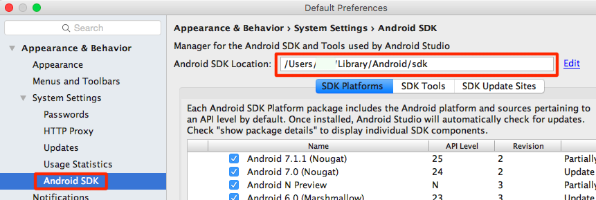

Once you have the sdk location, you can use adb by typing:

```<YOUR SDK LOCATION>/platform-tools/adb```

If you've added commands to your $PATH before, adb is a great one to add. 

### Helpful adb Commands

To simulate the phone being unplugged from usb charging you can use:

```adb shell dumpsys battery set usb 0```

or if you're on a device Android 6.0 or higher you can use:

```adb shell dumpsys battery unplug```

To "plug" the phone back in, just reset it's charging status using:

```adb shell dumpsys battery reset```

## Getting the current battery state

As mentioned, our code currently contains a bug. Our app adds and removes the dynamic broadcast receiver in **onResume** and **onPause**. When the app is not visible, the plug's image will not update. This can lead to the plug sometimes having the incorrect image when the app starts.

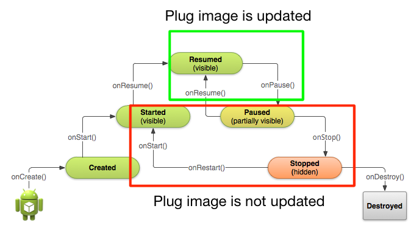

Now we could move the code to dynamically add and remove the broadcast receiver in different lifecycle methods, for example **onCreate** and **onDestroy**, but this would cause us to waste cycles swapping around an image which isn't even on screen. A better approach is to check what the current battery state is when the app resumes and update the image accordingly.

There are two ways to do this, depending on whether you're on API level 23+ or before.

### Getting Charging State on API level 23+

To get the current state of the battery on API level 23+, simply use the battery manager system service:

```java
BatteryManager batteryManager = (BatteryManager) getSystemService(BATTERY_SERVICE);
boolean isCharging = batteryManager.isCharging();
```

### Getting Charging State with a Sticky Intent

Prior to Android 23+ you needed to use a sticky intent to get battery state. As we've seen, a normal, broadcasted intent will be broadcasted, possibly caught by an intent filter, and then disspear after it is processed. A sticky intent is a broadcast intent that sticks around, allowing your app to access it at any point and get information from the broadcasted intent. In Android, a sticky intent is where the current battery state is saved.

You don't need a broadcast receiver for a sticky intent, but you use similar looking code to registering a receiver:

```java
IntentFilter ifilter = new IntentFilter(Intent.ACTION_BATTERY_CHANGED);
Intent batteryStatus = context.registerReceiver(null, ifilter);
```

Notice how **registerReceiver** is used, but instead of passing in a broadcast receiver, **null** is passed. The intent filter here is the intent filter for the **sticky intent** [Intent.ACTION_BATTERY_CHANGED](https://developer.android.com/reference/android/content/Intent.html#ACTION_BATTERY_CHANGED). The **registerReceiver** method will return an intent, and it is that intent which has all of the battery information, which you can use:

```java
boolean isCharging = status == BatteryManager.BATTERY_STATUS_CHARGING || status == BatteryManager.BATTERY_STATUS_FULL;
```

For more information on how to getting information about the battery, check out the [Monitoring the Battery Level and Charging State documentation](https://developer.android.com/training/monitoring-device-state/battery-monitoring.html).

Now that you know how to get battery state, you should be able to complete the following exercise and fix the bug. The code is below.

Note: If you need to check whether the user is on API 23+, you can use the following code:

```java
if (Build.VERSION.SDK_INT >= Build.VERSION_CODES.M)
```
## Synchronizing the weather (Sunshine app)

This process is going to be very similar to the one we followed when we created our toy app for this lesson. First, we’re going to create a class that represents the “task” we’re going to perform. Then, we’ll create and register an IntentService that will be able to perform that task. Next, we’ll create a class to handle all of our synchronization. Once that’s done, we can move on to rewiring the app to work with our new synchronization strategy.

### Create SunshineSyncTask

- (1) In order to keep all of our code organized, go ahead and create a class called **SunshineSyncTask**.
- (2) Within that class, we’re just going to write one method. This method is going to be the main “task” of Sunshine.
- (3) Call this method **syncWeather**, and within it, move the logic that was previously in our AsyncTaskLoader for loading the weather data.
- (4) If you fetch valid results, delete the old weather data and insert the new data.

### Create and Register SunshineSyncIntentService

Next, we’ll need a class to handle backgrounding our syncTask. IntentServices are perfect for one off tasks that need to be handled in the background, so we’ll create one here.

- (1) Create **SunshineSyncIntentService** class and set it to extend **IntentService**.
- (2) Next, create a constructor that calls super and passes the name of this class as a string.
- (3) Finally, override **onHandleIntent**. Within it, we’ll call SunshineSyncTask.syncWeather

### Create SunshinesyncUtils

Now that we have a way to sync the weather and a way to handle backgrounding that sync, let’s get everything wired up. For that, we’ll create a class called **SunshineSyncUtils**.

- (1) Inside we’ll create a **startImmediateSync** method that will start the IntentService and force an immediate synchronization when called.

## SmarterSyncing

This Exercise is all about optimizing the synchronization process that was made in the previous exercise. It’s best practice to not initialize things more than once, so for that, we will make sure that startImmediateSync will only get called once when the app starts and only if the database was empty.

### To do so, inside SunshineSyncUtils class:

- (1) Create a boolean flag called **sInitialized**. This will be mainly used as a safeguard to prevent calling the synchronize method more than once.
- (2) Next create an **initialize** method that will use that boolean to guarantee that **startImmediateSync** is called only when necessary!
- (3) Within it, don’t do any work if the **sInitialized** flag is already set to true. If it isn’t set to true, we want to check to see if our ContentProvider is empty, in case for example the app was just freshly installed and had no data stored yet!.
- (4) To check if the ContentProvider is empty, simply run a query and get the result count, but do so on a background thread using an **AsyncTask**.
- (5) If the ContentProvider is in fact empty, go ahead and call **startImmediateSync**.

## Sunshine FirebaseJobDispatcher

Syncing on demand is great, but don’t we want to continuously update the data for our users, even when the app isn’t in the foreground? After all, who wants to sit and wait for their weather data anymore? I know I certainly don’t! Now that we’ve learned about FirebaseJobDispatcher, let’s make use of it in Sunshine!

### Add the FirebaseJobDispatcher dependency

As with any dependency, we’ll need to add FirebaseJobDispatcher to our project. That’s going to be step one here.

### Create our FirebaseJobService

Next, we need to create the Service that FirebaseJobDispatcher runs when it, well, runs our service!

- (1) Let’s create a **jobdispatcher.JobService** called **SunshineFirebaseJobService**. It’s important that we verify that we’ve imported **jobdispatcher.JobService** rather than the Android framework’s **JobService**, because if you do, you’ll definitely have some headaches. Double and triple check that please.
- (2) Within your Service, override **onStartJob** and call to our **SunshineSyncTask.syncWeather** method in the background.
- (3) Once the **syncWeather** method finishes, call **jobFinished**, passing the JobParameters argument from **onStartJob** as well as a false value to signify that we don’t have any more work to do.
- (4) Now, to clean up any mess that may be caused by the framework cancelling our jobs, override **onStopJob**, and stop our background thread that was started in **onStartJob**.
- (5) Then, return **true** to tell the system, “Yes please, we’d like to be rescheduled to finish that work that we were doing when you so rudely interrupted us.”

### Declare our newly created Service in the Manifest

Although **FirebaseJobDispatcher** JobServices have some cool features, they are still one of those main four components of the Android framework that need to be declared in the **Manifest**. Go ahead and do that now, or your app will crash when **FirebaseJobDispatcher** attempts to run your service.

### Modify SunshineSyncUtils

We created **SunshineSyncUtils** in the last lesson, and we’ll finish it up here.

- (1) Add constant values to represent how frequently, and with what timeframe, we will perform our weather synchronization. Every three to four hours is a good rule of thumb here.
- (2) While we’re at it, let’s add a tag to identify our sync job. Call it **SUNSHINE_SYNC_TAG**.
- (3) After that, create the method that builds and dispatchers our Job, and then call that method from the **initialize** method (only if the method hasn’t been previously initialized).

## Sunshine Notifications

### Fill out NotificationUtils

We’ve started this for you, as there is some code that simply has nothing to do with creating notifications, and rather just accessing our data. We wanted you to get right into it, so let's do just that.

- (1) Create a constant int identifier for our notification. This can be used later to access the notification. Very useful for updates and for cancelling ongoing notifications, things like that.
- (2) Next, create an Intent with the proper Uri to start the **DetailActivity**.
- (3) We want to navigate back to the **MainActivity** from the **DetailActivity** if the user clicks the Notification and then clicks back, so use **TaskStackBuilder** for that.
- (4) Finally, assign that intent to the **NotificationBuilder** object so that when the user clicks the notification, it is fired off.
- (5) In order to notify the user, we need a reference to the **NotificationManager**, so use **getSystemService** to do so.
- (6) Now that everything is ready, notify the user and also save the time at which we showed this notification. Notifications are totally super awesome, but we don’t want to annoy our users with too many of them.

### Bools and default values

We’ll have a preference for whether or not to show notifications. The default value for this preference will be true, but we don’t want to just hard code that value.

- Create **bools.xml** under **res/values** and within it, create a boolean value set to **true**.

### Should we notify the user when we sync the data?

Using **FirebaseJobDispatcher**, we plan on updating the data from 6 to 8 times a day, depending on exactly when the system decides that’s best. We don’t want to send the user that many notifications, though!

- Within **SunshineSyncTask**, first check to see if notifications are enabled at all. If they are, we’ll also need to check to see when the last time we notified the user was. If it was less than a day ago, it’s better that we hold off, and just keep our user happy that her weather data is up to date and ready to be displayed as soon as she wants it!


