# Lesson 10 - Background Tasks

https://github.com/udacity/ud851-Exercises/tree/student/Lesson10-Hydration-Reminder

## Services

Great for things like processing loading and processing of data in the background.


## Services vs Loaders

### Loaders 

If the background task is loading information that will only be used in the activity, it's good candidate for a loader.

### Service

When the task that you are doing is decoupled from the user interface.


## Starting Services

[Bound Services](https://developer.android.com/guide/components/bound-services.html)


## Running Services in the Background


## Intent Services


## Starter Code

### Pluralization in Android

Part of Android’s robust resource framework involves a mechanism for pluralizing strings called “Quantity Strings”. In the **strings.xml** file for the Hydration Reminder app, you’ll see an example of how pluralization can be used:

```xml
<plurals name="charge_notification_count">
   <item quantity="zero">Hydrate while charging reminder sent %d times</item>
   <item quantity="one">Hydrate while charging reminder sent %d time</item>
   <item quantity="other">Hydrate while charging reminder sent %d times</item>
</plurals>
```

When you use the plural in code, you specify a quantity number. This number specifies what string should be used. In this case:

- if the number is zero, use ```<item quantity="zero">```
- If the number is one, use ```<item quantity="one">```
- otherwise use ```<item quantity="other">```

Then in the **MainActivity** we have the following Java code to generate the correct String:

```java
String formattedChargingReminders = getResources().getQuantityString(R.plurals.charge_notification_count, chargingReminders, chargingReminders);
```

The first usage of chargingReminder is the quantity number. It determines which version of the pluralized string to use (you must pass in a number). The second usage of chargingReminder is the number that’s actually inserted into the formatted string.

For more detail on Quantity Strings, check out the [documentation](https://developer.android.com/guide/topics/resources/string-resource.html#Plurals)

## Plan for Adding an IntentService


Steps to Implement the **IntentService**
- Create a new class that extends IntentService
- Override onHandleIntent
- Start the service using startService()

## Add an IntentService

In ReminderTasks class: 
```java
// 1. Create a class called ReminderTasks
public class ReminderTasks {

    // 2. Create a public static constant String called ACTION_INCREMENT_WATER_COUNT
    public static final String ACTION_INCREMENT_WATER_COUNT = "increment-water-count";

    //  6. Create a public static void method called executeTask
    //  7. Add a Context called context and String parameter called action to the parameter list
    public static void executeTask(Context context, String action) {
        // 8. If the action equals ACTION_INCREMENT_WATER_COUNT, 
        // call this class's incrementWaterCount
        if (ACTION_INCREMENT_WATER_COUNT.equals(action)) {
            incrementWaterCount(context);
        }
    }

    // 3. Create a private static void method called incrementWaterCount
    // 4. Add a Context called context to the argument list
    private static void incrementWaterCount(Context context) {
    // 5. From incrementWaterCount, call the PreferenceUtility method 
    // that will ultimately update the water count
        PreferenceUtilities.incrementWaterCount(context);
    }
}
```

In WaterReminderIntentService class :
```java
/**
 * An {@link IntentService} subclass for handling asynchronous task requests in
 * a service on a separate handler thread.
 */
// 9. Create WaterReminderIntentService and extend it from IntentService
public class WaterReminderIntentService extends IntentService {

    // 10. Create a default constructor that calls super with the name of this class
    public WaterReminderIntentService() {
        super("WaterReminderIntentService");
    }

    // 11. Override onHandleIntent
    @Override
    protected void onHandleIntent(Intent intent) {
        // 12. Get the action from the Intent that started this Service
        String action = intent.getAction();

        // 13. Call ReminderTasks.executeTask and pass in the action to be performed
        ReminderTasks.executeTask(this, action);
    }
}
```

In AndroidManifest.xml : 
```xml
</activity>
    <!-- 14. Declare WaterReminderIntentService in the Manifest and set the exported
        attribute to false (it controls wether other applications can access the service)-->
    <!--This is required for immediate syncs -->
    <service
        android:name=".sync.WaterReminderIntentService"
        android:exported="false"/>
 </application>
```

In MainActivity : 
```java
/**
* Adds one to the water count and shows a toast
*/
public void incrementWater(View view) {
    if (mToast != null) mToast.cancel();
    mToast = Toast.makeText(this, R.string.water_chug_toast, Toast.LENGTH_SHORT);
    mToast.show();

    // 15. Create an explicit intent for WaterReminderIntentService
    Intent incrementWaterCountIntent = new Intent(this, WaterReminderIntentService.class);
    // 16. Set the action of the intent to ACTION_INCREMENT_WATER_COUNT
    incrementWaterCountIntent.setAction(ReminderTasks.ACTION_INCREMENT_WATER_COUNT);
    // 17. Call startService and pass the explicit intent you just created
    startService(incrementWaterCountIntent);

}
```

## Notifications


- [Material Design Guide on Notifications](https://material.io/guidelines/patterns/notifications.html)
- [Notifications on Android Developer Website](https://developer.android.com/guide/topics/ui/notifiers/notifications.html)

## Notifications Oreo

### Notifications Channels

Fine grained notification control for users, with a consistent setting UI.

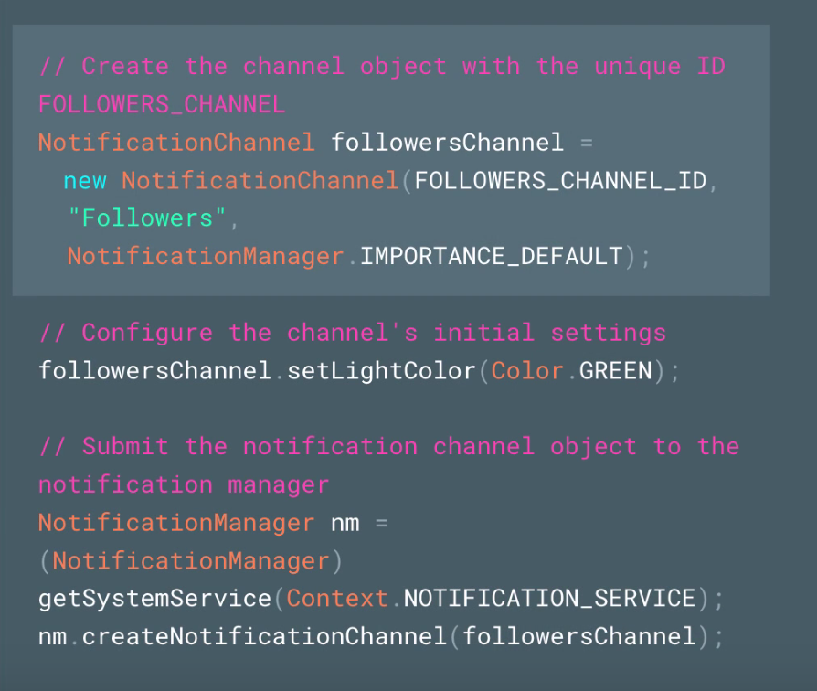

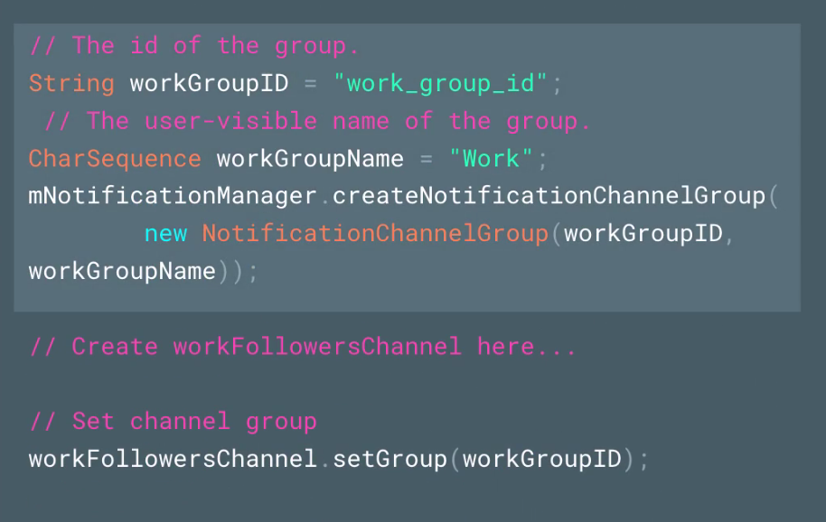

[Notification channel](https://developer.android.com/guide/topics/ui/notifiers/notifications.html#ManageChannels)

[Notification badge](https://developer.android.com/guide/topics/ui/notifiers/notifications.html#Badges)

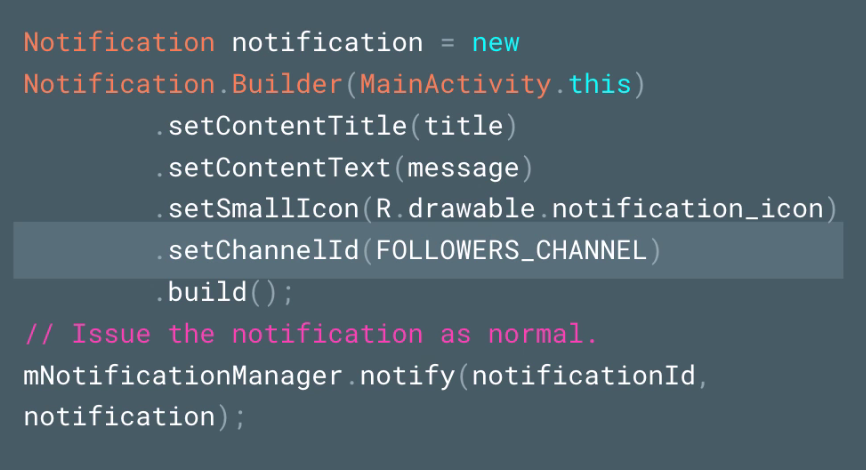

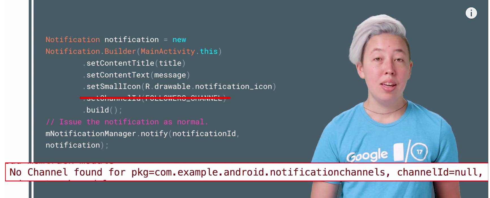

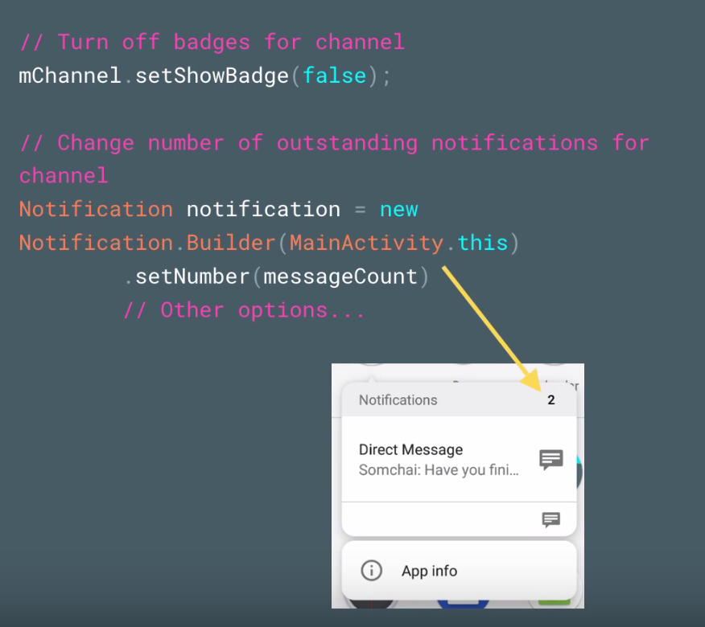

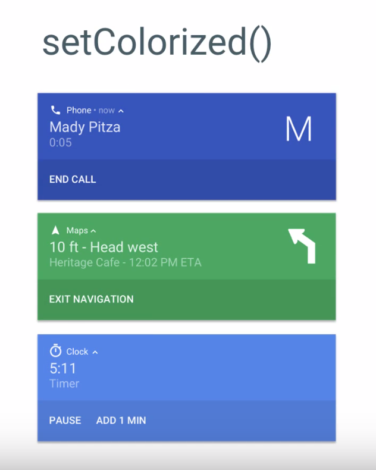

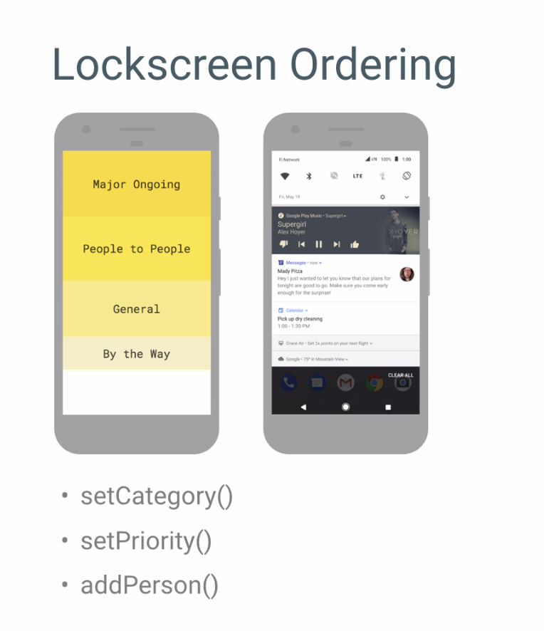

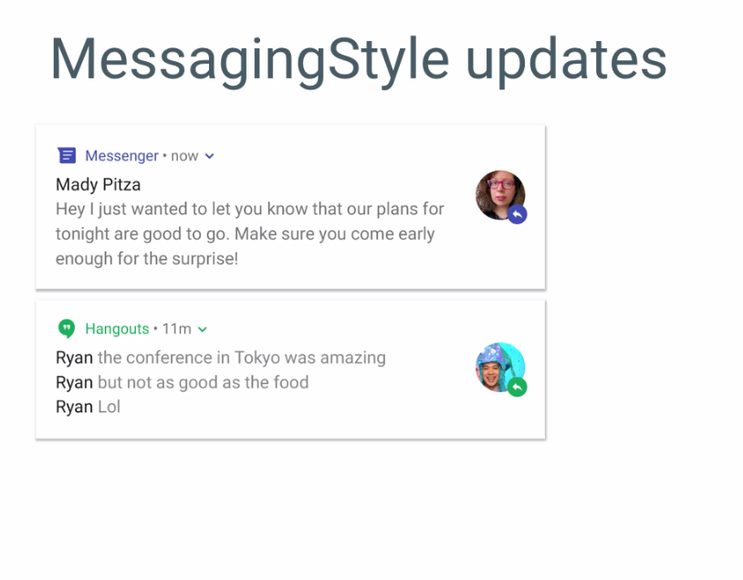

## Pending Intents

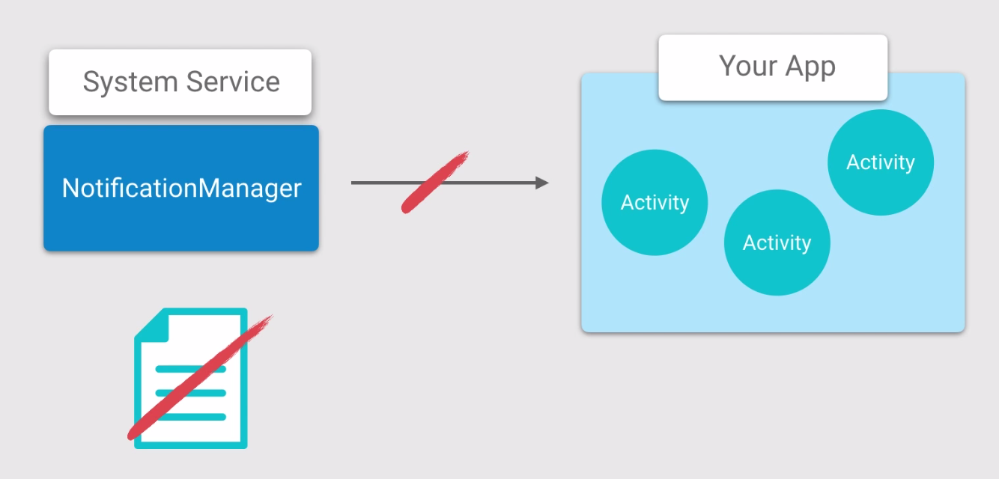

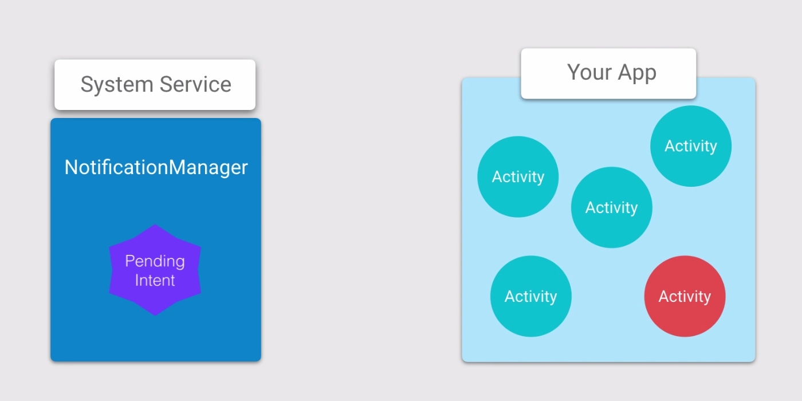

```java
PendingIntent.getService(context, ID, myIntent, FLAG_UPDATE_CURRENT);
```

## Notifications


- Here's more information on [Using Big View Styles](https://developer.android.com/training/notify-user/expanded.html)

- Another useful style is [Big Picture Style Notifications](https://developer.android.com/reference/android/app/Notification.BigPictureStyle.html)

In NotificationUtils class:
```java
// 1. Create a helper method called contentIntent with a single parameter for a Context. It
// should return a PendingIntent. This method will create the pending intent which will trigger when
// the notification is pressed. This pending intent should open up the MainActivity.
private static PendingIntent contentIntent(Context context) {
    // 2. Create an intent that opens up the MainActivity
    Intent startActivityIntent = new Intent(context, MainActivity.class);
    // 3. Create a PendingIntent using getActivity that:
    // - Take the context passed in as a parameter
    // - Takes an unique integer ID for the pending intent (you can create a constant for
    //   this integer above
    // - Takes the intent to open the MainActivity you just created; this is what is triggered
    //   when the notification is triggered
    // - Has the flag FLAG_UPDATE_CURRENT, so that if the intent is created again, keep the
    // intent but update the data
    return PendingIntent.getActivity(
            context,
            WATER_REMINDER_PENDING_INTENT_ID,
            startActivityIntent,
            PendingIntent.FLAG_UPDATE_CURRENT);
}

// 4.  Create a helper method called largeIcon which takes in a Context as a parameter and
// returns a Bitmap. This method is necessary to decode a bitmap needed for the notification.
private static Bitmap largeIcon(Context context) {
    // 5.  Get a Resources object from the context.
    Resources res = context.getResources();
    // 6.  Create and return a bitmap using BitmapFactory.decodeResource, passing in the
    // resources object and R.drawable.ic_local_drink_black_24px
    Bitmap largeIcon = BitmapFactory.decodeResource(res, R.drawable.ic_local_drink_black_24px);
    return largeIcon;
}

// 7.  Create a method called remindUserBecauseCharging which takes a Context.
// This method will create a notification for charging. It might be helpful
// to take a look at this guide to see an example of what the code in this method will look like:
// https://developer.android.com/training/notify-user/build-notification.html
public static void remindUserBecauseCharging(Context context) {
    // 8.  Get the NotificationManager using context.getSystemService
    NotificationManager notificationManager = (NotificationManager)
            context.getSystemService(Context.NOTIFICATION_SERVICE);
    // 9. Create a notification channel for Android O devices
    if (Build.VERSION.SDK_INT >= Build.VERSION_CODES.O) {
        NotificationChannel mChannel = new NotificationChannel(
                WATER_REMINDER_NOTIFICATION_CHANNEL_ID,
                context.getString(R.string.main_notification_channel_name),
                NotificationManager.IMPORTANCE_HIGH);
        notificationManager.createNotificationChannel(mChannel);
        }
    // 10.  In the remindUser method use NotificationCompat.Builder to create a notification
    // that:
    // - has a color of R.colorPrimary - use ContextCompat.getColor to get a compatible color
    // - has ic_drink_notification as the small icon
    // - uses icon returned by the largeIcon helper method as the large icon
    // - sets the title to the charging_reminder_notification_title String resource
    // - sets the text to the charging_reminder_notification_body String resource
    // - sets the style to NotificationCompat.BigTextStyle().bigText(text)
    // - sets the notification defaults to vibrate
    // - uses the content intent returned by the contentIntent helper method for the contentIntent
    // - automatically cancels the notification when the notification is clicked
    NotificationCompat.Builder notificationBuilder = new NotificationCompat.Builder(context,WATER_REMINDER_NOTIFICATION_CHANNEL_ID)
            .setColor(ContextCompat.getColor(context, R.color.colorPrimary))
            .setSmallIcon(R.drawable.ic_drink_notification)
            .setLargeIcon(largeIcon(context))
            .setContentTitle(context.getString(R.string.charging_reminder_notification_title))
            .setContentText(context.getString(R.string.charging_reminder_notification_body))
            .setStyle(new NotificationCompat.BigTextStyle().bigText(
                    context.getString(R.string.charging_reminder_notification_body)))
            .setDefaults(Notification.DEFAULT_VIBRATE)
            .setContentIntent(contentIntent(context))
            .setAutoCancel(true);

    // 11.  If the build version is greater than JELLY_BEAN and lower than OREO,
    // set the notification's priority to PRIORITY_HIGH.
    if (Build.VERSION.SDK_INT >= Build.VERSION_CODES.JELLY_BEAN
            && Build.VERSION.SDK_INT < Build.VERSION_CODES.O) {
        notificationBuilder.setPriority(NotificationCompat.PRIORITY_HIGH);
    }

    // 12. Trigger the notification by calling notify on the NotificationManager.
    // Pass in a unique ID of your choosing for the notification and notificationBuilder.build()
    notificationManager.notify(WATER_REMINDER_NOTIFICATION_ID, notificationBuilder.build());
}
```

In the AndroidManifest.xml, add the VIBRATE permission:
```xml
<uses-permission android:name="android.permission.VIBRATE" />
```

In activity_main.xml, add the button for testing notification:
```xml
<!-- 14. Add a button for testing your notification with an onClick method called testNotification -->
    <Button
        android:layout_width="wrap_content"
        android:layout_height="wrap_content"
        android:layout_gravity="center"
        android:onClick="testNotification"
android:text="Test Notification" />
```

In MainActivity:
```java
// 15. Create a method called testNotification that triggers NotificationUtils' remindUserBecauseCharging
    public void testNotification(View view) {
        NotificationUtils.remindUserBecauseCharging(this);
}
```

For performance sake, in AndroidManifest.xml, add launch mode:
```xml
<!-- 16.  Add the launch mode "single top" attribute to the MainActivity so that when you open
MainActivity using a notification, it will take you back to the already opened activity, not
generate a new one -->
<activity
    android:name=".MainActivity"
    android:launchMode="singleTop"
    android:screenOrientation="portrait">
    <intent-filter>
        <action android:name="android.intent.action.MAIN"/>

        <category android:name="android.intent.category.LAUNCHER"/>
    </intent-filter>
</activity>
``` 

## Notification Actions

To add actions to a notification, you call addAction as many as three time when creating the notification builder.

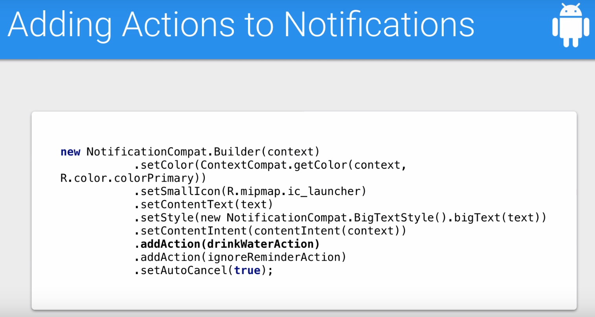

## Adding Actions to Notifications

In NotificationUtils class:
```java
//  1. Create a method to clear all notifications
    public static void clearAllNotifications(Context context) {
        NotificationManager notificationManager = (NotificationManager)
                context.getSystemService(Context.NOTIFICATION_SERVICE);
        notificationManager.cancelAll();
}
```

In ReminderTasks:
```java
//  2. Add a public static constant called ACTION_DISMISS_NOTIFICATION
public static final String ACTION_DISMISS_NOTIFICATION = "dismiss-notification";

public static void executeTask(Context context, String action) {
        if (ACTION_INCREMENT_WATER_COUNT.equals(action)) {
            incrementWaterCount(context);
        } else if (ACTION_DISMISS_NOTIFICATION.equals(action)) {
            NotificationUtils.clearAllNotifications(context);
        }
        // 3. If the user ignored the reminder, clear the notification
    }

private static void incrementWaterCount(Context context) {
    PreferenceUtilities.incrementWaterCount(context);
    // 4. If the water count was incremented, clear any notifications
    NotificationUtils.clearAllNotifications(context);
}
```

In NotificationsUtils, create two static helper methods that will create and return  the appropriate action instances for each button:
```java
//  5. Add a static method called ignoreReminderAction
    private static Action ignoreReminderAction(Context context) {
        // 6. Create an Intent to launch WaterReminderIntentService
        Intent ignoreReminderIntent = new Intent(context, WaterReminderIntentService.class);
        // 7. Set the action of the intent to designate you want to dismiss the notification
        ignoreReminderIntent.setAction(ReminderTasks.ACTION_DISMISS_NOTIFICATION);
        // 8. Create a PendingIntent from the intent to launch WaterReminderIntentService
        PendingIntent ignoreReminderPendingIntent = PendingIntent.getService(
                context,
                ACTION_IGNORE_PENDING_INTENT_ID,
                ignoreReminderIntent,
                PendingIntent.FLAG_UPDATE_CURRENT);
        // 9. Create an Action for the user to ignore the notification (and dismiss it)
        Action ignoreReminderAction = new Action(R.drawable.ic_cancel_black_24px,
                "No, thanks.",
                ignoreReminderPendingIntent);
        // 10 Return the action
        return ignoreReminderAction;
    }

    //  11. Add a static method called drinkWaterAction
    private static Action drinkWaterAction(Context context) {
        // 12. Create an Intent to launch WaterReminderIntentService
        Intent incrementWaterCountIntent = new Intent(context, WaterReminderIntentService.class);
        // 13. Set the action of the intent to designate you want to increment the water count
        incrementWaterCountIntent.setAction(ReminderTasks.ACTION_INCREMENT_WATER_COUNT);
        // 14. Create a PendingIntent from the intent to launch WaterReminderIntentService
        PendingIntent incrementWaterPendingIntent = PendingIntent.getService(
                context,
                ACTION_DRINK_PENDING_INTENT_ID,
                incrementWaterCountIntent,
                PendingIntent.FLAG_CANCEL_CURRENT);
        // 15. Create an Action for the user to tell us they've had a glass of water
        Action drinkWaterAction = new Action(R.drawable.ic_local_drink_black_24px,
                "I did it!",
                incrementWaterPendingIntent);
        // 16. Return the action
        return drinkWaterAction;
}

public static void remindUserBecauseCharging(Context context) {
        NotificationManager notificationManager = (NotificationManager)
                context.getSystemService(Context.NOTIFICATION_SERVICE);
        if (Build.VERSION.SDK_INT >= Build.VERSION_CODES.O) {
            NotificationChannel mChannel = new NotificationChannel(
                    WATER_REMINDER_NOTIFICATION_CHANNEL_ID,
                    context.getString(R.string.main_notification_channel_name),
                    NotificationManager.IMPORTANCE_HIGH);
            notificationManager.createNotificationChannel(mChannel);
            }
        NotificationCompat.Builder notificationBuilder = new NotificationCompat.Builder(context,WATER_REMINDER_NOTIFICATION_CHANNEL_ID)
                .setColor(ContextCompat.getColor(context, R.color.colorPrimary))
                .setSmallIcon(R.drawable.ic_drink_notification)
                .setLargeIcon(largeIcon(context))
                .setContentTitle(context.getString(R.string.charging_reminder_notification_title))
                .setContentText(context.getString(R.string.charging_reminder_notification_body))
                .setStyle(new NotificationCompat.BigTextStyle().bigText(
                        context.getString(R.string.charging_reminder_notification_body)))
                .setDefaults(Notification.DEFAULT_VIBRATE)
                .setContentIntent(contentIntent(context))
                // 17. Add the two new actions using the addAction method and your helper methods
                .addAction(drinkWaterAction(context))
                .addAction(ignoreReminderAction(context))
                .setAutoCancel(true);

        if (Build.VERSION.SDK_INT >= Build.VERSION_CODES.JELLY_BEAN
                && Build.VERSION.SDK_INT < Build.VERSION_CODES.O) {
            notificationBuilder.setPriority(NotificationCompat.PRIORITY_HIGH);
        }
        notificationManager.notify(WATER_REMINDER_NOTIFICATION_ID, notificationBuilder.build());
}
```

## Foreground Services
