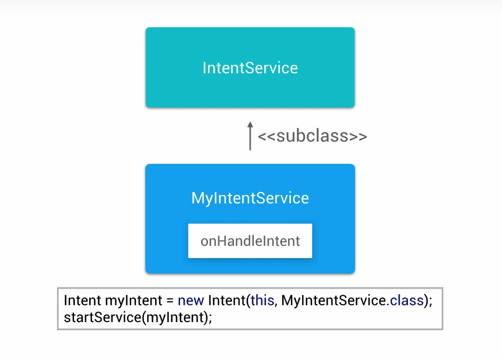

# Lesson 10 - Background Tasks

https://github.com/udacity/ud851-Exercises/tree/student/Lesson10-Hydration-Reminder

## Services

Great for things like processing loading and processing of data in the background.


## Services vs Loaders

### Loaders 

If the background task is loading information that will only be used in the activity, it's good candidate for a loader.

### Service

When the task that you are doing is decoupled from the user interface.


## Starting Services

[Bound Services](https://developer.android.com/guide/components/bound-services.html)


## Running Services in the Background


## Intent Services





## Starter Code

### Pluralization in Android

Part of Android’s robust resource framework involves a mechanism for pluralizing strings called “Quantity Strings”. In the **strings.xml** file for the Hydration Reminder app, you’ll see an example of how pluralization can be used:

```xml
<plurals name="charge_notification_count">
   <item quantity="zero">Hydrate while charging reminder sent %d times</item>
   <item quantity="one">Hydrate while charging reminder sent %d time</item>
   <item quantity="other">Hydrate while charging reminder sent %d times</item>
</plurals>
```

When you use the plural in code, you specify a quantity number. This number specifies what string should be used. In this case:

- if the number is zero, use ```<item quantity="zero">```
- If the number is one, use ```<item quantity="one">```
- otherwise use ```<item quantity="other">```

Then in the **MainActivity** we have the following Java code to generate the correct String:

```java
String formattedChargingReminders = getResources().getQuantityString(R.plurals.charge_notification_count, chargingReminders, chargingReminders);
```

The first usage of chargingReminder is the quantity number. It determines which version of the pluralized string to use (you must pass in a number). The second usage of chargingReminder is the number that’s actually inserted into the formatted string.

For more detail on Quantity Strings, check out the [documentation](https://developer.android.com/guide/topics/resources/string-resource.html#Plurals)

## Plan for Adding an IntentService


Steps to Implement the **IntentService**
- Create a new class that extends IntentService
- Override onHandleIntent
- Start the service using startService()

## Add an IntentService

In ReminderTasks class: 
```java
// 1. Create a class called ReminderTasks
public class ReminderTasks {

    // 2. Create a public static constant String called ACTION_INCREMENT_WATER_COUNT
    public static final String ACTION_INCREMENT_WATER_COUNT = "increment-water-count";

    //  6. Create a public static void method called executeTask
    //  7. Add a Context called context and String parameter called action to the parameter list
    public static void executeTask(Context context, String action) {
        // 8. If the action equals ACTION_INCREMENT_WATER_COUNT, 
        // call this class's incrementWaterCount
        if (ACTION_INCREMENT_WATER_COUNT.equals(action)) {
            incrementWaterCount(context);
        }
    }

    // 3. Create a private static void method called incrementWaterCount
    // 4. Add a Context called context to the argument list
    private static void incrementWaterCount(Context context) {
    // 5. From incrementWaterCount, call the PreferenceUtility method 
    // that will ultimately update the water count
        PreferenceUtilities.incrementWaterCount(context);
    }
}
```

In WaterReminderIntentService class :
```java
/**
 * An {@link IntentService} subclass for handling asynchronous task requests in
 * a service on a separate handler thread.
 */
// 9. Create WaterReminderIntentService and extend it from IntentService
public class WaterReminderIntentService extends IntentService {

    // 10. Create a default constructor that calls super with the name of this class
    public WaterReminderIntentService() {
        super("WaterReminderIntentService");
    }

    // 11. Override onHandleIntent
    @Override
    protected void onHandleIntent(Intent intent) {
        // 12. Get the action from the Intent that started this Service
        String action = intent.getAction();

        // 13. Call ReminderTasks.executeTask and pass in the action to be performed
        ReminderTasks.executeTask(this, action);
    }
}
```

In AndroidManifest.xml : 
```xml
</activity>
    <!-- 14. Declare WaterReminderIntentService in the Manifest and set the exported
        attribute to false (it controls wether other applications can access the service)-->
    <!--This is required for immediate syncs -->
    <service
        android:name=".sync.WaterReminderIntentService"
        android:exported="false"/>
 </application>
```

In MainActivity : 
```java
/**
* Adds one to the water count and shows a toast
*/
public void incrementWater(View view) {
    if (mToast != null) mToast.cancel();
    mToast = Toast.makeText(this, R.string.water_chug_toast, Toast.LENGTH_SHORT);
    mToast.show();

    // 15. Create an explicit intent for WaterReminderIntentService
    Intent incrementWaterCountIntent = new Intent(this, WaterReminderIntentService.class);
    // 16. Set the action of the intent to ACTION_INCREMENT_WATER_COUNT
    incrementWaterCountIntent.setAction(ReminderTasks.ACTION_INCREMENT_WATER_COUNT);
    // 17. Call startService and pass the explicit intent you just created
    startService(incrementWaterCountIntent);

}
```