# Lesson 11 - Completing the UI

## Views & View Group

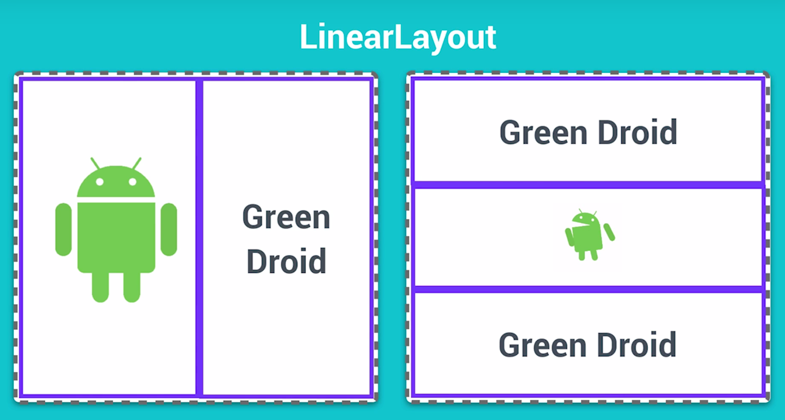

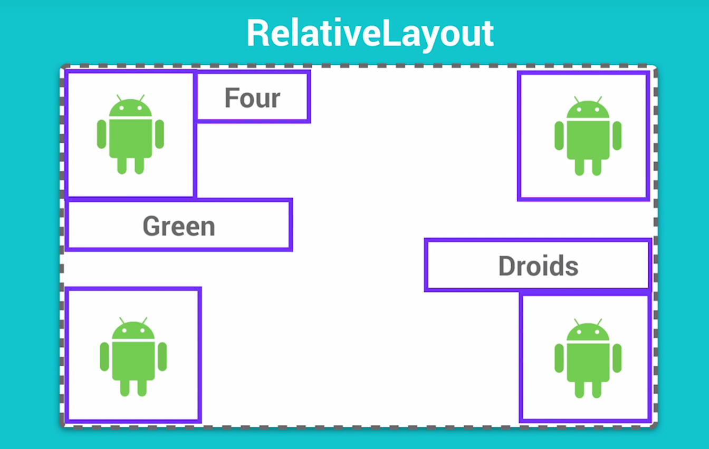

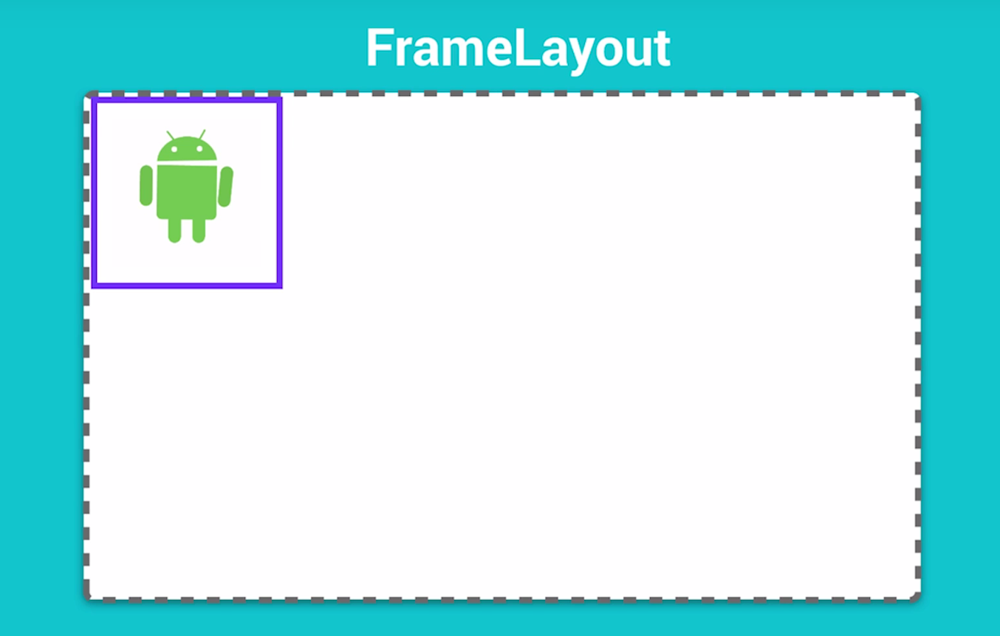

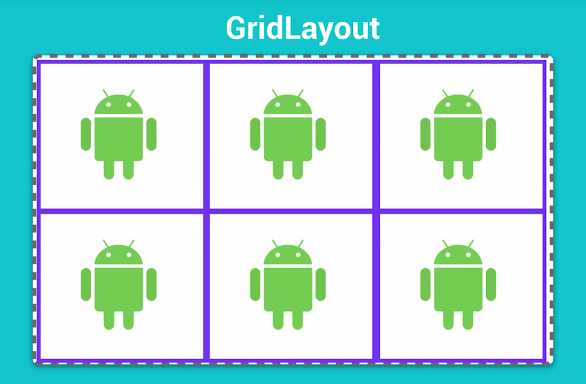

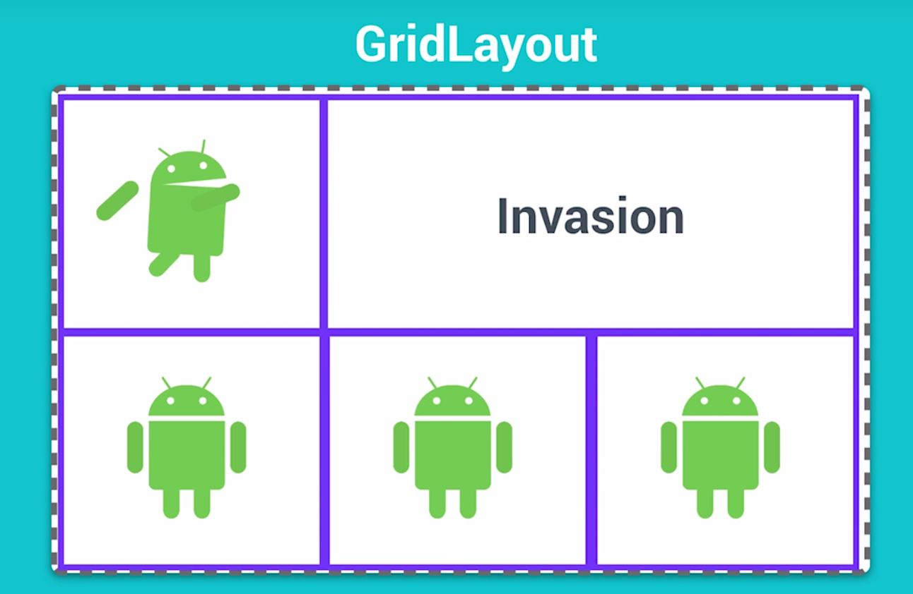

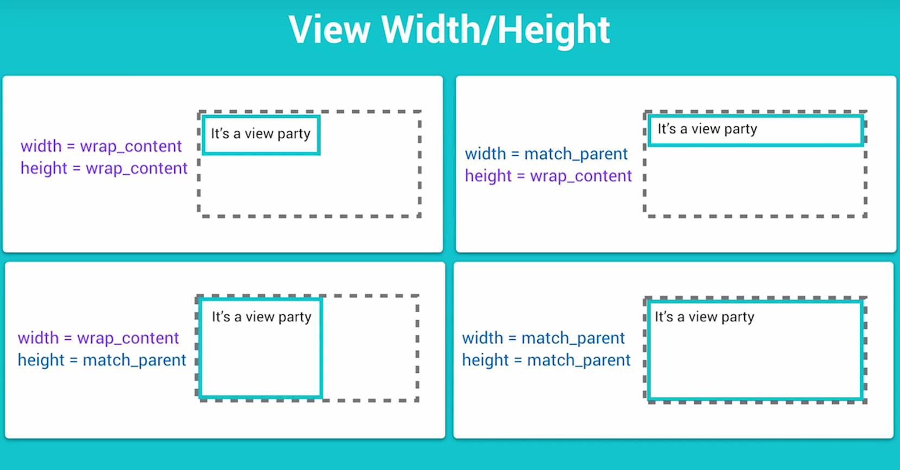

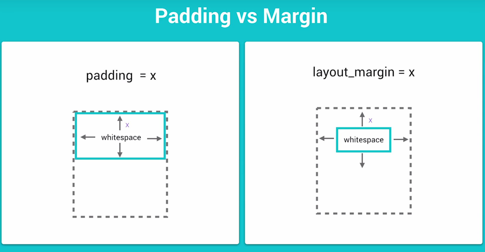

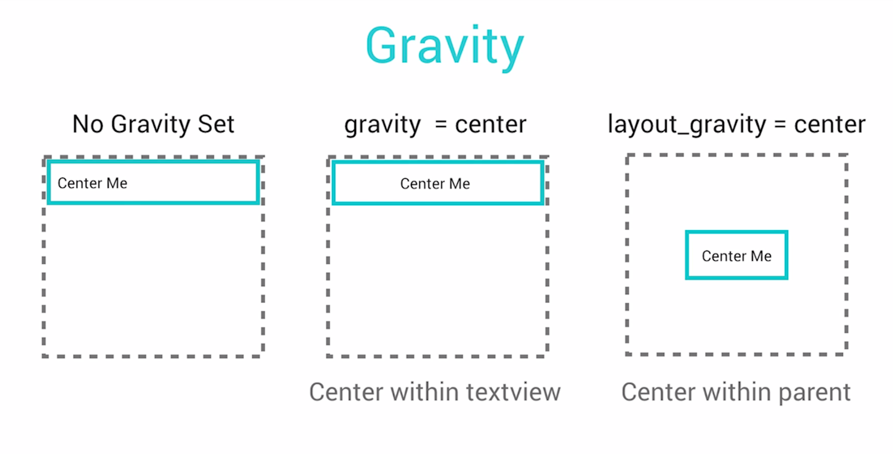

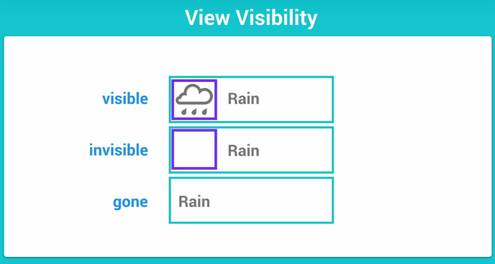

## Constraint Layout

Constraint Layout allows to create a complex layout without having to nest view group inside each other.

It's very similar to a relative layout in that older views are laid out relative to each other, or to the parent layout itself.

## Installing the Constraint Layout Library

To continue building the Boarding Pass app, you'll need to make sure you have the latest Constraint Layout library. To ensure you have the latest Constraint Layout library:

1. Click **Tools** > **Android** > **SDK Manager**.
2. Click the **SDK Tools** tab.
3. Expand **Support Repository** and then check **ConstraintLayout for Android** and **Solver for ConstraintLayout**. Check **Show Package Details** and take note of the version you're downloading (you'll need this below).
4. Click OK.
5. Add the **ConstraintLayout** library as a dependency in your module-level **build.gradle** file:

```
dependencies {
    compile 'com.android.support.constraint:constraint-layout:1.0.0-beta4'
}
```

6. The library version you download may be higher, so be sure the value you specify here matches the version from step 3.
7. In the toolbar or sync notification, click **Sync Project with Gradle Files**.
8. Now you're ready to build your layout with **ConstraintLayout**.

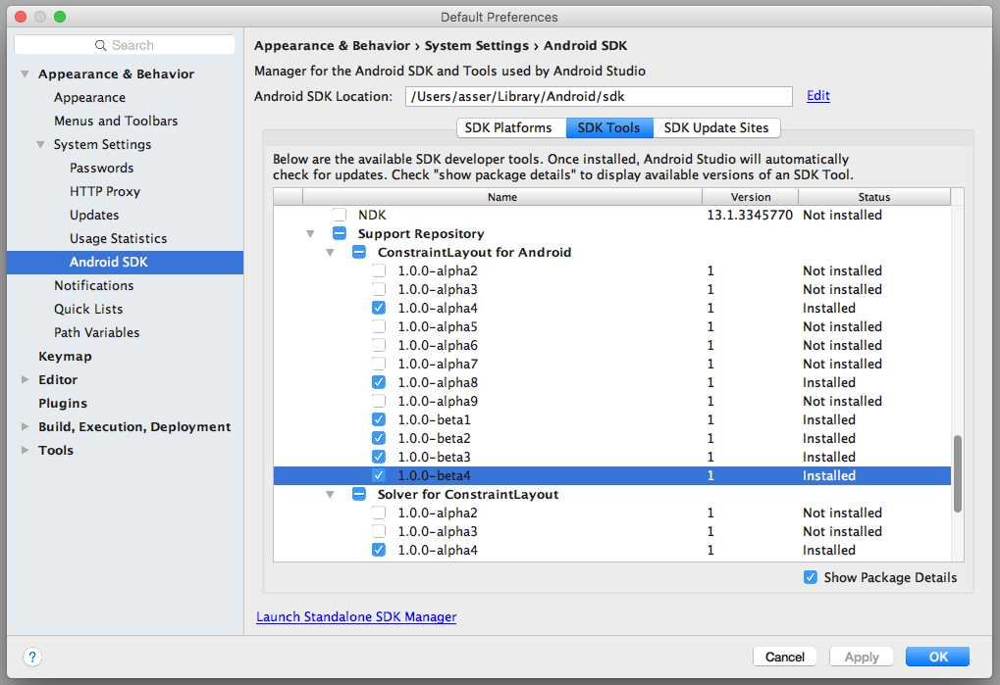

## Design the Boarding Pass

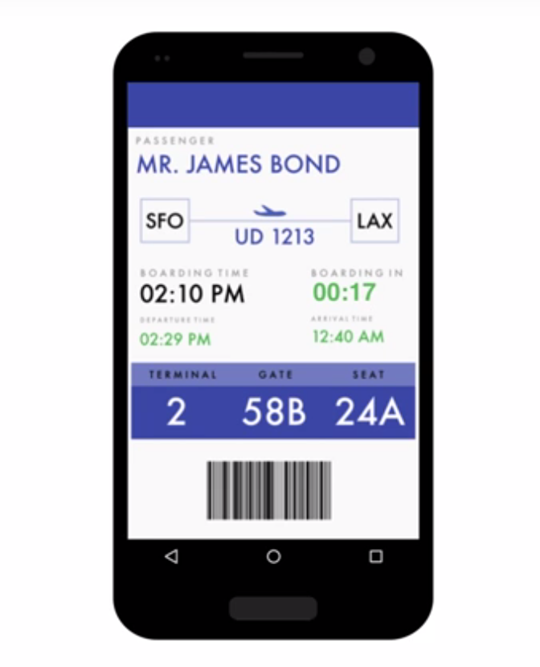

In build.gradle:
```
// 1.  Add the compile dependency for the constraint layout support library
compile 'com.android.support.constraint:constraint-layout:1.0.0-beta4'
```

In activity_main.xml:
```xml
<?xml version="1.0" encoding="utf-8"?>
<!-- 17. Surround the Constraint layout with a ScrollView -->
<ScrollView xmlns:app="http://schemas.android.com/apk/res-auto"
    xmlns:tools="http://schemas.android.com/tools"
    xmlns:android="http://schemas.android.com/apk/res/android"
    android:id="@+id/scroll"
    android:layout_width="match_parent"
    android:layout_height="wrap_content">

    <!-- 2. Replace the Relative layout with a ConstraintLayout -->
    <android.support.constraint.ConstraintLayout
        android:orientation="vertical"
        android:layout_width="match_parent"
        android:layout_height="match_parent">


        <!-- 3. Create a TextView for the Passenger label and name -->
        <TextView
            android:text="@string/passenger_label"
            android:layout_width="wrap_content"
            android:layout_height="wrap_content"
            android:id="@+id/textViewPassengerLabel"
            android:textAppearance="@style/TextAppearance.AppCompat.Caption"
            android:letterSpacing="0.5"
            app:layout_constraintLeft_toLeftOf="parent"
            app:layout_constraintTop_toTopOf="parent"
            android:layout_marginStart="16dp"
            android:layout_marginTop="16dp"
            android:layout_marginLeft="16dp"
            tools:layout_constraintTop_creator="1"
            tools:layout_constraintLeft_creator="1" />

        <!-- 4. Use tool:text to set the text value -->
        <TextView
            tools:text="@string/passenger_name"
            android:layout_width="wrap_content"
            android:layout_height="wrap_content"
            android:id="@+id/textViewPassengerName"
            android:textAppearance="@style/TextAppearance.AppCompat.Display1"
            android:textColor="@color/colorPrimary"
            app:layout_constraintTop_toBottomOf="@+id/textViewPassengerLabel"
            android:layout_marginStart="16dp"
            app:layout_constraintLeft_toLeftOf="parent"
            android:layout_marginLeft="16dp"
            tools:layout_constraintTop_creator="1" />


        <!-- 5. Create an ImageView for the left rectangle -->
        <!-- 6. Set the background to the shape_rectangle_stroke drawable -->
        <ImageView
            android:id="@+id/leftRectangle"
            android:layout_width="60dp"
            android:layout_height="80dp"
            android:background="@drawable/shape_rectangle_stroke"
            app:layout_constraintLeft_toLeftOf="parent"
            app:layout_constraintTop_toBottomOf="@id/textViewPassengerName"
            android:layout_marginLeft="32dp"
            android:layout_marginTop="16dp"
            android:layout_marginStart="32dp" />

        <!-- 7. Create an ImageView for the divider -->
        <ImageView
            android:id="@+id/divider"
            android:background="@color/colorPrimaryLight"
            android:layout_height="1dp"
            android:layout_width="0dp"
            app:layout_constraintLeft_toRightOf="@+id/leftRectangle"
            app:layout_constraintRight_toLeftOf="@+id/rightRectangle"
            app:layout_constraintTop_toBottomOf="@+id/rightRectangle"
            app:layout_constraintBottom_toTopOf="@+id/rightRectangle"
            app:layout_constraintHorizontal_bias="0.0"/>

        <!-- 8. Create an ImageView for the rightRectangle -->
        <ImageView
            android:id="@+id/rightRectangle"
            android:layout_width="60dp"
            android:layout_height="80dp"
            android:background="@drawable/shape_rectangle_stroke"
            app:layout_constraintRight_toRightOf="parent"
            app:layout_constraintTop_toBottomOf="@id/textViewPassengerName"
            android:layout_marginRight="32dp"
            android:layout_marginTop="16dp"
            android:layout_marginEnd="32dp" />

        <!-- 9. Create a TextView for the origin code, the destination code and the flight code -->
        <TextView
            tools:text="@string/origin_code"
            android:layout_width="wrap_content"
            android:layout_height="wrap_content"
            android:id="@+id/textViewOriginAirport"
            android:textAppearance="@style/TextAppearance.AppCompat.Headline"
            app:layout_constraintBottom_toBottomOf="@+id/divider"
            app:layout_constraintRight_toRightOf="@+id/leftRectangle"
            app:layout_constraintTop_toBottomOf="@+id/divider"
            app:layout_constraintLeft_toLeftOf="@+id/leftRectangle" />

        <TextView
            tools:text="@string/destination_code"
            android:layout_width="wrap_content"
            android:layout_height="wrap_content"
            android:id="@+id/textViewDestinationAirport"
            android:textAppearance="@style/TextAppearance.AppCompat.Headline"
            app:layout_constraintBottom_toBottomOf="@+id/divider"
            app:layout_constraintRight_toRightOf="@+id/rightRectangle"
            app:layout_constraintTop_toBottomOf="@+id/divider"
            app:layout_constraintLeft_toLeftOf="@+id/rightRectangle" />

        <!-- 15. Import the plane image SVG file into the drawable directory and name it art_plane -->
        <!-- 16. Create an ImageView for the plane and set the background to art_plane drawable -->
        <ImageView
            android:id="@+id/imagePlane"
            android:layout_height="wrap_content"
            android:layout_width="wrap_content"
            android:background="@drawable/art_plane"
            app:layout_constraintBottom_toTopOf="@+id/divider"
            app:layout_constraintLeft_toRightOf="@+id/leftRectangle"
            app:layout_constraintRight_toLeftOf="@+id/rightRectangle"
            android:layout_marginBottom="16dp"
            />


        <TextView
            android:id="@+id/textViewFlightCode"
            tools:text="@string/flight_code"
            android:layout_width="wrap_content"
            android:layout_height="wrap_content"
            android:textAppearance="@style/TextAppearance.AppCompat.Display1"
            android:textColor="@color/colorPrimary"

            app:layout_constraintTop_toTopOf="@+id/divider"
            app:layout_constraintLeft_toRightOf="@+id/leftRectangle"
            app:layout_constraintRight_toLeftOf="@+id/rightRectangle"
            android:layout_marginTop="8dp"
            android:layout_marginStart="8dp"
            android:layout_marginEnd="8dp"
            android:layout_marginLeft="8dp"
            android:layout_marginRight="8dp" />


        <!-- 10. Create a TextView for the time texts and their corresponding labels -->
        <TextView
            android:id="@+id/textViewBoardingTimeLabel"
            android:text="@string/boarding_time_label"
            android:layout_width="wrap_content"
            android:layout_height="wrap_content"
            android:textAppearance="@style/TextAppearance.AppCompat.Caption"
            android:letterSpacing="0.3"
            app:layout_constraintLeft_toLeftOf="parent"
            app:layout_constraintTop_toBottomOf="@+id/leftRectangle"
            android:layout_marginTop="16dp"
            android:layout_marginStart="16dp"
            android:layout_marginLeft="16dp" />


        <TextView
            android:id="@+id/textViewBoardingTime"
            tools:text="@string/boarding_time"
            android:layout_width="wrap_content"
            android:layout_height="wrap_content"
            android:textAppearance="@style/TextAppearance.AppCompat.Display1"
            android:textColor="@android:color/black"
            app:layout_constraintLeft_toLeftOf="@+id/textViewBoardingTimeLabel"
            app:layout_constraintTop_toBottomOf="@+id/textViewBoardingTimeLabel" />


        <TextView
            android:id="@+id/textViewDepartureTimeLabel"
            android:text="@string/departure_time_label"
            android:layout_width="wrap_content"
            android:layout_height="wrap_content"
            android:textAppearance="@style/TextAppearance.AppCompat.Caption"
            android:letterSpacing="0.3"
            android:layout_marginTop="8dp"
            app:layout_constraintTop_toBottomOf="@+id/textViewBoardingTime"
            app:layout_constraintLeft_toLeftOf="@+id/textViewBoardingTime" />


        <TextView
            android:id="@+id/textViewDepartureTime"
            tools:text="@string/departure_time"
            android:layout_width="wrap_content"
            android:layout_height="wrap_content"
            android:textAppearance="@style/TextAppearance.AppCompat.Headline"
            android:textColor="@color/colorGood"
            app:layout_constraintLeft_toLeftOf="@+id/textViewDepartureTimeLabel"
            app:layout_constraintTop_toBottomOf="@+id/textViewDepartureTimeLabel" />


        <TextView
            android:id="@+id/textViewBoardingInTimeLabel"
            android:text="@string/boarding_in_label"
            android:layout_width="wrap_content"
            android:layout_height="wrap_content"
            android:textAppearance="@style/TextAppearance.AppCompat.Caption"
            android:letterSpacing="0.3"
            android:layout_marginEnd="40dp"
            app:layout_constraintRight_toRightOf="parent"
            app:layout_constraintTop_toBottomOf="@+id/leftRectangle"
            android:layout_marginTop="16dp"
            android:layout_marginRight="40dp" />


        <TextView
            android:id="@+id/textViewBoardingInCountdown"
            tools:text="@string/boarding_in_time"
            android:layout_width="wrap_content"
            android:layout_height="wrap_content"
            android:textAppearance="@style/TextAppearance.AppCompat.Display1"
            android:textColor="@color/colorBad"
            app:layout_constraintLeft_toLeftOf="@+id/textViewBoardingInTimeLabel"
            app:layout_constraintTop_toBottomOf="@+id/textViewBoardingInTimeLabel" />


        <TextView
            android:id="@+id/textViewArrivalTimeLabel"
            android:text="@string/arrival_time_label"
            android:layout_width="wrap_content"
            android:layout_height="wrap_content"
            android:textAppearance="@style/TextAppearance.AppCompat.Caption"
            android:letterSpacing="0.3"
            app:layout_constraintTop_toBottomOf="@+id/textViewBoardingInCountdown"
            app:layout_constraintLeft_toLeftOf="@+id/textViewBoardingInCountdown"
            android:layout_marginTop="8dp"/>


        <TextView
            android:id="@+id/textViewArrivalTime"
            tools:text="@string/arrival_time"
            android:layout_width="wrap_content"
            android:layout_height="wrap_content"
            android:textAppearance="@style/TextAppearance.AppCompat.Headline"
            android:textColor="@color/colorGood"
            app:layout_constraintLeft_toLeftOf="@+id/textViewArrivalTimeLabel"
            app:layout_constraintTop_toBottomOf="@+id/textViewArrivalTimeLabel" />

        <!-- 11. Create an ImageView for the blue table's header -->
        <ImageView
            android:id="@+id/tableHeaderImage"
            android:background="@color/colorPrimaryLight"
            android:layout_height="24dp"
            android:layout_width="0dp"
            app:layout_constraintLeft_toLeftOf="parent"
            app:layout_constraintRight_toRightOf="parent"
            android:layout_marginTop="32dp"
            android:layout_marginLeft="16dp"
            android:layout_marginRight="16dp"
            app:layout_constraintTop_toBottomOf="@+id/textViewDepartureTime"
            app:layout_constraintHorizontal_bias="0.33" />

        <!-- 12. Create an ImageView for the blue table's body -->
        <ImageView
            android:id="@+id/tableImage"
            android:background="@color/colorPrimary"
            android:layout_height="0dp"
            android:layout_width="0dp"
            android:layout_marginLeft="16dp"
            android:layout_marginRight="16dp"
            app:layout_constraintLeft_toLeftOf="parent"
            app:layout_constraintRight_toRightOf="parent"
            app:layout_constraintTop_toBottomOf="@+id/tableHeaderImage"
            app:layout_constraintBottom_toBottomOf="@+id/textViewTerminal"/>


        <!-- 13. Create a TextView for each of the labels and text fields in the blue table -->
        <TextView
            android:id="@+id/textViewTerminalLabel"
            android:text="@string/terminal_label"
            android:layout_width="wrap_content"
            android:layout_height="wrap_content"
            android:textAppearance="@style/TextAppearance.AppCompat.Caption"
            android:textColor="@android:color/black"
            app:layout_constraintBottom_toBottomOf="@+id/tableHeaderImage"
            app:layout_constraintLeft_toLeftOf="@+id/textViewTerminal"
            app:layout_constraintRight_toRightOf="@+id/textViewTerminal"

            app:layout_constraintTop_toTopOf="@+id/tableHeaderImage" />

        <TextView
            android:id="@+id/textViewGateLabel"
            android:text="@string/gate_label"
            android:layout_width="wrap_content"
            android:layout_height="wrap_content"
            android:textAppearance="@style/TextAppearance.AppCompat.Caption"
            android:textColor="@android:color/black"
            app:layout_constraintBottom_toBottomOf="@+id/tableHeaderImage"
            app:layout_constraintLeft_toLeftOf="@+id/textViewGate"
            app:layout_constraintRight_toRightOf="@+id/textViewGate"
            app:layout_constraintTop_toTopOf="@+id/tableHeaderImage"
            />

        <TextView
            android:id="@+id/textViewSeatLabel"
            android:text="@string/seat_label"
            android:layout_width="wrap_content"
            android:layout_height="wrap_content"
            android:textAppearance="@style/TextAppearance.AppCompat.Caption"
            android:textColor="@android:color/black"
            app:layout_constraintBottom_toBottomOf="@+id/tableHeaderImage"
            app:layout_constraintRight_toRightOf="@+id/textViewSeat"
            app:layout_constraintLeft_toLeftOf="@+id/textViewSeat"
            app:layout_constraintTop_toTopOf="@+id/tableHeaderImage"
            />

        <TextView
            tools:text="@string/terminal"
            android:layout_width="120dp"
            android:layout_height="wrap_content"
            android:id="@+id/textViewTerminal"
            app:layout_constraintTop_toTopOf="@+id/tableImage"
            app:layout_constraintLeft_toLeftOf="@+id/tableImage"
            app:layout_constraintRight_toRightOf="@+id/tableImage"
            android:textAppearance="@style/TextAppearance.AppCompat.Display2"
            android:textColor="@android:color/white"
            app:layout_constraintHorizontal_bias="0.0"
            android:textAlignment="center" />


        <TextView
            android:id="@+id/textViewGate"
            tools:text="@string/gate"
            android:layout_width="120dp"
            android:layout_height="0dp"
            app:layout_constraintLeft_toLeftOf="@+id/tableImage"
            app:layout_constraintRight_toRightOf="@+id/tableImage"
            android:textAppearance="@style/TextAppearance.AppCompat.Display2"
            android:textColor="@android:color/white"
            android:textAlignment="center"
            app:layout_constraintTop_toBottomOf="@+id/tableHeaderImage"
            app:layout_constraintBottom_toBottomOf="@+id/tableImage"/>

        <TextView
            android:id="@+id/textViewSeat"
            tools:text="@string/seat"
            android:layout_height="wrap_content"
            app:layout_constraintTop_toTopOf="@+id/tableImage"
            app:layout_constraintLeft_toLeftOf="@+id/tableImage"
            app:layout_constraintRight_toRightOf="@+id/tableImage"
            android:textAppearance="@style/TextAppearance.AppCompat.Display2"
            android:textColor="@android:color/white"
            app:layout_constraintHorizontal_bias="1.0"
            android:textAlignment="center"
            android:layout_width="120dp" />

        <!-- 14.Create an ImageView for the barcode -->
        <ImageView
            android:layout_width="100dp"
            android:layout_height="100dp"
            app:srcCompat="@mipmap/barcode"
            android:id="@+id/barcode"
            app:layout_constraintRight_toRightOf="parent"
            app:layout_constraintLeft_toLeftOf="parent"
            app:layout_constraintTop_toBottomOf="@+id/tableImage"
            android:layout_marginTop="16dp"
            />

    </android.support.constraint.ConstraintLayout>
</ScrollView>
```

## The Hierarchy Viewer

- Select Tools > Android > Android device Monitor.
- Then select Windows > Open Perspective.
- Finally, select Hierarchy View > OK.
- Click on the activity (on the left).

The hierarchy viewer builds a tree of all the views and view groups you have in any layout.

If the views aren't nested, it becomes super fast to load.

Too many views in a layout, nested or not, may still affect the display performance.

That's why it's always a good ideato break down your design in multiple screens, if you seems to be using too many views in one screen.

A general rule of thumbs is to have a maximum of 80 views in a single layout and never more then 10 nested view groups.

## Data Binding

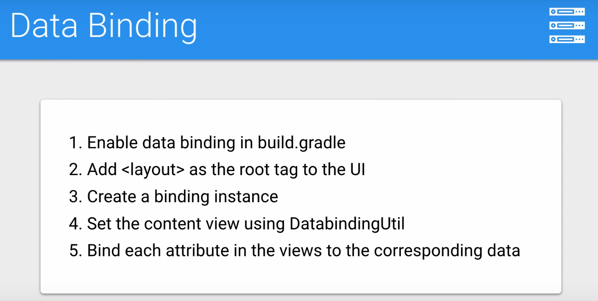

Enable Data Binding in build.gradle, inside the Android section:
```
dataBinding{
    enabled = true
}
```
In activity_main.xml, surround the **ScrollView** tag with the **layout** tag:
```xml
<layout xmlns:app="http://schemas.android.com/apk/res-auto"
    xmlns:tools="http://schemas.android.com/tools"
xmlns:android="http://schemas.android.com/apk/res/android">
<ScrollView
    android:id="@+id/scroll"
    android:layout_width="match_parent"
android:layout_height="wrap_content">
...
</ScrollView>
</layout>
```

In MainActivity : 
```java
// 3. Create a data binding instance called mBinding of type ActivityMainBinding
ActivityMainBinding mBinding;

@Override
protected void onCreate(Bundle savedInstanceState) {
    super.onCreate(savedInstanceState);
    setContentView(R.layout.activity_main);


    // 4. Set the Content View using DataBindingUtil to the activity_main layout
    /*
    * DataBindUtil.setContentView replaces our normal call of setContent view.
    * DataBindingUtil also created our ActivityMainBinding that we will eventually use to
    * display all of our data.
    */
    mBinding = DataBindingUtil.setContentView(this, R.layout.activity_main);
    // 5. Load a BoardingPassInfo object with fake data using FakeDataUtils
    BoardingPassInfo fakeBoardingInfo = FakeDataUtils.generateFakeBoardingPassInfo();
    // 9. Call displayBoardingPassInfo and pass the fake BoardingInfo instance
    displayBoardingPassInfo(fakeBoardingInfo);
}

private void displayBoardingPassInfo(BoardingPassInfo info) {

    // 6. Use mBinding to set the Text in all the textViews using the data in info
    mBinding.textViewPassengerName.setText(info.passengerName);
    mBinding.textViewOriginAirport.setText(info.originCode);
    mBinding.textViewFlightCode.setText(info.flightCode);
    mBinding.textViewDestinationAirport.setText(info.destCode);

    // 7. Use a SimpleDateFormat formatter to set the formatted value in time text views
    SimpleDateFormat formatter = new SimpleDateFormat(getString(R.string.timeFormat), Locale.getDefault());
    String boardingTime = formatter.format(info.boardingTime);
    String departureTime = formatter.format(info.departureTime);
    String arrivalTime = formatter.format(info.arrivalTime);

    mBinding.textViewBoardingTime.setText(boardingTime);
    mBinding.textViewDepartureTime.setText(departureTime);
    mBinding.textViewArrivalTime.setText(arrivalTime);

    // 8. Use TimeUnit methods to format the total minutes until boarding
    long totalMinutesUntilBoarding = info.getMinutesUntilBoarding();
    long hoursUntilBoarding = TimeUnit.MINUTES.toHours(totalMinutesUntilBoarding);
    long minutesLessHoursUntilBoarding =
            totalMinutesUntilBoarding - TimeUnit.HOURS.toMinutes(hoursUntilBoarding);

    String hoursAndMinutesUntilBoarding = getString(R.string.countDownFormat,
            hoursUntilBoarding,
            minutesLessHoursUntilBoarding);

    mBinding.textViewBoardingInCountdown.setText(hoursAndMinutesUntilBoarding);
    mBinding.textViewTerminal.setText(info.departureTerminal);
    mBinding.textViewGate.setText(info.departureGate);
    mBinding.textViewSeat.setText(info.seatNumber);
}

```
## Accessibility

**Accessibility** refers to the design of products, devices, services, or environments for people who experience disabilities. Android provides accessibility features like

- **TalkBack** which is a pre-installed screen reader service provided by Google. It uses spoken feedback to describe the results of actions such as launching an app, and events such as notifications.
- **Explore by Touch** which is a system feature that works with TalkBack, allowing you to touch your device's screen and hear what's under your finger via spoken feedback. This feature is helpful to users with low vision.
- **Accessibility settings** that let you modify your device's display and sound options, such as increasing the text size, changing the speed at which text is spoken, and more. and more.

To take full advantage of those features, you should follow this checklist listed [here](https://developer.android.com/guide/topics/ui/accessibility/apps.html#recommendations) from the android developer website, but let’s focus on the first one for now which is the most important.

### Describe user interface controls

If you look at our layout design for the boarding pass, you can immediately tell that our origin airport is JFK and the destination airport is DCA, simply because of their relative location on the screen and the direction of the plane. But if you cannot see this layout due to a visual limitation, simply having android read out everything on the screen won’t tell you enough information about which is which.

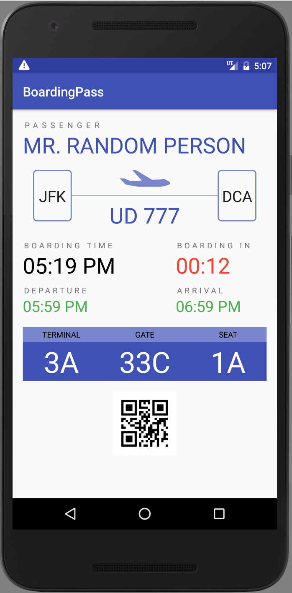

That’s why Android offers the **contentDescription** attribute to describe what any view actually presents, this description text is not displayed anywhere on the screen, but if the user enables accessibility services that provide audible prompts, then when the user navigates to that control, the text is spoken.

```xml
<ImageView android:contentDescription="@string/origin_label"/>
```

Ideally, in any app, you would want to describe all ImageViews, ImageButtons and all Checkboxes using the **contentDescription** attribute.

ContentDescription is just one of many things you need to consider when building your app for accessibility, others include:

- **Enable focus-based navigation** which makes sure users can navigate your screen layouts using external hardware like bluetooth keyboards.
- **No audio-only feedback** which guarantees any audio feedback to always have a secondary feedback mechanism to support users who are deaf or hard of hearing

For the full check list and best practices follow this link: [Accessibility Developer Checklist](https://developer.android.com/guide/topics/ui/accessibility/apps.html#recommendations)

## Localization

**Localization** (also known as **Internationalization**) is the adaptation of a product or service to meet the needs of a particular language, culture or desired population's "look-and-feel".

### I. Translation:

You should always design your app in a way that can be easily translated to other languages. To do so, any text that you would expect to be translated like labels and titles and button descriptions should all be defined as a string resource in **res/values/strings.xml**

This allows you to create other versions of **strings.xml** for other languages. This is done by creating a new **values** folder with the pattern **value-xx** where **xx** can be the abbreviation of any language from the ISO 639 code list [here](https://www.loc.gov/standards/iso639-2/php/code_list.php), for example **res/values-fr/strings.xml** will contain the french version of the strings.xml file with all the strings translated from the default language to french.

This way, when a user who has set up their phone to use french as the default language, android will automatically load the french version of strings and use all the pre-translated french labels.

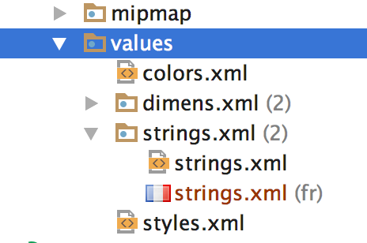

Sometimes however, you would still want to use the strings recourses for strings that you don't intend to translate, this includes strings representing identifiers for views or variable names os string formats etc.

For those strings, there's an attribute called **translatable** that can be set to false to indicate that this string recourse should not be translated.

```xml
<string name="timeFormat" translatable="false">hh:mm a</string>
```

### II. RTL support

If you’re distributing to countries where right-to-left (RTL) scripts are used (like Arabic or Hebrew), you should consider implementing support for RTL layouts and text display and editing, to the extent possible.

You've already seen how to set image recourses to flip when RTL support activated to indicate the correct direction of travel using

```xml
<vector android:autoMirrored="true"> </vector>
```

Another set of attributes related to RTL support are the

```xml
android:layout_marginStart
android:layout_marginEnd
```

that correspond to

```xml
android:layout_marginLeft
android:layout_marginRight
```

respectively, but only when the default language is English (or any LTR language), for RTL languages however, **Start** is mapped to **Right** and **End** is mapped to **Left** instead, the idea is that when the app runs on a device with a default RTL language , everything will get mirrored by switching margins and constraints to the other side.

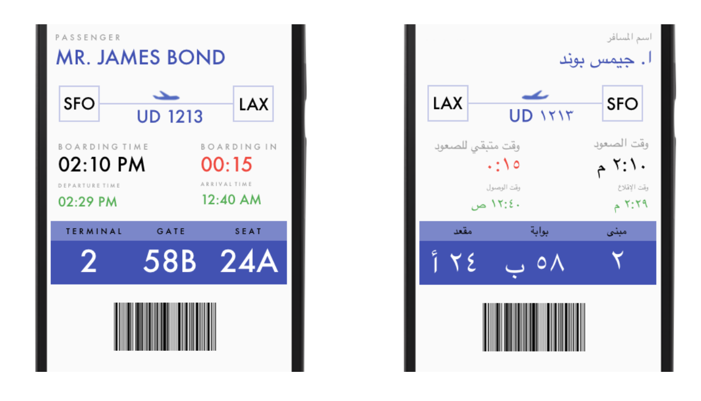

Keep in mind that these Start and End attributes are relatively new, so to support older devices (prior to 4.1) you should still backup the Start and End margins with the outdated Left and Right ones with the same values, and if your app ends up running on a more recent device the Left Right margins are ignored and the Start End ones are used instead.

This [Localization Checklist](https://developer.android.com/distribute/best-practices/launch/localization-checklist.html) offers some more important steps you should follow to make your Android app run on many devices in many regions and hence reach the most users.

## Responsive Design

Alternate layout = you can create an entire new XML layout file only for landscape mode.

- Create a new folder **layout-land**
- Copy the activity_main.xml and paste it inside layout-land
- Modify the xml to fit everything in the same screen when it's in landscape mode.

Some elements are identical in landscape mode and portrait mode.
Instead of recreating them in both layouts, it's wise to move each of them in a separate small layout themselves and then use Android's include tag to combine them in the default and landscape layout.

Create a new Constraint Layout and paste everything that has to do with the blue table.

```xml
<?xml version="1.0" encoding="utf-8"?>

<!--
        // 2. Create a new xml file called boarding_info in the layout directory
        // 4. Move all Views in the boarding information table from activity_main to boarding_info
-->

<layout xmlns:app="http://schemas.android.com/apk/res-auto"
    xmlns:tools="http://schemas.android.com/tools"
    xmlns:android="http://schemas.android.com/apk/res/android">

<android.support.constraint.ConstraintLayout
    android:layout_width="match_parent"
    android:layout_height="match_parent">

    <ImageView
        android:id="@+id/tableHeaderImage"
        android:background="@color/colorPrimaryLight"
        android:layout_height="24dp"
        android:layout_width="0dp"
        app:layout_constraintLeft_toLeftOf="parent"
        app:layout_constraintRight_toRightOf="parent"
        android:layout_marginTop="32dp"
        app:layout_constraintTop_toBottomOf="@+id/textViewDepartureTime"
        app:layout_constraintHorizontal_bias="0.33" />

    <ImageView
        android:id="@+id/tableImage"
        android:background="@color/colorPrimary"
        android:layout_height="0dp"
        android:layout_width="0dp"
        app:layout_constraintLeft_toLeftOf="parent"
        app:layout_constraintRight_toRightOf="parent"
        app:layout_constraintTop_toBottomOf="@+id/tableHeaderImage"
        app:layout_constraintBottom_toBottomOf="@+id/textViewTerminal"/>


    <TextView
        android:id="@+id/textViewTerminalLabel"
        android:text="@string/terminal_label"
        android:layout_width="wrap_content"
        android:layout_height="wrap_content"
        android:textAppearance="@style/TextAppearance.AppCompat.Caption"
        android:textColor="@android:color/black"
        app:layout_constraintBottom_toBottomOf="@+id/tableHeaderImage"
        app:layout_constraintLeft_toLeftOf="@+id/textViewTerminal"
        app:layout_constraintRight_toRightOf="@+id/textViewTerminal"

        app:layout_constraintTop_toTopOf="@+id/tableHeaderImage" />

    <TextView
        android:id="@+id/textViewGateLabel"
        android:text="@string/gate_label"
        android:layout_width="wrap_content"
        android:layout_height="wrap_content"
        android:textAppearance="@style/TextAppearance.AppCompat.Caption"
        android:textColor="@android:color/black"
        app:layout_constraintBottom_toBottomOf="@+id/tableHeaderImage"
        app:layout_constraintLeft_toLeftOf="@+id/textViewGate"
        app:layout_constraintRight_toRightOf="@+id/textViewGate"
        app:layout_constraintTop_toTopOf="@+id/tableHeaderImage"
        />

    <TextView
        android:id="@+id/textViewSeatLabel"
        android:text="@string/seat_label"
        android:layout_width="wrap_content"
        android:layout_height="wrap_content"
        android:textAppearance="@style/TextAppearance.AppCompat.Caption"
        android:textColor="@android:color/black"
        app:layout_constraintBottom_toBottomOf="@+id/tableHeaderImage"
        app:layout_constraintRight_toRightOf="@+id/textViewSeat"
        app:layout_constraintLeft_toLeftOf="@+id/textViewSeat"
        app:layout_constraintTop_toTopOf="@+id/tableHeaderImage"
        />

    <TextView
        tools:text="@string/terminal"
        android:layout_width="120dp"
        android:layout_height="wrap_content"
        android:id="@+id/textViewTerminal"
        app:layout_constraintTop_toTopOf="@+id/tableImage"
        app:layout_constraintLeft_toLeftOf="@+id/tableImage"
        app:layout_constraintRight_toRightOf="@+id/tableImage"
        android:textAppearance="@style/TextAppearance.AppCompat.Display2"
        android:textColor="@android:color/white"
        app:layout_constraintHorizontal_bias="0.0"
        android:textAlignment="center" />


    <TextView
        android:id="@+id/textViewGate"
        tools:text="@string/gate"
        android:layout_width="120dp"
        android:layout_height="0dp"
        app:layout_constraintLeft_toLeftOf="@+id/tableImage"
        app:layout_constraintRight_toRightOf="@+id/tableImage"
        android:textAppearance="@style/TextAppearance.AppCompat.Display2"
        android:textColor="@android:color/white"
        android:textAlignment="center"
        app:layout_constraintTop_toBottomOf="@+id/tableHeaderImage"
        app:layout_constraintBottom_toBottomOf="@+id/tableImage"/>

    <TextView
        android:id="@+id/textViewSeat"
        tools:text="@string/seat"
        android:layout_height="wrap_content"
        app:layout_constraintTop_toTopOf="@+id/tableImage"
        app:layout_constraintLeft_toLeftOf="@+id/tableImage"
        app:layout_constraintRight_toRightOf="@+id/tableImage"
        android:textAppearance="@style/TextAppearance.AppCompat.Display2"
        android:textColor="@android:color/white"
        app:layout_constraintHorizontal_bias="1.0"
        android:textAlignment="center"
        android:layout_width="120dp" />

</android.support.constraint.ConstraintLayout>

</layout>
```

Delete the constraints that we don't need anymore.

Do the same for the flight informations.
```xml
<?xml version="1.0" encoding="utf-8"?>

<!--
        // 1. Create a new xml file called flight_info in the layout directory
        // 3. Move all Views in the flight information section from activity_main to flight_info
-->

<layout xmlns:app="http://schemas.android.com/apk/res-auto"
    xmlns:tools="http://schemas.android.com/tools"
    xmlns:android="http://schemas.android.com/apk/res/android">

<android.support.constraint.ConstraintLayout
    android:layout_width="match_parent"
    android:layout_height="match_parent">

    <ImageView
        android:id="@+id/leftRectangle"
        android:layout_width="60dp"
        android:layout_height="80dp"
        android:background="@drawable/shape_rectangle_stroke"
        app:layout_constraintLeft_toLeftOf="parent"
        android:layout_marginLeft="32dp"
        android:layout_marginTop="16dp"
        android:layout_marginStart="32dp" />

    <ImageView
        android:id="@+id/divider"
        android:background="@color/colorPrimaryLight"
        android:layout_height="1dp"
        android:layout_width="0dp"
        app:layout_constraintLeft_toRightOf="@+id/leftRectangle"
        app:layout_constraintRight_toLeftOf="@+id/rightRectangle"
        app:layout_constraintTop_toBottomOf="@+id/rightRectangle"
        app:layout_constraintBottom_toTopOf="@+id/rightRectangle"
        app:layout_constraintHorizontal_bias="0.0"/>

    <ImageView
        android:id="@+id/rightRectangle"
        android:layout_width="60dp"
        android:layout_height="80dp"
        android:background="@drawable/shape_rectangle_stroke"
        app:layout_constraintRight_toRightOf="parent"
        android:layout_marginRight="32dp"
        android:layout_marginTop="16dp"
        android:layout_marginEnd="32dp" />

    <TextView
        tools:text="@string/origin_code"
        android:layout_width="wrap_content"
        android:layout_height="wrap_content"
        android:id="@+id/textViewOriginAirport"
        android:textAppearance="@style/TextAppearance.AppCompat.Headline"
        app:layout_constraintBottom_toBottomOf="@+id/divider"
        app:layout_constraintRight_toRightOf="@+id/leftRectangle"
        app:layout_constraintTop_toBottomOf="@+id/divider"
        app:layout_constraintLeft_toLeftOf="@+id/leftRectangle" />

    <TextView
        tools:text="@string/destination_code"
        android:layout_width="wrap_content"
        android:layout_height="wrap_content"
        android:id="@+id/textViewDestinationAirport"
        android:textAppearance="@style/TextAppearance.AppCompat.Headline"
        app:layout_constraintBottom_toBottomOf="@+id/divider"
        app:layout_constraintRight_toRightOf="@+id/rightRectangle"
        app:layout_constraintTop_toBottomOf="@+id/divider"
        app:layout_constraintLeft_toLeftOf="@+id/rightRectangle" />

    <ImageView
        android:id="@+id/imagePlane"
        android:layout_height="wrap_content"
        android:layout_width="wrap_content"
        android:background="@drawable/art_plane"
        app:layout_constraintBottom_toTopOf="@+id/divider"
        app:layout_constraintLeft_toRightOf="@+id/leftRectangle"
        app:layout_constraintRight_toLeftOf="@+id/rightRectangle"
        android:layout_marginBottom="16dp"
        />

    <TextView
        android:id="@+id/textViewFlightCode"
        tools:text="@string/flight_code"
        android:layout_width="wrap_content"
        android:layout_height="wrap_content"
        android:textAppearance="@style/TextAppearance.AppCompat.Display1"
        android:textColor="@color/colorPrimary"

        app:layout_constraintTop_toTopOf="@+id/divider"
        app:layout_constraintLeft_toRightOf="@+id/leftRectangle"
        app:layout_constraintRight_toLeftOf="@+id/rightRectangle"
        android:layout_marginTop="8dp"
        android:layout_marginStart="8dp"
        android:layout_marginEnd="8dp"
        android:layout_marginLeft="8dp"
        android:layout_marginRight="8dp" />


</android.support.constraint.ConstraintLayout>
    </layout>

```

Update the default activity_main layout:
```xml
<?xml version="1.0" encoding="utf-8"?>
<layout xmlns:app="http://schemas.android.com/apk/res-auto"
    xmlns:tools="http://schemas.android.com/tools"
    xmlns:android="http://schemas.android.com/apk/res/android">

    <ScrollView
        android:id="@+id/scroll"
        android:layout_width="match_parent"
        android:layout_height="wrap_content">

        <android.support.constraint.ConstraintLayout
            android:orientation="vertical"
            android:layout_width="match_parent"
            android:layout_height="match_parent">

            <TextView
                android:text="@string/passenger_label"
                android:layout_width="wrap_content"
                android:layout_height="wrap_content"
                android:id="@+id/textViewPassengerLabel"
                android:textAppearance="@style/TextAppearance.AppCompat.Caption"
                android:letterSpacing="0.5"
                app:layout_constraintLeft_toLeftOf="parent"
                app:layout_constraintTop_toTopOf="parent"
                android:layout_marginStart="16dp"
                android:layout_marginTop="16dp"
                android:layout_marginLeft="16dp"
                tools:layout_constraintTop_creator="1"
                tools:layout_constraintLeft_creator="1" />


            <TextView
                tools:text="@string/passenger_name"
                android:layout_width="wrap_content"
                android:layout_height="wrap_content"
                android:id="@+id/textViewPassengerName"
                android:textAppearance="@style/TextAppearance.AppCompat.Display1"
                android:textColor="@color/colorPrimary"
                app:layout_constraintTop_toBottomOf="@+id/textViewPassengerLabel"
                android:layout_marginStart="16dp"
                app:layout_constraintLeft_toLeftOf="parent"
                android:layout_marginLeft="16dp"
                tools:layout_constraintTop_creator="1" />

<!--
       5. Add an include tag in activity_main to include flightInfo in the right position
-->

            <include
                app:layout_constraintLeft_toLeftOf="parent"
                app:layout_constraintTop_toBottomOf="@+id/textViewPassengerName"
                android:layout_marginTop="16dp"
                android:id="@+id/flight_info"
                layout="@layout/flight_info"
                android:layout_width="0dp"
                android:layout_height="wrap_content"
                app:layout_constraintRight_toRightOf="parent" />


            <TextView
                android:id="@+id/textViewBoardingTimeLabel"
                android:text="@string/boarding_time_label"
                android:layout_width="wrap_content"
                android:layout_height="wrap_content"
                android:textAppearance="@style/TextAppearance.AppCompat.Caption"
                android:letterSpacing="0.3"
                app:layout_constraintLeft_toLeftOf="parent"
                app:layout_constraintTop_toBottomOf="@+id/flight_info"
                android:layout_marginTop="16dp"
                android:layout_marginStart="16dp"
                android:layout_marginLeft="16dp" />


            <TextView
                android:id="@+id/textViewBoardingTime"
                tools:text="@string/boarding_time"
                android:layout_width="wrap_content"
                android:layout_height="wrap_content"
                android:textAppearance="@style/TextAppearance.AppCompat.Display1"
                android:textColor="@android:color/black"
                app:layout_constraintLeft_toLeftOf="@+id/textViewBoardingTimeLabel"
                app:layout_constraintTop_toBottomOf="@+id/textViewBoardingTimeLabel" />


            <TextView
                android:id="@+id/textViewDepartureTimeLabel"
                android:text="@string/departure_time_label"
                android:layout_width="wrap_content"
                android:layout_height="wrap_content"
                android:textAppearance="@style/TextAppearance.AppCompat.Caption"
                android:letterSpacing="0.3"
                android:layout_marginTop="8dp"
                app:layout_constraintTop_toBottomOf="@+id/textViewBoardingTime"
                app:layout_constraintLeft_toLeftOf="@+id/textViewBoardingTime" />


            <TextView
                android:id="@+id/textViewDepartureTime"
                tools:text="@string/departure_time"
                android:layout_width="wrap_content"
                android:layout_height="wrap_content"
                android:textAppearance="@style/TextAppearance.AppCompat.Headline"
                android:textColor="@color/colorGood"
                app:layout_constraintLeft_toLeftOf="@+id/textViewDepartureTimeLabel"
                app:layout_constraintTop_toBottomOf="@+id/textViewDepartureTimeLabel" />


            <TextView
                android:id="@+id/textViewBoardingInTimeLabel"
                android:text="@string/boarding_in_label"
                android:layout_width="wrap_content"
                android:layout_height="wrap_content"
                android:textAppearance="@style/TextAppearance.AppCompat.Caption"
                android:letterSpacing="0.3"
                android:layout_marginEnd="40dp"
                app:layout_constraintRight_toRightOf="parent"
                app:layout_constraintTop_toBottomOf="@+id/flight_info"
                android:layout_marginTop="16dp"
                android:layout_marginRight="40dp" />


            <TextView
                android:id="@+id/textViewBoardingInCountdown"
                tools:text="@string/boarding_in_time"
                android:layout_width="wrap_content"
                android:layout_height="wrap_content"
                android:textAppearance="@style/TextAppearance.AppCompat.Display1"
                android:textColor="@color/colorBad"
                app:layout_constraintLeft_toLeftOf="@+id/textViewBoardingInTimeLabel"
                app:layout_constraintTop_toBottomOf="@+id/textViewBoardingInTimeLabel" />


            <TextView
                android:id="@+id/textViewArrivalTimeLabel"
                android:text="@string/arrival_time_label"
                android:layout_width="wrap_content"
                android:layout_height="wrap_content"
                android:textAppearance="@style/TextAppearance.AppCompat.Caption"
                android:letterSpacing="0.3"
                app:layout_constraintTop_toBottomOf="@+id/textViewBoardingInCountdown"
                app:layout_constraintLeft_toLeftOf="@+id/textViewBoardingInCountdown"
                android:layout_marginTop="8dp"/>


            <TextView
                android:id="@+id/textViewArrivalTime"
                tools:text="@string/arrival_time"
                android:layout_width="wrap_content"
                android:layout_height="wrap_content"
                android:textAppearance="@style/TextAppearance.AppCompat.Headline"
                android:textColor="@color/colorGood"
                app:layout_constraintLeft_toLeftOf="@+id/textViewArrivalTimeLabel"
                app:layout_constraintTop_toBottomOf="@+id/textViewArrivalTimeLabel" />

<!--
        6. Add an include tag in activity_main to include boardingInfo in the right position
-->
            <include
                app:layout_constraintLeft_toLeftOf="parent"
                app:layout_constraintTop_toBottomOf="@+id/textViewArrivalTime"
                android:layout_marginTop="16dp"
                android:id="@+id/boarding_info"
                layout="@layout/boarding_info"
                android:layout_width="0dp"
                android:layout_height="wrap_content"
                app:layout_constraintRight_toRightOf="parent"
                android:layout_marginStart="16dp"
                android:layout_marginLeft="16dp"
                android:layout_marginEnd="16dp"
                android:layout_marginRight="16dp"/>


            <ImageView
                android:layout_width="100dp"
                android:layout_height="100dp"
                app:srcCompat="@mipmap/barcode"
                android:id="@+id/barcode"
                app:layout_constraintRight_toRightOf="parent"
                app:layout_constraintLeft_toLeftOf="parent"
                app:layout_constraintTop_toBottomOf="@+id/boarding_info"
                android:layout_marginTop="16dp"
                />

        </android.support.constraint.ConstraintLayout>
    </ScrollView>
</layout>
```

Do the same with the landscape layout:
```xml
<?xml version="1.0" encoding="utf-8"?>

<!--
        // 9. Copy activity_main.xml into the layout-land folder to have 2 layout xml files for the same activity
        // 10. Re-organize the views in the landscape file to fit all in the one screen
-->

<layout xmlns:app="http://schemas.android.com/apk/res-auto"
    xmlns:tools="http://schemas.android.com/tools"
    xmlns:android="http://schemas.android.com/apk/res/android">

    <ScrollView
        android:id="@+id/scroll"
        android:layout_width="match_parent"
        android:layout_height="wrap_content">

        <android.support.constraint.ConstraintLayout
            android:orientation="vertical"
            android:layout_width="match_parent"
            android:layout_height="match_parent">

            <TextView
                android:text="@string/passenger_label"
                android:layout_width="wrap_content"
                android:layout_height="wrap_content"
                android:id="@+id/textViewPassengerLabel"
                android:textAppearance="@style/TextAppearance.AppCompat.Caption"
                android:letterSpacing="0.5"
                app:layout_constraintLeft_toLeftOf="parent"
                app:layout_constraintTop_toTopOf="parent"
                android:layout_marginStart="16dp"
                android:layout_marginTop="16dp"
                android:layout_marginLeft="16dp"
                tools:layout_constraintTop_creator="1"
                tools:layout_constraintLeft_creator="1" />


            <TextView
                tools:text="@string/passenger_name"
                android:layout_width="wrap_content"
                android:layout_height="wrap_content"
                android:id="@+id/textViewPassengerName"
                android:textAppearance="@style/TextAppearance.AppCompat.Display1"
                android:textColor="@color/colorPrimary"
                app:layout_constraintLeft_toRightOf="@+id/textViewPassengerLabel"
                app:layout_constraintBaseline_toBaselineOf="@+id/textViewPassengerLabel"
                android:layout_marginLeft="16dp"
                android:layout_marginStart="16dp" />

            <include
                app:layout_constraintLeft_toLeftOf="parent"
                app:layout_constraintTop_toBottomOf="@+id/textViewPassengerName"
                android:layout_marginTop="32dp"
                android:id="@+id/flight_info"
                layout="@layout/flight_info"
                android:layout_width="0dp"
                android:layout_height="wrap_content"
                app:layout_constraintRight_toLeftOf="@+id/textViewDepartureTimeLabel" />


            <TextView
                android:id="@+id/textViewBoardingTimeLabel"
                android:text="@string/boarding_time_label"
                android:layout_width="wrap_content"
                android:layout_height="wrap_content"
                android:textAppearance="@style/TextAppearance.AppCompat.Caption"
                android:letterSpacing="0.3"
                android:layout_marginLeft="32dp"
                android:layout_marginStart="32dp"
                android:layout_marginTop="12dp"
                app:layout_constraintLeft_toLeftOf="parent"
                app:layout_constraintTop_toBottomOf="@+id/flight_info"

                 />


            <TextView
                android:id="@+id/textViewBoardingTime"
                tools:text="@string/boarding_time"
                android:layout_width="wrap_content"
                android:layout_height="wrap_content"
                android:textAppearance="@style/TextAppearance.AppCompat.Display2"
                android:textColor="@android:color/black"

                app:layout_constraintLeft_toLeftOf="@+id/textViewBoardingTimeLabel"
                app:layout_constraintTop_toBottomOf="@+id/textViewBoardingTimeLabel"/>


            <TextView
                android:id="@+id/textViewBoardingInCountdownLabel"
                android:text="@string/boarding_in_label"
                android:layout_width="wrap_content"
                android:layout_height="wrap_content"
                android:textAppearance="@style/TextAppearance.AppCompat.Caption"
                android:letterSpacing="0.3"
                app:layout_constraintLeft_toRightOf="@+id/textViewBoardingTimeLabel"
                app:layout_constraintTop_toTopOf="@+id/textViewBoardingTimeLabel"
                android:layout_marginLeft="120dp"
                android:layout_marginStart="120dp"
                 />


            <TextView
                android:id="@+id/textViewBoardingInCountdown"
                tools:text="@string/boarding_in_time"
                android:layout_width="wrap_content"
                android:layout_height="wrap_content"
                android:textAppearance="@style/TextAppearance.AppCompat.Display2"
                android:textColor="@color/colorBad"
                app:layout_constraintLeft_toLeftOf="@+id/textViewBoardingInCountdownLabel"
                app:layout_constraintTop_toBottomOf="@+id/textViewBoardingInCountdownLabel"

                />


            <TextView
                android:id="@+id/textViewDepartureTimeLabel"
                android:text="@string/departure_time_label"
                android:layout_width="wrap_content"
                android:layout_height="wrap_content"
                android:textAppearance="@style/TextAppearance.AppCompat.Caption"
                android:letterSpacing="0.3"
                android:layout_marginTop="64dp"
                app:layout_constraintTop_toBottomOf="@+id/textViewPassengerName"
                app:layout_constraintLeft_toRightOf="@+id/flight_info"
                app:layout_constraintRight_toRightOf="parent"
                android:layout_marginRight="32dp"
                android:layout_marginEnd="32dp"
                />


            <TextView
                android:id="@+id/textViewDepartureTime"
                tools:text="@string/departure_time"
                android:layout_width="wrap_content"
                android:layout_height="wrap_content"
                android:textAppearance="@style/TextAppearance.AppCompat.Large"
                android:textColor="@color/colorGood"
                app:layout_constraintLeft_toLeftOf="@+id/textViewDepartureTimeLabel"
                app:layout_constraintTop_toBottomOf="@+id/textViewDepartureTimeLabel" />


            <TextView
                android:id="@+id/textViewArrivalTimeLabel"
                android:text="@string/arrival_time_label"
                android:layout_width="wrap_content"
                android:layout_height="wrap_content"
                android:textAppearance="@style/TextAppearance.AppCompat.Caption"
                android:letterSpacing="0.3"
                app:layout_constraintTop_toBottomOf="@+id/textViewDepartureTime"
                app:layout_constraintLeft_toLeftOf="@+id/textViewDepartureTime"
                android:layout_marginTop="32dp"/>


            <TextView
                android:id="@+id/textViewArrivalTime"
                tools:text="@string/arrival_time"
                android:layout_width="wrap_content"
                android:layout_height="wrap_content"
                android:textAppearance="@style/TextAppearance.AppCompat.Large"
                android:textColor="@color/colorGood"
                app:layout_constraintLeft_toLeftOf="@+id/textViewArrivalTimeLabel"
                app:layout_constraintTop_toBottomOf="@+id/textViewArrivalTimeLabel" />


            <include
                app:layout_constraintLeft_toLeftOf="parent"
                app:layout_constraintTop_toBottomOf="@+id/textViewBoardingTime"
                android:layout_marginTop="16dp"
                android:id="@+id/boarding_info"
                layout="@layout/boarding_info"
                android:layout_width="0dp"
                android:layout_height="wrap_content"
                app:layout_constraintRight_toLeftOf="@+id/barcode"
                android:layout_marginStart="16dp"
                android:layout_marginLeft="16dp"
                android:layout_marginEnd="16dp"
                android:layout_marginRight="16dp"
                />


            <ImageView
                android:layout_width="100dp"
                android:layout_height="100dp"
                app:srcCompat="@mipmap/barcode"
                android:id="@+id/barcode"
                app:layout_constraintRight_toRightOf="parent"
                app:layout_constraintLeft_toRightOf="@+id/boarding_info"
                app:layout_constraintTop_toTopOf="@+id/boarding_info"
                app:layout_constraintBottom_toBottomOf="@+id/boarding_info"
                android:layout_marginEnd="16dp"
                android:layout_marginRight="16dp"
                />

        </android.support.constraint.ConstraintLayout>
    </ScrollView>
</layout>
```

