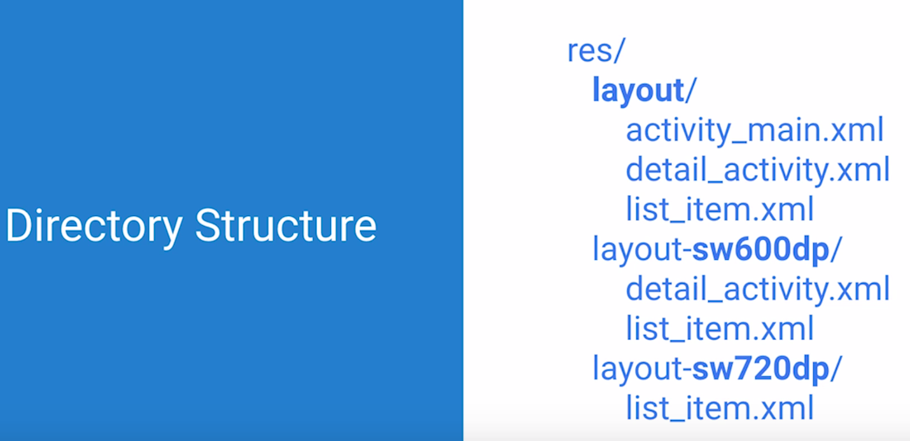

# Lesson 12 - Polishing the UI

https://github.com/udacity/ud851-Exercises/tree/student/Lesson12-Visual-Polish

## Android Design Principles

Users jugde the quality of your app within the first 30 seconds.

For some guidance on how to make slick and beautiful apps, check out [Material Design](https://developer.android.com/design/material/index.html). Material Design is a design language incorporated in the Android Lollipop release. The [Material Design specifications](https://material.io/guidelines/material-design/introduction.html) is a great place to start.

## Visual Mocks and Keylines

Mockup = a model of an app, used for design evaluations.

Keyline = lines that specify the size and the spacing of app components.

Material Design = a set of principles for creating useful and beautiful visuals.

## Color Guidelines

### Color Palette Tools

Material Design Guideline recommend a primary color (3 slightly different shades) and an accent color.

Primary color = menu bar...

Accent color = serves to draw attention to key elements like buttons.

Following material design guidelines, Google provides [vibrant color palettes](https://material.io/guidelines/style/color.html#color-color-palette) for use in Android apps.

There are also other helpful resources for choosing a color palette for your app, including [this primary and accent color palette generator](https://www.materialpalette.com/).


## Typography

[Typography Guidelines](https://material.io/guidelines/style/typography.html)

The default text for Android is a font called Roboto.

Font-family = groups of fonts that share similar design characteristics, like serif or sans-serif.

Sans-serif is the default in Android.

Scale-Independent Pixels = scale-independent pixels will stay the same physical size across different resolution screens. Text size is mesured in units of sp (scale independent pixels).

SP is also used for accesibility purposes.

## Changing colors and fonts

In colors.xml file:
```xml
<?xml version="1.0" encoding="utf-8"?>
<resources>
    <!-- Base application colors -->
    <color name="colorPrimary">#673AB7</color>
    <color name="colorPrimaryDark">#512DA8</color>
    <color name="colorAccent">#FF9100</color>
    <color name="colorPrimaryLight">#D1C4E9</color>
</resources>
```
Font Example:
```xml
<TextView
    android:id="@+id/text16"
    android:layout_width="wrap_content"
    android:layout_height="wrap_content"
    android:text="@string/smallcaps_16"
    android:textSize="16sp"
    android:fontFamily="sans-serif-smallcaps"/>
```

## Styles and Themes

Styles = a style is an xml resource file, separate from the layouts, qhere you can set all these properties in one place. Then later, we can apply that style to any View we want.

Theme = is just a style that's applied to an entire Activity or application and not just one view.

## Style a mail layout

In styles.xml:
```xml
<resources>

    <!-- Base application theme. -->
    <style name="AppTheme" parent="Theme.AppCompat.Light.DarkActionBar">
        <!-- Customize your theme here. -->
        <item name="colorPrimary">@color/colorPrimary</item>
        <item name="colorPrimaryDark">@color/colorPrimaryDark</item>
        <item name="colorAccent">@color/colorAccent</item>
    </style>


    <!-- Style for the activity textViews that are displayed in a list on the main screen-->
    <style name="ActivityLabelStyle">
        <item name="android:layout_width">match_parent</item>
        <item name="android:layout_height">80dp</item>
        <item name="android:gravity">center_vertical</item>
        <item name="android:padding">16dp</item>
        <item name="android:textColor">@android:color/black</item>
        <item name="android:textStyle">bold</item>
        <item name="android:textAppearance">?android:textAppearanceMedium</item>
        <item name="android:layout_marginBottom">8dp</item>
        <!-- 1. Change the background color for activity views to colorPrimaryLight and their text to black -->
        <item name="android:background">@color/colorPrimaryLight</item>
    </style>

    <!-- 2. Create a new style "folderStyle" to group properties for the mail folder text views -->
    <!-- This style should group all the property values found in the inbox view, like layout_width, height, etc, that are meant to repeat -->
    <style name="folderStyle">
        <item name="android:layout_width">match_parent</item>
        <item name="android:layout_height">wrap_content</item>
        <item name="android:drawablePadding">8dp</item>
        <item name="android:paddingTop">4dp</item>
        <item name="android:paddingBottom">4dp</item>
        <item name="android:textSize">28sp</item>
        <item name="android:textColor">@android:color/black</item>
    </style>

    <!-- 4. Create a new "inboxStyle" that inherits from "folderStyle" and includes a bold textStyle property -->
    <style name="inboxStyle" parent="folderStyle">
        <item name="android:textStyle">bold</item>
    </style>

</resources>

```

In the layout:
```xml
<?xml version="1.0" encoding="utf-8"?>
<LinearLayout xmlns:android="http://schemas.android.com/apk/res/android"
    xmlns:tools="http://schemas.android.com/tools"
    android:id="@+id/activity_main"
    android:orientation="vertical"
    android:layout_width="match_parent"
    android:layout_height="match_parent"
    android:paddingBottom="@dimen/activity_vertical_margin"
    android:paddingLeft="@dimen/activity_horizontal_margin"
    android:paddingRight="@dimen/activity_horizontal_margin"
    android:paddingTop="@dimen/activity_vertical_margin"
    tools:context="com.example.android.visualpolish.StyleActivity">

    <!-- All mail folder views -->
    <!-- 5. Apply the "inboxStyle" to the inbox text view -->
    <TextView
        style="@style/inboxStyle"
        android:drawableStart="@drawable/ic_inbox"
        android:drawableLeft="@drawable/ic_inbox"
        android:text="@string/inbox" />

    <!-- 3. Apply the "folderStyle" to all of these views and delete the redundant properties -->
    <TextView
        style="@style/folderStyle"
        android:drawableStart="@drawable/ic_star"
        android:drawableLeft="@drawable/ic_star"
        android:text="@string/starred" />

    <TextView
        style="@style/folderStyle"
        android:drawableStart="@drawable/ic_drafts"
        android:drawableLeft="@drawable/ic_drafts"
        android:text="@string/drafts" />

    <TextView
        style="@style/folderStyle"
        android:drawableStart="@drawable/ic_sent"
        android:drawableLeft="@drawable/ic_sent"
        android:text="@string/sent" />

    <TextView
        style="@style/folderStyle"
        android:drawableStart="@drawable/ic_trash"
        android:drawableLeft="@drawable/ic_trash"
        android:text="@string/trash" />

</LinearLayout>

```

## Screen Density

Density is the number of piwels in the physical area of the screen, and it's often mesured in dots per inch or dpi.


Density-Independent Pixels or dips (dps) are the same physical size on each device => for spacing and images.

## Small Width Qualifiers

-sw```<size in dp>```




## Creating a tablet layout

Create a new layout : 
- Right click on **res** folder
- Select new **Android resource directory**
- Choose **Layout** as resource type
- Select the qualifer **smallest screen width**
- Type the smallest width and click OK
- Copy and paste the activity that you want to modifiy for tablets

## Touch Selectors

- Right click on **res** folder
- Select new **drawable**
- Choose **Drawable** as Resource type
- Choose **selector** as Root element
- Click OK

```xml
<?xml version="1.0" encoding="utf-8"?>
<!-- 1. Create a new drawable resource,named list_item_selector, choosing "selector" as the root element -->
<selector xmlns:android="http://schemas.android.com/apk/res/android">

    <!-- 2. Add the primary light color to three items for: pressed, activated, and selected states -->
    <item android:drawable="@color/colorPrimaryLight" android:state_pressed="true" />
    <item android:drawable="@color/colorPrimaryLight" android:state_activated="true" />
    <item android:drawable="@color/colorPrimaryLight" android:state_selected="true" />

    <!-- 3. Add one more item for the default (unselected) state -->
    <!-- This should have a default drawable color = "@android:color/background_light" -->
    <item android:drawable="@android:color/background_light" />

</selector>
```

