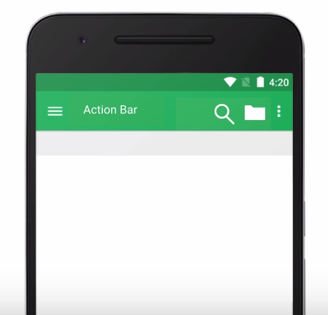
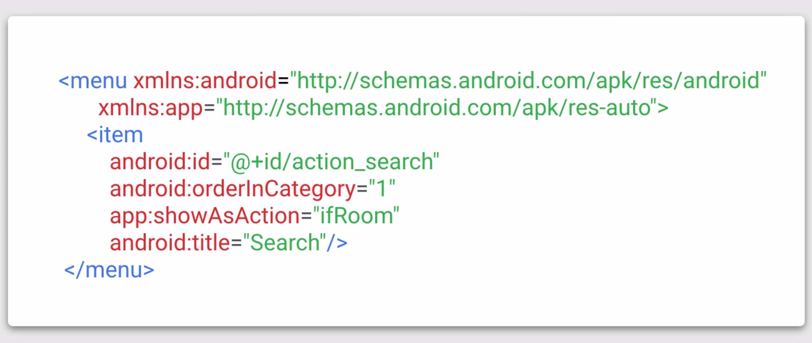
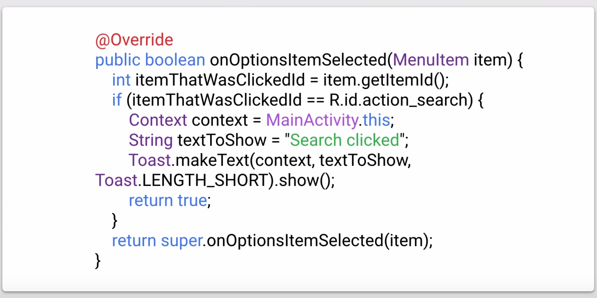
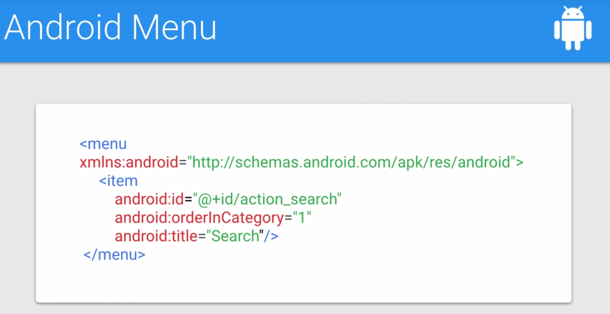
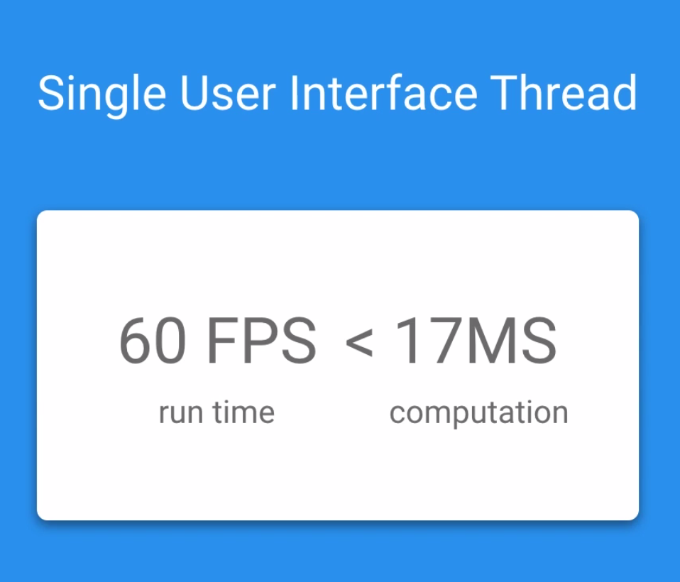
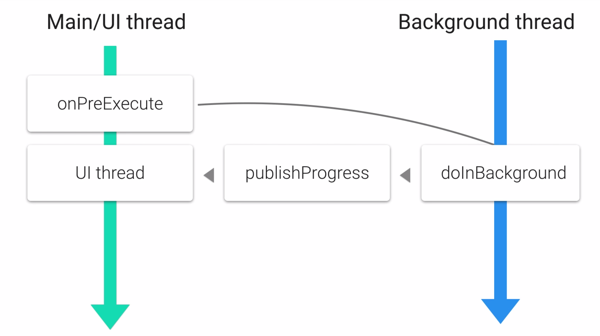
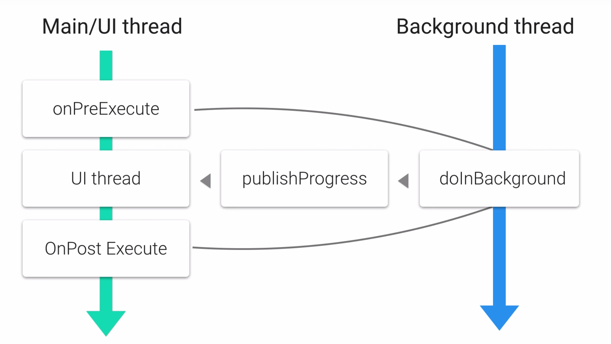

# Lesson 2 - Connect to the Internet

## Logging

| | |
| --- | :--- |
|Log.e| Error|
|Log.w| Warn|
|Log.i| Info|
|Log.d| Debug|
|Log.v| Verbose|

Syntaxe : 
```java
Log.d(String TAG,String message);
```

## Internet Toy App Intro

[Github Search Api](https://api.github.com/search/repositories?q=android&sort=stars)

## Create a Layout

```xml
<LinearLayout xmlns:android="http://schemas.android.com/apk/res/android"
   android:layout_width="match_parent"
   android:layout_height="match_parent"
   android:paddingLeft="16dp"
   android:paddingRight="16dp"
   android:paddingTop="16dp"
   android:paddingBottom="16dp"
   android:id="@+id/activity_main"
   android:orientation="horizontal">

   <!-- Include other widget or layout tags here. These are considered
           "child views" or "children" of the linear layout -->

 </LinearLayout>
```
Add a **EditText** :
```xml
<EditText
     android:id="@+id/et_search_box"
     android:layout_height="wrap_content"
     android:layout_width="match_parent"
     android:hint="Type a query for Github" />
```
Add a **TextView** for the URL : 
```xml
<TextView
        android:id="@+id/tv_url_display"
        android:textSize="22sp"
        android:text="Enter a search query and your URL will show up here"
        android:layout_height="wrap_content"
        android:layout_width="wrap_content" />
```

Add a **ScrollView** and a TextView inside of it : 
```xml
<ScrollView
    android:layout_width="match_parent"
    android:layout_height="wrap_parent">
    <TextView
        android:id="@+id/tv_github_search_results_json"
        android:textSize="18sp"
        android:text="Make a search and your results will show up here!"
        android:layout_height="wrap_content"
        android:layout_width="wrap_content" />
</ScrollView>
```
Add a reference of each views with `findById` in the **MainActivity**.
## Resources


## On Menus

**ActionBar** where you specify the menu's items : 




Override **onCreateOptionsMenu** : 


Menu selection : override **onOptionsItemSelected** 


## Add a menu

Create a resource directory in the **res** folder.
Choose "menu" as Resource Type.
```xml
<menu xmlns:android="http://schemas.android.com/apk/res/android"
        xmlns:app="http://schemas.android.com/apk/res-auto">
        <item 
                android:title="@string/search"
                android:orderInCategory="1"
                app:showAsAction="ifRoom"
                android:id="@+id/action_search" />
</menu>
```
Override **onCreateOptionsMenu** to inflate de menu : 
```java
@Override
public boolean onCreateOptionsMenu(Menu menu) {
        getMenuInflater().inflate(R.menu.main, menu);
        return true;
}
```
**Toast** provides simple feedback about an operation in a small popup.
To show a toast in action, we display a message when the item is selected on the menu : 
```java
@Override
public boolean onOptionsItemSelected(MenuItem item) {
        int menuitemThatWasSelected = item.getitemId();
        if (menuitemThatWasSelected == R.id.action_search) {
                Context context = MainActivity.this;
                String message = "Search clicked".show();
                Toast.makeText(context, message, Toast.LENGHT_LONG).show();
        }
}
```

## Build the URL 

Create constants to avoid typing long URLs :
```java
final static String GITHUB_BASE_URL = "https://api.github.com/search/repositories";
final static String PARAM_QUERY = "q";
final static String PARAM_SORT = "sort";
```
URI
```java
Uri.builtUri = Uri.parse(GITHUB_BASE_URL).buildUpon()
                .appendQueryParameter(PARAM_QUERY, githubSearchQuery)
                .appendQueryParameter(PARAM_SORT, sortBy)
                .build();
```
URL
```java
URL url = null;
try {
        url = new URL(builtUri.toString());
} catch(MalformedURLException e) {
        e.printStackTrace();
}
```
MainActivity
```java
private void makeGithubSearchQuery() {
        String githubQuery = mSearchBoxEditText.getText().toString();
        URL githubSearchUrl = NetworkUtils.buildUrl(githubQuery);
        mUrlDisplayTextView.setText(githubSearchUrl.toString());
}
```
onOptionsItemSelected
```java
@Override
public boolean onOptionsItemSelected(MenuItem item) {
        int menuitemThatWasSelected = item.getitemId();
        if (menuitemThatWasSelected == R.id.action_search) {
                makeGithubSearchQuery();
        }
}
```

## Fetching an HTTP Request

Helper Method
```java
public static String getResponseFromHttpUrl(URL url) throws IOException {
        // create URL connection object
        HttpURLConnection urlConnection = (HttpURLConnection) url.openConnection();
        try {
                InputStream in = urlConnection.getInputStream();

                // read the content of the InputStream
                Scanner scanner = new Scanner(in);
                // force the scanner to read the entire contents of the stream into the next token stream,
                // buffer the data, 
                // handle buffers of different sizes, 
                // allocated and deallocated the buffers automatically, 
                // handle encoding
                scanner.useDelimiter("\\A");

                booealn hasInput = scanner.hasNext();
                if (hasInput) {
                        return scanner.next();
                } else {
                        return null;
                }
        } finally {
                urlConnection.disconnect();
        }
}
```
[Read/convert InputStream to a string](https://stackoverflow.com/questions/309424/read-convert-an-inputstream-to-a-string)

[OkHttp](http://square.github.io/okhttp/)

## Permissions

[Permissions](https://developer.android.com/guide/topics/permissions/index.html)
The best practices is to request the absolute minimum of permissions
In the **AndroidManifest.xml** :
```xml
<uses-permission android:name="android.permission.INTERNET">
```
In the method **makeGithubSearchQuery** we need to call NetworkUtils to get response from URL rather than simply displaying the URL:
```java
private void makeGithubSearchQuery() {
        String githubQuery = mSearchBoxEditText.getText().toString();
        URL githubSearchUrl = NetworkUtils.buildUrl(githubQuery);
        mUrlDisplayTextView.setText(githubSearchUrl.toString());
        try {
                githubSearchResults = NetworkUtils.getResponseFromHttpUrl(githubSearchUrl);
                mSearchResultsTextView.setText(githubSearchUrl)
        } catch (IOException e) {
                e.printStackTrace();
        }
}
```

## Thread Basics

Android supports doing multiples things at once.
Android apps have a single user interface thread.
This thread is responsible for getting events from the various sensors and setting up the next frma to draw.



We want to do as little as possible on the main thread.
We must run the network task ona secondary execution thread et make changes to the user interface (**AsyncTask**).

## AsyncTask

Allows you to run a task on a background thread, while publishing results to the UI thread.
Override these four methods :
- doInBackground
- onProgressUpdate
- onPostExecute
- onPreExecute

Notice the UI thread with **publishProgress**




## Create an AsyncTask

In **MainActivity** : 
```java
public class GitHubQueryTask extends AsyncTask<URL, Void, String> {
        @Override
        protected String doInBackground(URL... urls) {
                URL search URL = urls[0];
                String githubSearchResults = null;
                try {
                        githubSearchResults = NetworkUtils.getResponseFromHttpUrl(searchUrl);
                } catch (IOException e) {
                        e.printStackTrace();
                }
                return githubSearchResults;
        }

        @Override
        protected void onPostExecute(String s) {
                if (s != null && !s.equals("")) {
                        mSearchResultsTextView.setText(s);
                }
        }
}
```
In the method **makeGithubSearchQuery**, replace the networking code with instanciating ans executing **GitHubQueryTask**:
```java
private void makeGithubSearchQuery() {
        String githubQuery = mSearchBoxEditText.getText().toString();
        URL githubSearchUrl = NetworkUtils.buildUrl(githubQuery);
        mUrlDisplayTextView.setText(githubSearchUrl.toString());
        
        // instance ans execution of GithubQueryTask
        new GitHubQueryTask().execute();
}
```
## Add polish

```xml
<FrameLayout ...>
        <ScrollView
                android:layout_width="match_parent"
                android:layout_height="wrap_content"
                android:layout_marginTop="16dp">
                <TextView 
                        android:id="@+id/tv_github_search_results_json"
                        android:layout_widht="wrap_content"
                        android:layout_height="wrap_content"
                        android:text="Make a search !"
                        android:textSize="18sp" />
        </ScrollView>        
</FrameLayout>
```

In **activity_main.xml**: 
```xml
<ProgressBar
        android:id="@+id/pb_loading_indicator"
        android:layout_gravity="center"
        android:visibility="invisible"
        android:layout_width="42dp"
        android:layout_height="42dp" />
```

In **MainActivity** : 
```java
ProgressBar mLoadingIndicator;
TextView errorMessageTextView;
...
protected void onCreate(Bundle savedInstanceState) {
        ...
        errorMessageTextView = (TextView) findViewById(R.id.tv_error_message);
        mLoadinIndicator = (ProgressBar) findViewById(R.id.pb_loading_indicator);
}
...
private void showJsonDataView() {
        mErrorMessageDisplay.setVisibility(View.INVISIBLE);
        mSearchResultsTextView.setVisibility(View.VISIBLE);
}
private void showErrorMessage() {
        mErrorMessageDisplay.setVisibility(View.VISIBLE);
        mSearchResultsTextView.setVisibility(View.INVISIBLE);
}
...
public class GithubQueryTask extends AsyncTask<URL, Void, String> {
        @Override
        protected void onPreExecute() {
                super.onPreExecute();
                mLoadingIndicator.setVisibility(VISIBLE);
        }
        ...
        @Override
        protected void onPostExecute(String githubSearchResults) {
                mLoadingIndicator.setVisibility(View.INVISIBLE);
                if (githubSearchResults != null && !githubSearchResults.equals("")) {
                        mSearchResultsTextView.setText(githubSearchResults);
                } else {
                        showErrorMessage();
                }
        }
}
```
## JSON 

Javascript Object Notation

## Parse JSON

Example : 
```json
{
        "name":{
                "firstname":"John",
                "lastname":"Doe"
        },
        "title":"Missing Person"
}
```

```java
// Initialize JSONObject from JSON string
JSONObject contact = new JSONObject(JSONString);
JSONObject name = contact.getJSONObject("name");
String firstname = name.getString("firstname");
String lastname = name.getString("lastname");
String title = contact.getString("title");
```

