# Lesson 3 - RecycleView

## How RecyclerView works

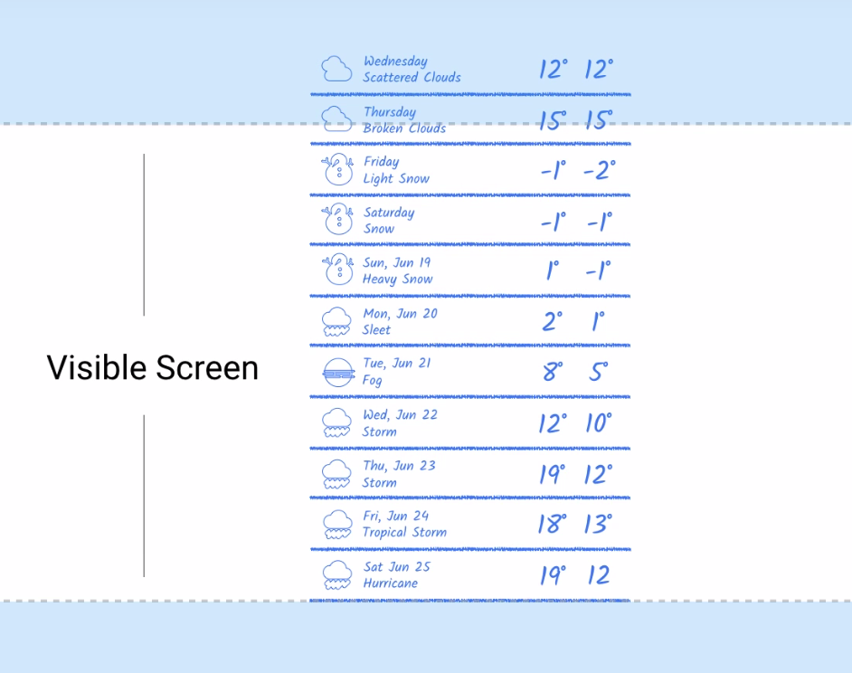

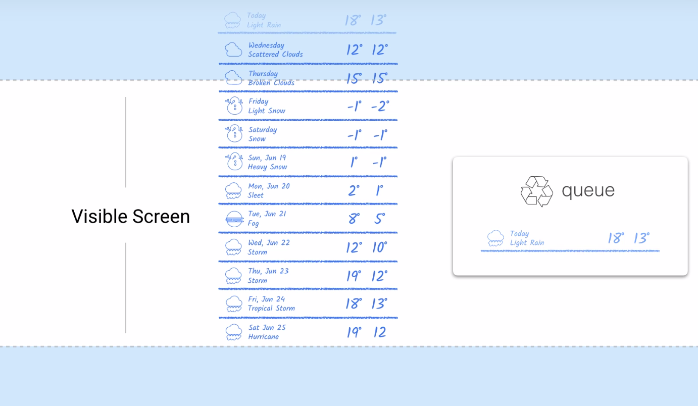

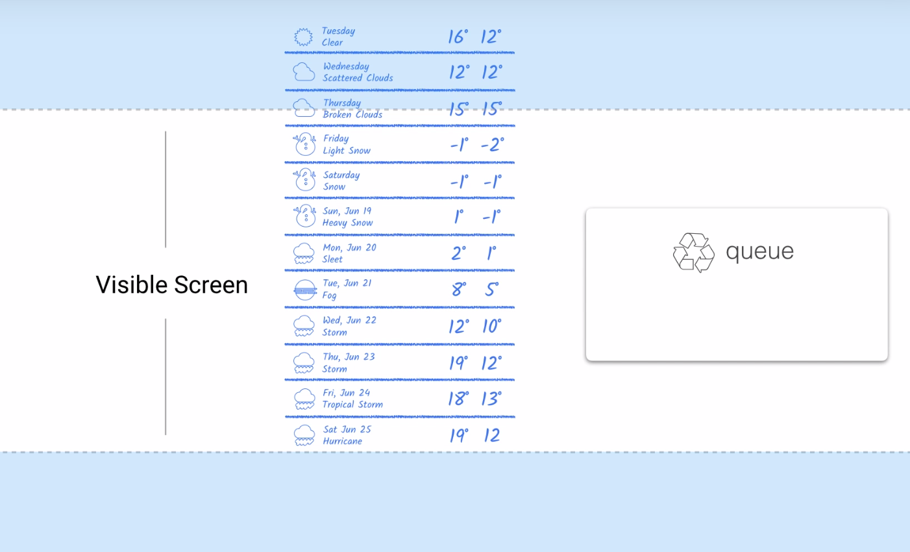

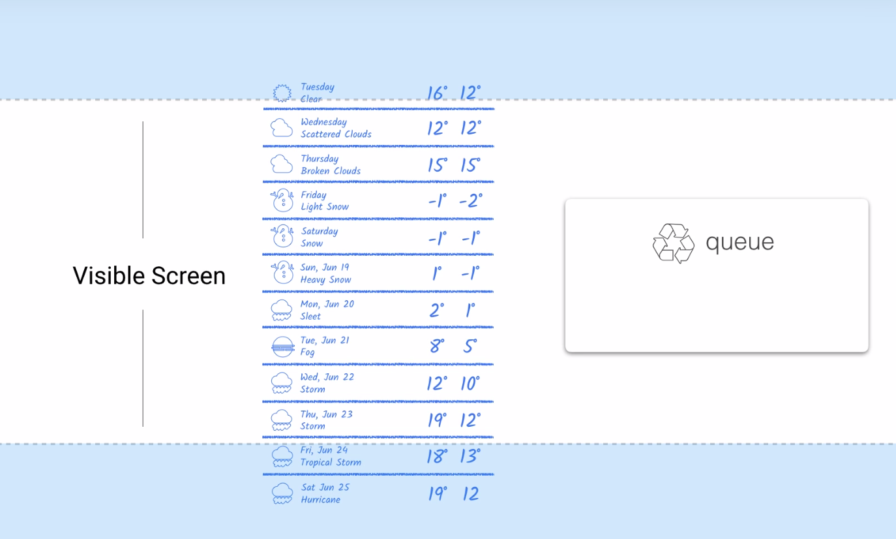

## Using RecyclerView

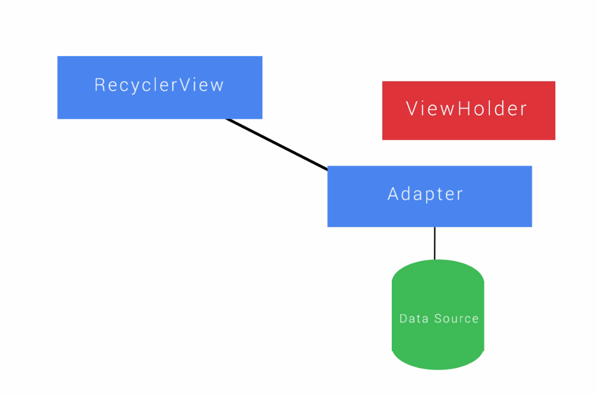

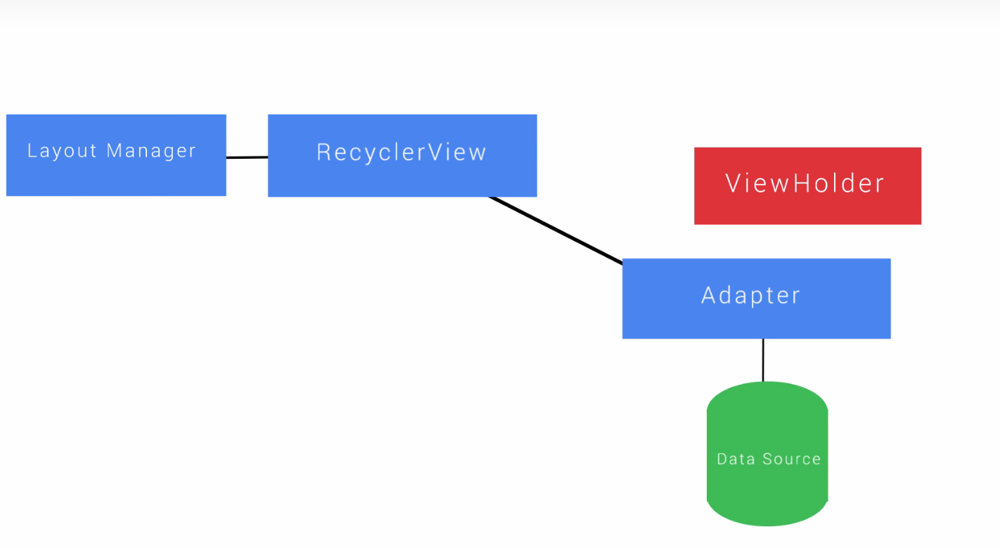

## Why ViewHolders ?

To cache the view Objects that we are going to be populating with data or images.
We can access views later without having to look them up repeatedly.

## Visualizing ViewHolders

Steps to create RecyclerView and ViewHolder : 
- create the RecyclerView in the Layout
- Create the list item layout and ViewHolder
- Add the RecyclerView adapter
- Add the LayoutManager and connect everything together

## Create RecyclerView Layout

In **build.gradle** file : 
```
compile 'com.android.support:recyclerview-v7:24.1.1'
```
In **activity_layout.xml** : 
```xml
<FrameLayout ...>
    <android.support.v7.widget.RecyclerView
    android:layout_width="match_parent"
    android:layout_height="match_parent"
    android:id="@+id/rv_numbers" >
    </android.support.v7.widget.RecyclerView>
</FrameLayout>
```
**FrameLayout** is optinal here.

## Items and ViewHolders

ViewHolder determines how an individual entry is displayed.

Create another Layout **number_list_item** : 
```xml
<FrameLayout xmlns:android="http://schemas.android.com/apk/res/android"
   android:layout_width="match_parent"
   android:layout_height="match_parent"
   android:padding="16dp" >
    <TextView 
        android:id="@+id/tv_item_number"
        style="@style/TextAppearance.AppComat.Title"
        android:layout_width="wrap_parent"
        android:layout_height="wrap_parent"
        android:fonFamily="monospace"
        android:textSize="42sp" />

</FrameLayout>
```

px = dp * (dpi / 160)
**SP** is for fonts and widget that have hard coded sizes that contain fonts.

In the class that extends **RecyclerViewAdapter** : 
```java
class NumberViewHolder extends RecyclerView.ViewHolder {
    TextView listItemNumberView;

    public NumberViewHolder (View itemView) {
        super(itemView);

        listItemNumberView = (TextView) itemView.findViewById(R.id.tv_item_number);

    }

    void bind(int listIndex) {
        listItemNumberView.setText(String.valueOf(listIndex));
    }

}
```

## RecyclerView and Adapters
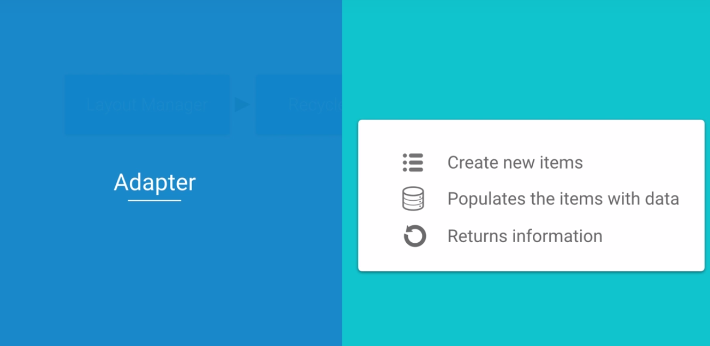

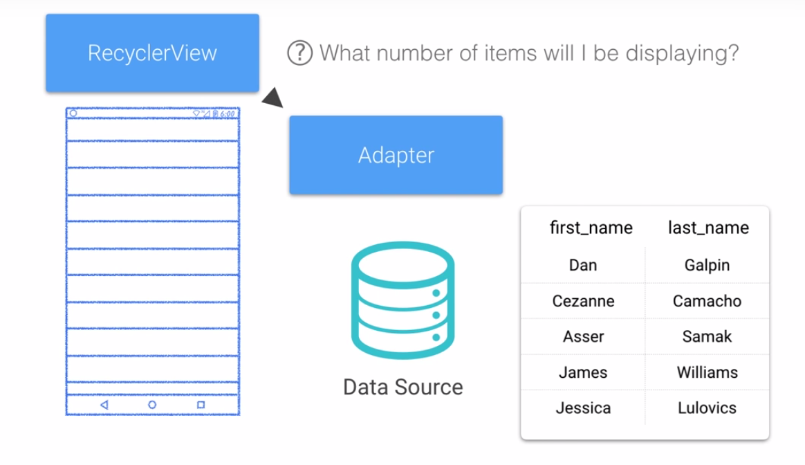

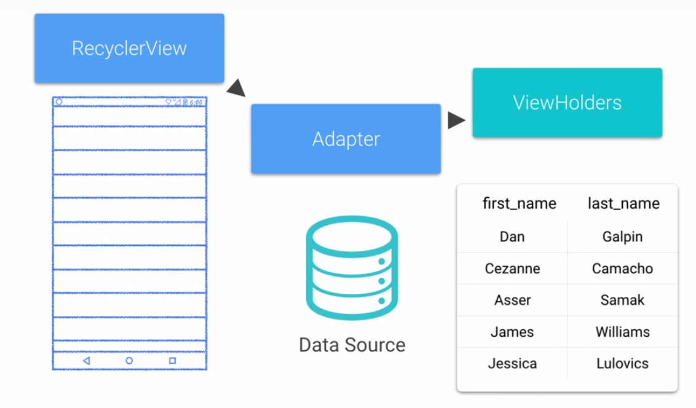

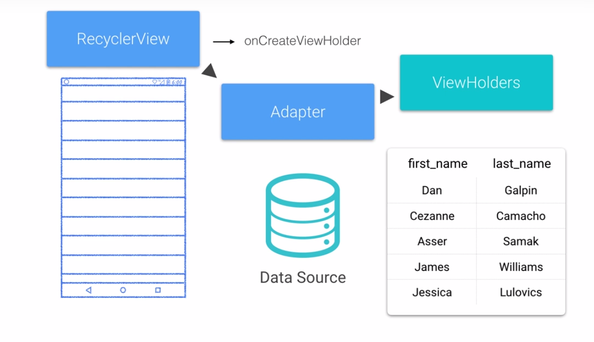

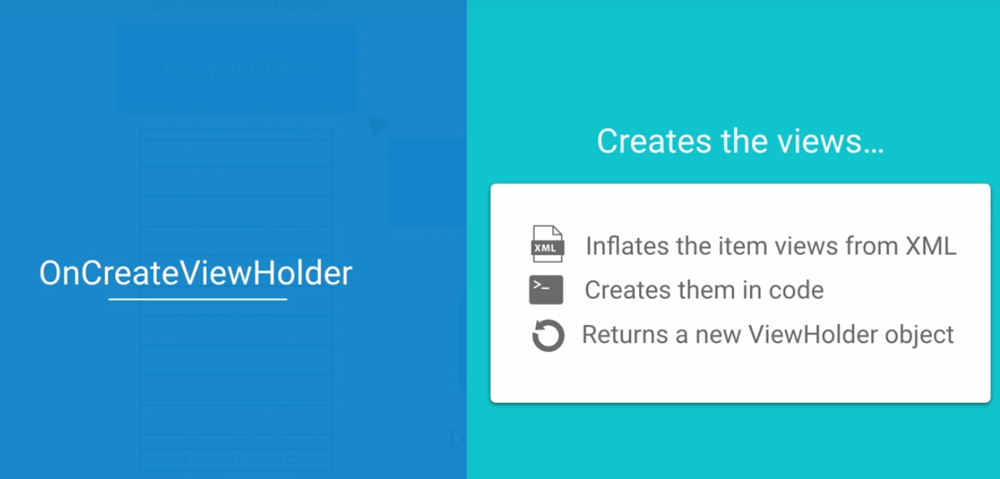

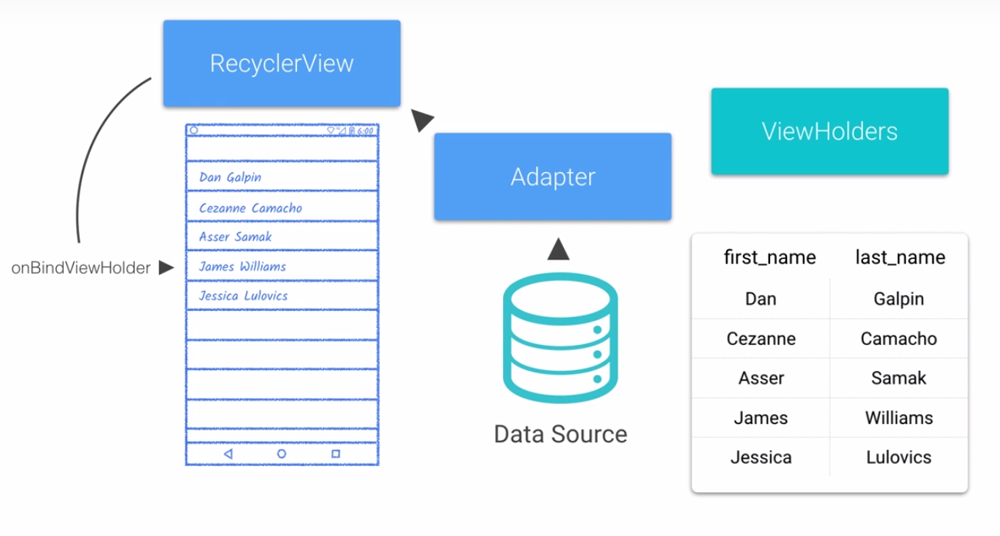

## Creating an Adapter
```java
public class GreenAdapter extends RecyclerView.Adapter<GreenAdapter.NumberViewHolder> {
    private int mNumberItem;

    public GreenAdapter(int numberOfitems) {
        mNumberItems = numberOfItems;
    }

    @Override
    public NumberViewHolder onCreateViewHolder(ViewGroup viewGroup, int viewType) {
        Context context = viewGroup.getContext();
        int layoutIdForListItem = R.layout.number_list_item;
        LayoutInflater inflater = LayoutInflater.from(context);
        boolean shoulsAttachToParentImmediately = false;

        View view = inflater.inflate(layoutIdForListItem, viewGroup, shoulAttachToParentImmediately);
        NumberViewHolder viewHolder = new NumberViewHolder(view);

        return viewHolder;
    }

    @Override
    public void onBindViewHolder(NumberViewHolder holder, int position) {
        Log.d(TAG, "#" + position);
        holder.bind(position);
    }

    @Override
    public int getItemCount() {
        return mNumberItems;
    }
}
```

## RecyclerView Layout Manager

The Layout Manager determines how the collection of items is displayed.
It determines when to recycle items views that are no longer visible.
3 implementations : 
- LinearLayoutManager : horizontal scrolling  (default) or vertical scrolling.
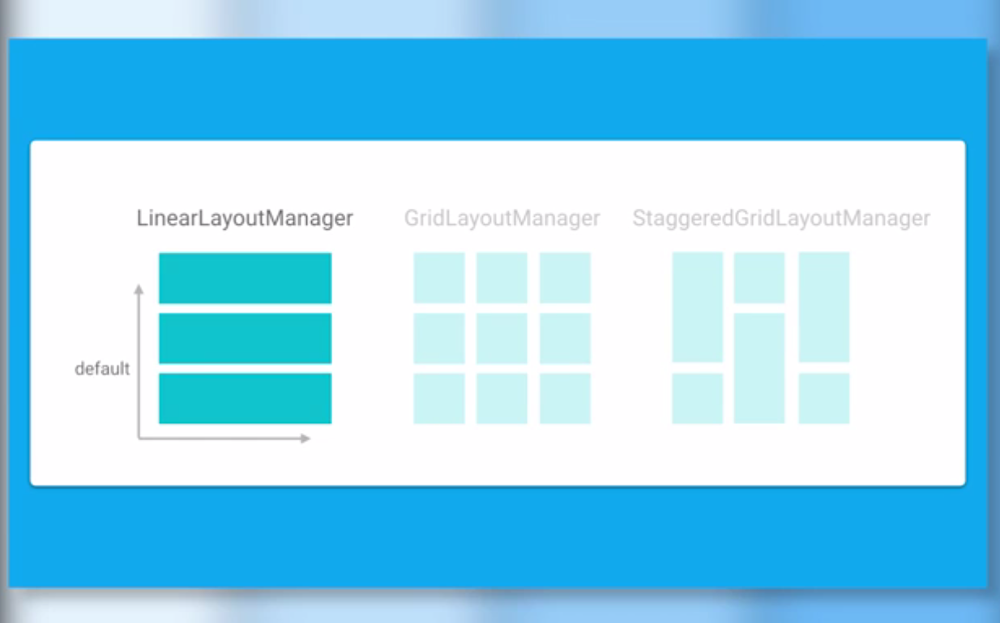

- GridLayoutManager : horizontal scrolling  (default) or vertical scrolling.
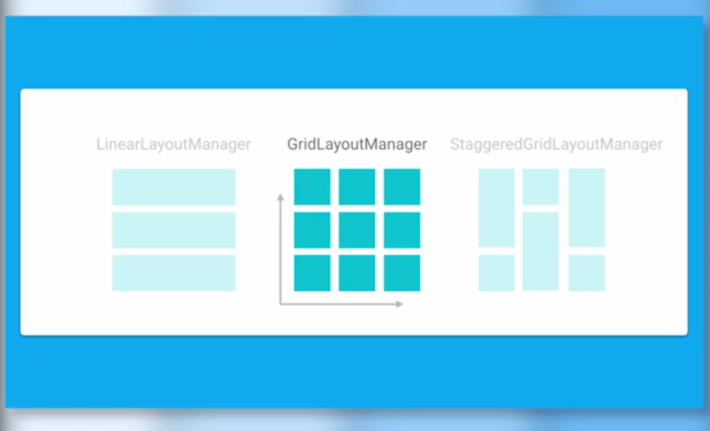

- StaggeredGridLayoutManager : offset grid of items, commonly used for applications that have views with content of varying dimensions.
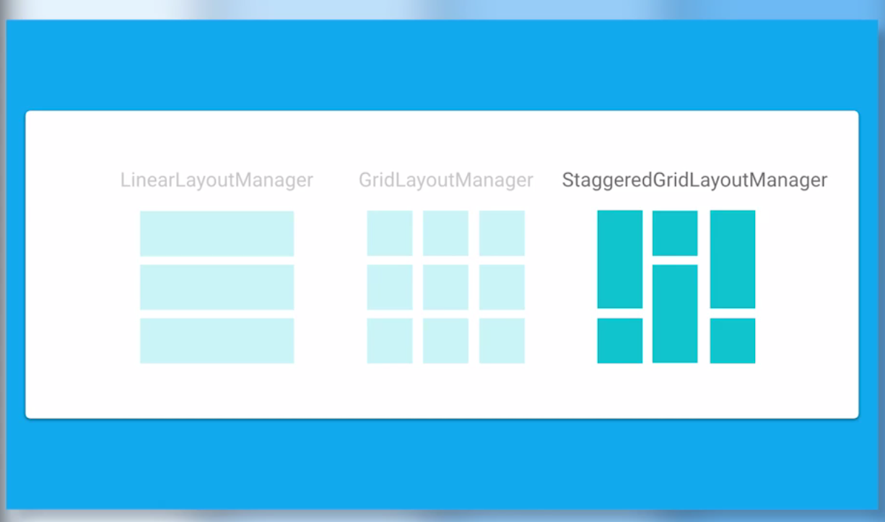

Or extend from LayoutManager and create your own.

## Wiring up RecyclerView

In **MainActivity** : 

```java
private GreenAdapter mAdapter;
private RecyclerView mNumberList;

@Override void onCreate(Bundle savedInstanceState) {
    super.onCreate(savedInstanceState);
    setContentView(R/layout.activity_main);

    mNumberList = (RecyclerView) findViewById(R.id.rv_numbers);

    LinearLayoutManager layoutManager = new LinearLayoutManager(this);
    mNumberList.setLayoutManager(layoutManager);

    mNumberList.setHasFxedSize(true);

    mAdapter = new GreenAdapter(NUM_LIST_ITEMS);

    mNumberList.setAdapter(mAdapter);
}
```
## Responding to item clicks

In the Adapter : 
```java

final private ListItemClickListener mOnClickListener;

public interface ListItemClickListener {
    void onListItemClick(int clickedItemIndex);
}

// we need to modify the green adapter constructor
public GreenAdapter(int numberOfItem, ListItemClickListener listener) {
    mNumberItems = numberOfitems;
    mOnClickListener = listener;
    viewHolderCount = 0;
} 

...

class NumberViewHolder extends RecyclerView.ViewHolder implements View.onClickListener {
    public NumberViewHolder(View view) {
        super(itemView);

        listitemNumberView = (TextView) item.findViewById(R.id.tv_item_number);
        viewHolderIndex = (TextView) itemView.findViewById(R.id.tv_view_holder_instance);

        itemView.setOnClickListener(this);
    }
    ...

    @Override
    public void onClick(View view) {
        int clickedPosition = getAdapterPosition();
        mOnClickListener.onListItemClick(clickedPosition);

    }
}
```

In **MainActivity** : 
```java
private Toast mToast;

@Override void onCreate(Bundle savedInstanceState) {
    ...

    mAdapter = new GreenAdapter(NUM_LIST_ITEMS, this);

    ...
}

@Override
public boolean onOptionsitemSelected(Menu item) {
    ...
    case R.id.action_refresh :
        mAdapter = new GreenAdapter(NUM_LIST_ITEMS, this);
    ...
}
@Override
public void onListItemClick(int clickedItemIndex) {
    if(mToast != null) {
        mToast.cancel();
    }
    
    String toastMessage = "Item #" + clickedItemIndex + " clicked";
    mToast = Toast.makeText(this, toastMessage, Toast.LENGTH_LONG);

    mToast.show();
}
```
