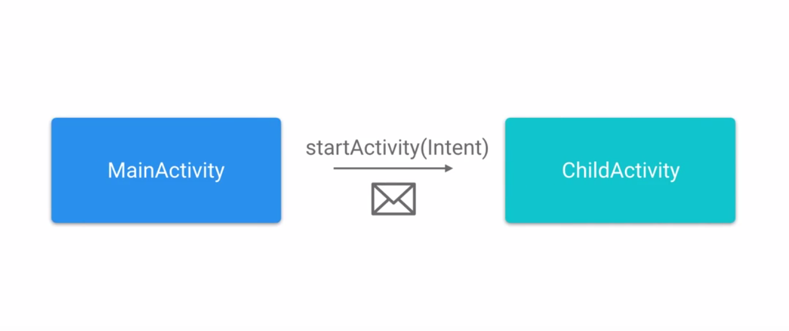

# Lesson 5 - Intents

## Intent Framework

**Intents** let the app request that an action take place.


**Intents** are like envelopes, each one includes which, component you want to deliver to.

There's even room for a small amount of date to be delivered, packaged as extras which are primitive topples.

## Creating an Activity

Create an **empty Activity** (the activity which will receive the intent) : File > Activity > Empty Activity

In **activity_child.xml** :
```xml
<RelativeLayout ...>
    <TextView 
        android:layout_width="wrap_content"
        android:layout_height="wrap_content"
        android:id="@+id/tv_display"
        android:text="This is default text." />
 </RelativeLayout ...>   
```
In the **ChildActivity** : 
```java
private TextView mDisplayText;

@Override
protected void onCreate(Bundle savedInstanceState) {
    super.onCreate(savedInstanceState);
    setContentView(R.layout.activity_child);

    mDisplayText = (TextView) findViewById(R.id.tv_display);
}
```
## Creating an Intent



In **MainActivity** : 
```java
// declaration Button and EditText

mDoSomethingCollButton.setOnClickListener((v) -> {
    // first parameter is the context, the second is the destination activity 
    Intent intent = new Intent(MainActivity.this, ChildActivity.class);
    StartActivity(intent);
});
```
## Passing data between activities

In **MainActivity** : 
```java
mNameEntry = (EditText) findViewById(R.id.et_text_entry);
mDoSomethingCollButton.setOnClickListener((v) -> {
    // retrieve and store the text into a variable
    String textEntered = mNameEntry.getText().toString();
    Intent intentThatStartedThisActivity = new Intent(MainActivity.this, ChildActivity.class);
    // pass extra : key - value
    intentThatStartedThisActivity.putExtra(Intent.EXTRA_TEXT, textEntered);
    StartActivity(intentThatStartedThisActivity);
});
```

In the **ChildActivity** : 
```java
@Override
protected void onCreate(Bundle savedInstanceState) {
    super.onCreate(savedInstanceState);
    setContentView(R.layout.activity_child);

    mDisplayText = (TextView) findViewById(R.id.tv_display);

    Intent intent = getIntent();
    // always check if the intent has extra: hasExtra(TheKeyTextOfTheExtra)
    if(intentThatStartedThisActivity.hasExtra(Intent.EXTRA_TEXT)) {
        String textEntered = intentThatStartedThisActivity.getStringExtra(Intent.EXTRA_TEXT);
        mDisplayText.setText(textEntered);
    }
}
```

## What are implicit intents ?

If we want to retrieve a contact or an image, or call a number, **implicit intents indicate an action to be done and an optional bit of date on which to execute** it like picking a contact from the contacts content provider, or dialing a number.

The user can choose the app to fulfill the action, or if only one app is installed, it will run automatically
.

## Creating implicit intents

[Common Intents](https://developer.android.com/guide/components/intents-common.html)

Most **implicit intents** include an **action** and a **data.** The action says **what you're trying to do** and the data is **what you're passing onto the action**.

Button **Open Web Page** : 

In **MainActivity** :
```java
private void openWebPage(String url) {
    Uri webpage = Uri.parse(url);
    Intent intent = new Intent(Intent.ACTION_VIEW, webpage);
    // always check if the intent can be launch (otherwise, if the device doesn't have an app installed that can handle our request the app will crash)
    if (intent.resolveActivity(getPackageManager()) != null) {
        startActivity(intent);
    }
}

public void onClickOpenWebpageButton(View v) {
    String urlAsString = "http://udacity.com";
    openWebpage(urlAsString);
}
```

## Understanding URIs

**URI**  = Uniform Resource Identifier
The **formal name of a web address is a URL** ( Uniform Resource Locator). A **URL is a URI that identifies a web or network resource**.
A URI like geo can describe a physical location.
full form (optional part shown in brackets) : 

scheme:[//[user:password@]host[:port][/]path[?query][#fragment]

Scheme describes what type of resource we're pointing to.
ex : HTTP, HTTPS, mailto, FTP, file and geo...

### Show a location on a map : 

geo:latitude, longitude => "geo:47.6,-122.3"

## Creating a map intent

```java
public void onClickOpenAddressButton(View v) {
    String addressString = "1600 Amphitheatre Parkway, CA";

    Uri.Builder builder = new Uri.Builder();
    builder.scheme("geo")
            .path("0,0")
            .query(addressString);
    Uri addressUri = builder.build();

    Intent inten = new Intent(Intent.ACTION_VIEW);
    intent.setData(addressUri);

    if (intent.resolveActivity(getPackageManager()) != null) {
        startActivity(intent);
    }
}
```
## Sharing is caring

**ShareCompat** and it's inner class **IntentBuilder**.

## Media Types

**MIME** = Multipurpose Internet Mail Extension

A Media Type String :
top-level **type** name / **subtype** name [;**parameters**]

(text/plain         text/rtf        image/png      video/mp4)

ex : text/html; charset=UTF-8

Whenever you want to share data between apps, you'll have to specify it's media type so that Android can determnine how and if it can fulfill the request.

## Implementing a share intent

```java
public void onClickShareTextButton(View v) {
    String mimeType = "text/plain";
    String title = "Learning How to Share";
    String textToShare = "Hello there";

    ShareCompat.IntentBuilder.from(this)
        .setChooserTitle(title)
        .setType(mimeType)
        .setText(textToShare);

}
```


