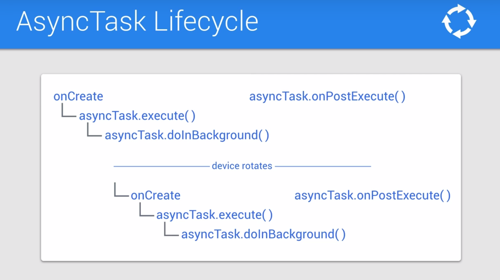
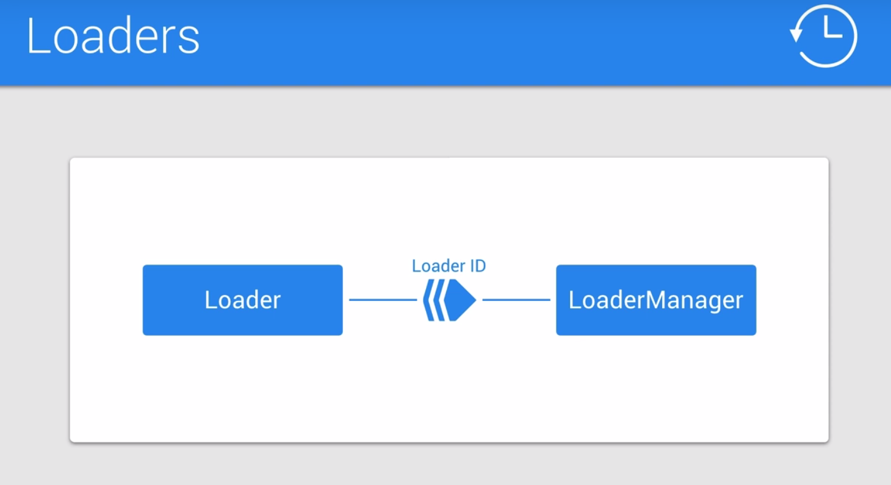
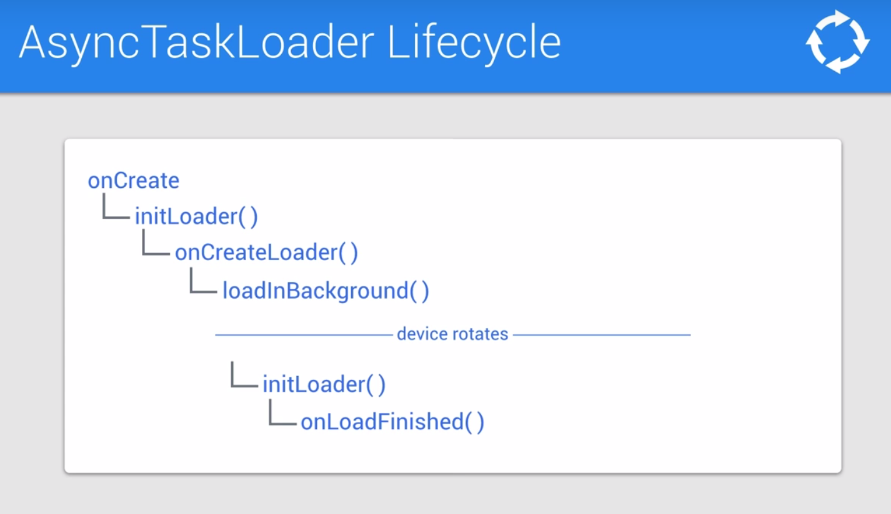

# Lesson 5 - Lifecycle

## Android activity lifecycle


- **onCreate** : where you build and wire up your **UI**.
Once that's done, your activity has been created.
- **onStart** : when the activity becomes **visible**.
- **onResume** : when it gain **focus** and becomes the active foreground app.

- **onPause** : indicated the activity has **lost focus**.
- **onStop**: when the app is **no longer visible**.
- **onDestroy** : indicates **the end of the app** life cycle.

## Reto on the Android Activity Lifecycle


## Save and restore instance state

onSaveInstanceState : the Bundle is a key-value storage mechanism that we use to store the data we want to be saved.
Bundle need to be pass between processes or serialized to a file.
You can add complexe types to a bundle by having them implements the parcelable interface.

Example with a TextView : 
```java
private static final String LIFECYCLE_CALLBACK_TEXT_KEY = "callbacks";
private static final String ON_SAVE_INSTANCE_STATE = "onSaveInstanceState";
@Override
protected void onSaveInstanceState(Bundle outState) {
    super.onSaveInstanceState(outState);
    logAndAppend(ON_SAVE_INSTANCE_STATE);
    // get the text from the TextView
    String lifecycleDisplayTextViewContents = mLifecycleDisplay.getText().toString();
    // store it in the bundle
    outstate.putString(LIFECYCLE_CALLBACK_TEXT_KEY,lifecycleDisplayTextViewContents);
}

...onCreate(Bundle saveInstanceState) {
    ...

    if (saveInstanceState != null) {
        if (saveInstanceState.containsKey(LIFECYCLE_CALLBACK_TEXT_KEY)) {
            String allPreviousLifecycleCallbacks = saveInstanceState.getString(LIFECYCLE_CALLBACK_TEXT_KEY);
            mLifecycleDisplay.setText(allPreviousLifecycleCallbacks);
        }
    }
}
```
## AsyncTask and Loaders







## Leveraging Loaders

3 steps : 
1. Create a Loader ID
2. Fill-in Loader Callbacks
3. Init Loader with LoaderManager

```java
public class MainActivity extends AppCompatActivity implements LoaderManager.LoaderCallbacks<String> {
    private static final int GITHUB_SEARCH_LOADER = 22;

    private void makeGithubSearchQuery() {
        // remove the call to execute the AsyncTask
        ...
        Bundle queryBundle = new Bundle();
        queryBundle.putString(SEARCH_QUERY_URL_EXTRA, githubSeaarchUrl.toString());

        LoaderManager loaderManager = getSupportLoaderManager();
        Loader<String> githubSearchLoader = loaderManager.getLoader(GITHUB_SEARCH_LOADER);

        if (githubSearchLoader == null) {
            // if it doesn't exist, we initialze it
            loaderManager.intiLoader(GITHUB_SEARCH_LOADER, queryBundle, this);
        } else {
            // otherwise, we reload it
            loaderManager.restartLoader(GITHUB_SEARCH_LOADER, queryBundle, this);
        }
    }

    @Override
    public Loader<String> onCreateLoader(int id, final Bundle args) {
        return new AsyncTaskLoader<String>(this) {
            @Overrride
            protected void onStartLoading() {
                super.onStartLoading();
                if (args == null) {
                    return;
                }
                //remove the code from onPreExecute and paste it here
                mLoadingIndicator.setVisibility(View.VISIBLE);

            }
            
            @Override
            public String loadInBackground() {
                String searchQueryUrlString = args.getString(SEARCH_QUERY_URL_EXTRA);
                if (searchQueryUrlString == null || TextUtils.isEmpty(searchQueryUrlString)) {
                    // copy & paste the try/catch block from the AsyncTask doInBackground and modify  it to compile
                    try {
                        URL githubUrl = new URL(searchQueryUrlString);  
                        return NetworkUtils.getResponsefromHttpUrl(githubUrl);
                    } catch (IOException e) {
                        e.printStackTrace();
                        return null;
                    }
                }
                return null;
            }

            // copy & paste the code from onPostExecute to onLoadFinished
            @Override
            public void onLoadFinished(Loader<String> loader, String data) {
                mLoadingIndicator.setVisibility(View.INVISIBLE);
                if (data != null && data.equals("")) {
                    showJsonDataView();
                    mSearchResultsTextView.setText(data);
                } else {
                    showErrorMessage();
                }
            }
        }

        // remove the code that retrieves and displays the JSON , in onSaveInstanceState.
        // and the code that persists to JSON
    }
}
```
## Caching with Loaders

## Resources
[An Idiot's guide to Android AsyncTaskLoader](https://medium.com/@sanjeevy133/an-idiots-guide-to-android-asynctaskloader-76f8bfb0a0c0)

[It's time to ditch Loaders in Android](https://medium.com/inloopx/its-time-to-ditch-loaders-in-android-6492616775f7)

[Making loading data lifecycle aware](https://medium.com/google-developers/making-loading-data-on-android-lifecycle-aware-897e12760832)

[Exploring asynchronous data loading with Loaders in Android](https://en.proft.me/2017/08/17/exploring-asynchronous-data-loading-loaders-androi/)


