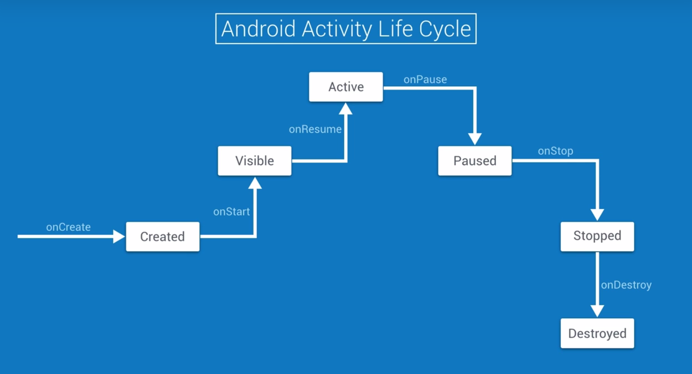
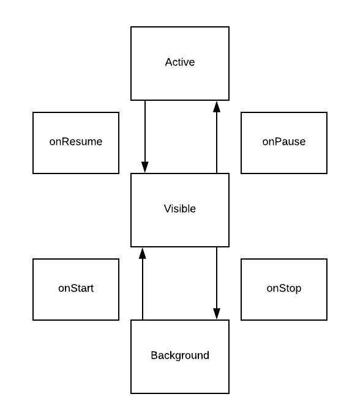

# Lesson 5 - Lifecycle

## Android activity lifecycle



- **onCreate** : where you build and wire up your **UI**.
Once that's done, your activity has been created.
- **onStart** : when the activity becomes **visible**.
- **onResume** : when it gain **focus** and becomes the active foreground app.

- **onPause** : indicated the activity has **lost focus**.
- **onStop**: when the app is **no longer visible**.
- **onDestroy** : indicates **the end of the app** life cycle.

## Reto on the Android Activity Lifecycle



## Save and restore instance state

onSaveInstanceState : the Bundle is a key-value storage mechanism that we use to store the data we want to be saved.
Bundle need to be pass between processes or serialized to a file.
You can add complexe types to a bundle by having them implements the parcelable interface.

Example with a TextView : 
```java
private static final String LIFECYCLE_CALLBACK_TEXT_KEY = "callbacks";
private static final String ON_SAVE_INSTANCE_STATE = "onSaveInstanceState";
@Override
protected void onSaveInstanceState(Bundle outState) {
    super.onSaveInstanceState(outState);
    logAndAppend(ON_SAVE_INSTANCE_STATE);
    // get the text from the TextView
    String lifecycleDisplayTextViewContents = mLifecycleDisplay.getText().toString();
    // store it in the bundle
    outstate.putString(LIFECYCLE_CALLBACK_TEXT_KEY,lifecycleDisplayTextViewContents);
}

...onCreate(Bundle saveInstanceState) {
    ...

    if (saveInstanceState != null) {
        if (saveInstanceState.containsKey(LIFECYCLE_CALLBACK_TEXT_KEY)) {
            String allPreviousLifecycleCallbacks = saveInstanceState.getString(LIFECYCLE_CALLBACK_TEXT_KEY);
            mLifecycleDisplay.setText(allPreviousLifecycleCallbacks);
        }
    }
}
```


