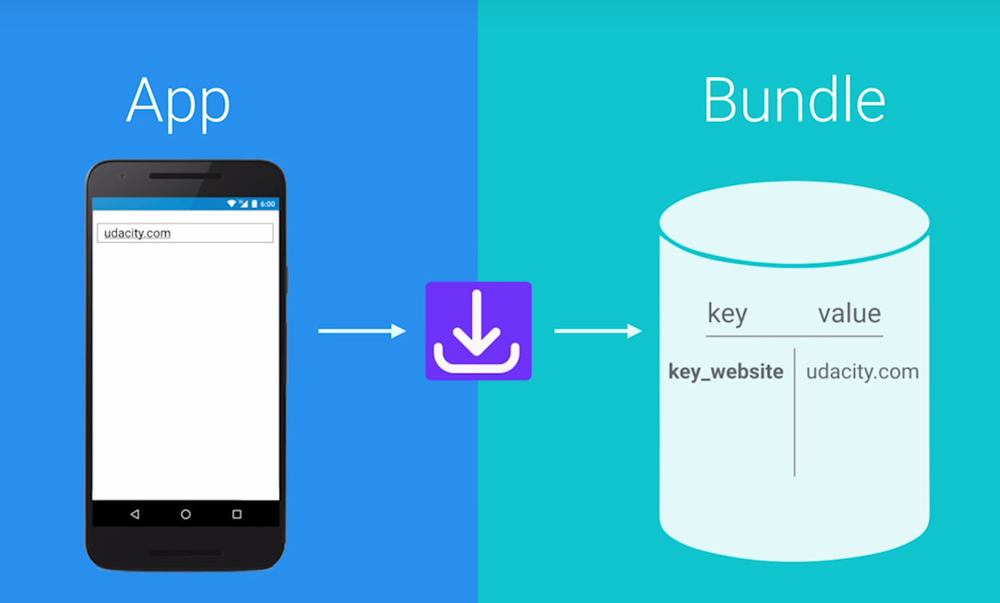
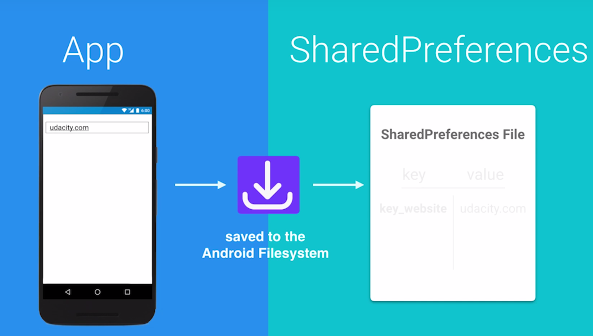
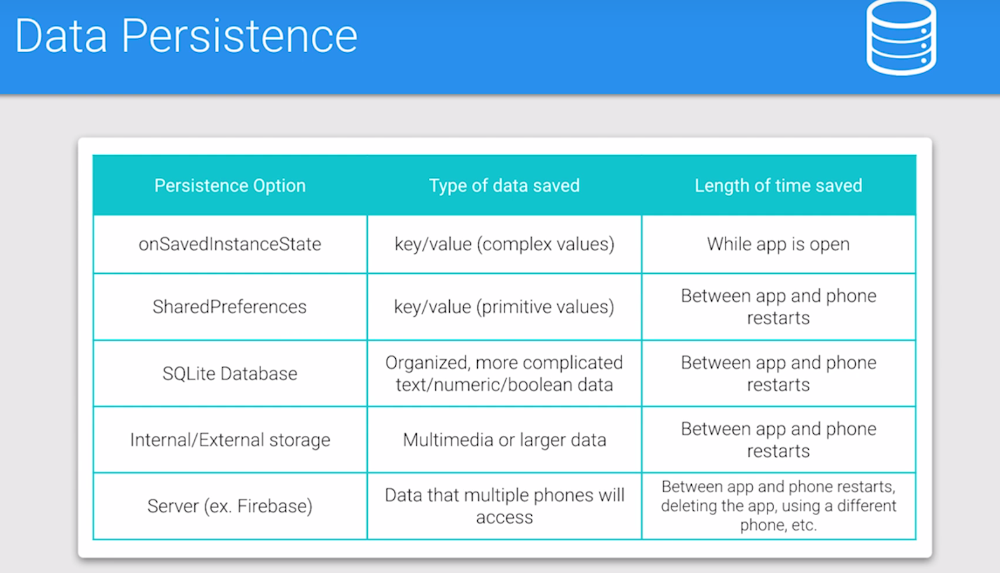
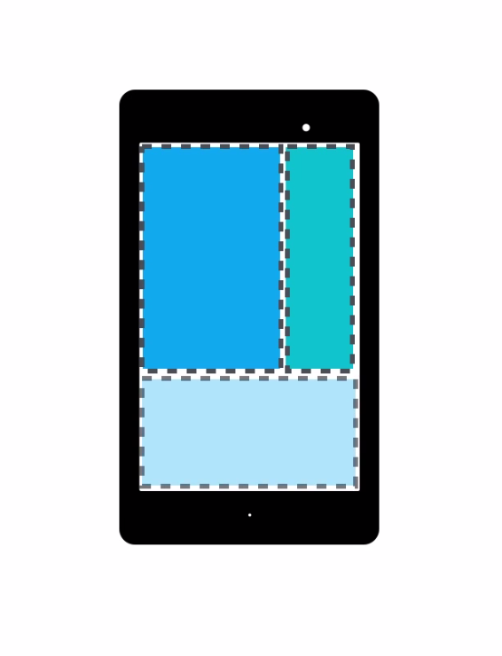
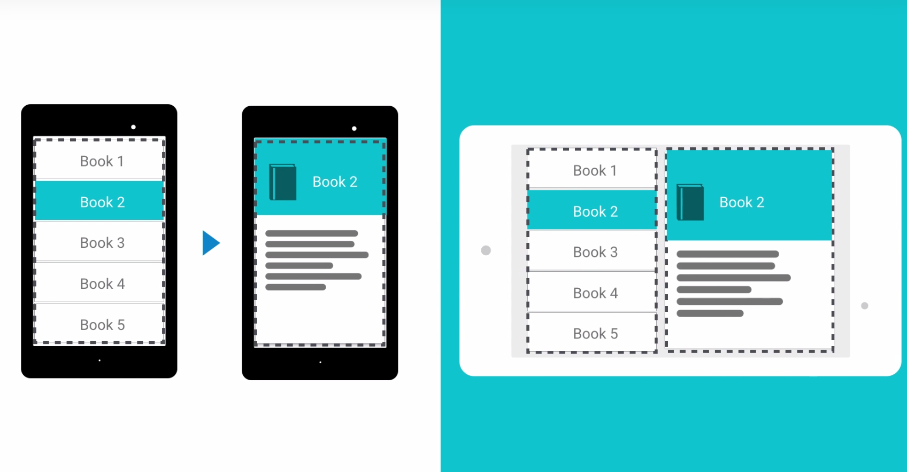
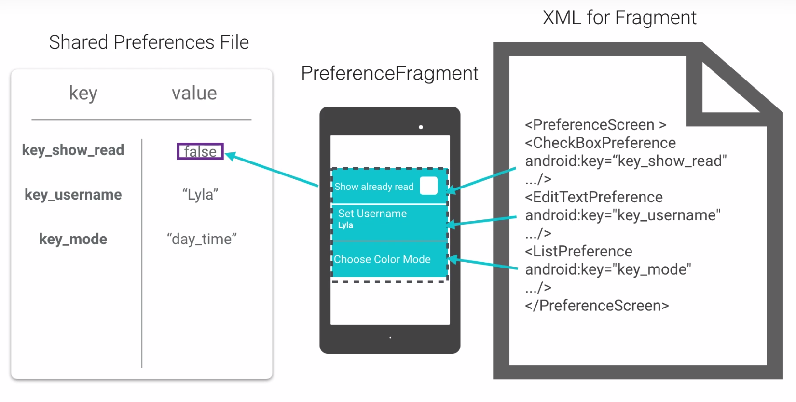
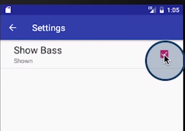

# Lesson 6 - Preferences

## Data Persistence

SavedInstanceState : allows to save key- value pairs, to store the state of one of the views.
It's usually used to save the state during things like app rotation or if the system destroys the activity because of memory constraints.
Should only be used if the user is still actively using the app.



If we need data available across app restarts and turning the phone off and on again :

1. SharedPreferences class : specify a file and it saves simple key value pairs to that file
=> to save single text or numerical value about the user.


2. Databases :  for complexe data with relations

3. Internal/External storage (to save files): store multimedia or large amounts of text. 

4. In the Cloud (database on a server or service like Google's Firebase) : save data in a place accessed by multiple devices.



## Preference Fragments

Fragment = a class that represents a modular and reusable piece of an Activity





PreferenceFragment = 



## Setting up the Settings Activity

- Add a new Activity SettingsActivity.
- Add a new Resource Folder Menu.
- In this directory, add a new File my_menu.xml
- Add one item 
```xml
<item 
  android:id="@+id/action_settings"
  android:orderInCategory="100"
  android:title="@string/action_settings"
  app:showAsAction="never"  />
```
- in the main activity, ovveride onCreateOptionsMenu(Menu menu)
```java
@Override
public boolean onCreateOptionsMenu(Menu menu) {
    MenuInflater inflater = getMenuInflater();
    inflater.inflate(R.menu.my_menu, menu);
    return true;
}
```

- override onOptionsItemsSelected
```java
@Override
public boolean onOptionsItemSelected(MenuItem item) {
    int id = item.getItemId();
    if (id == R.id.action_settings) {
        Intent startSettingsActivity = new Intent(this, SettingsActivity.class);
        return true;
    }
    return super.onOptionsItemSelected(item);
}
```
- in AndroidManifest.xml
```xml
<activity
    android:name=".MainActivity"
    android:launchMode="singleTop">
    ...
</activity>
<activity
    android:name=".SettingsActivity"
    android:label="@string/action_settings"
    android:parentActivityName=".MainActivity">
    <meta-data
        android:name="android.support.PARENT_ACTIVITY"
        android:value=".MainActivity" />
</activity>
```
- In SettingsActivity
```java
    @Override
    protected vois onCreate(Bundle savedInstanceState) {
        super.onCreate(savedInstanceState);
        setContentView(R.layout.activity_settings);
        ActionBar actionBar = this.getSupportActionBar();

        if (actionBar != null) {
            actionBar.setDisplayHomeAsUpEnabled(true);
        }
    }

    @Override
    public boolean onOptionsItemSelected(MenuItem item) {
        int id = item.getItemId();
        if (id == android.R.id.home) {
            NavUtils.navigateUpFromSameTask(this);
        }
        return super.onOptionsItemsSelected(item);
    }

```

## Making a PreferenceFragment

- In the gradle file :
```
compile 'com.android.support:preference-v7:25.0.0'
```
- Create a new class SettingsFragment
```java
public class SettingsFragment extends PreferenceFragmentCompat {
    @Override
    public void onCreatePreference(Bundle savedInstanceState, String rootKey) {
        addPreferenceFromResource(R.xml.pref_main);
    }
}
```
- Create a new Directory xml
-  In this folder, create a new xml file pref_main.xml
```xml
<PreferenceScreen xmlns:android="http://schemas.android.com/apk/res/android">
    <CheckBoxPreference
        android:defaultValue="true"
        android:key="show_bass"
        android:summaryOff="Hidden"
        android:summaryOn="Shown"
        android:title="Show Bass" />
</PreferenceScreen>
```
- Replace the activity_settings.xml
```xml
<fragment xmlns="http://schemas.android.com/apk/res/android"
    android:id="@+id/activity_settings"
    android:name="android.example.com.mainpreferences.SettngsFragment"
    android:layout_width="match_parent"
    android:layout_height="match_parent" />
```
- In styles.xml, add a theme
```xml
    <item name="preferenceTheme">Style/PreferenceThemeOverlay</item>
```



## Reading from SharedPreferences

- Use the preference manager method called getDefaultSharedPreferences (in MainActivity)
```java
@Override
protected void onCreate(Bundle savedInstancceState) {
    ...
    setupSharedPreferences();
    ...
}
private void setupSharedPreferences() {

    SharedPreferences sharedPreferences = PreferenceManager.getDefaultSharedPreferences(this);

    // to read the checkbox, we need to use getBoolean
    mVisualizerView.setShowBass(sharedPreferences.getBoolean("show_bass", true));
    ...
}
```
- To write in the share preferences :
```java
SharedPreferences.Editor editor = sharedPreferences.edit();
editor.putBoolean("show_bass", true);
editor.apply();

```

**getDefaultSharedPreferences** : Gets a SharedPreferences instance that points to the default file that is used by the preference framework in the given context!

**getSharedPreferences**: Gets a specific SharedPreferences instance by name in case you have more than one preference in the same context!

For more information on how to use either of them check out the documentation [here](https://developer.android.com/reference/android/preference/PreferenceManager.html)

## Preference Change Listener


