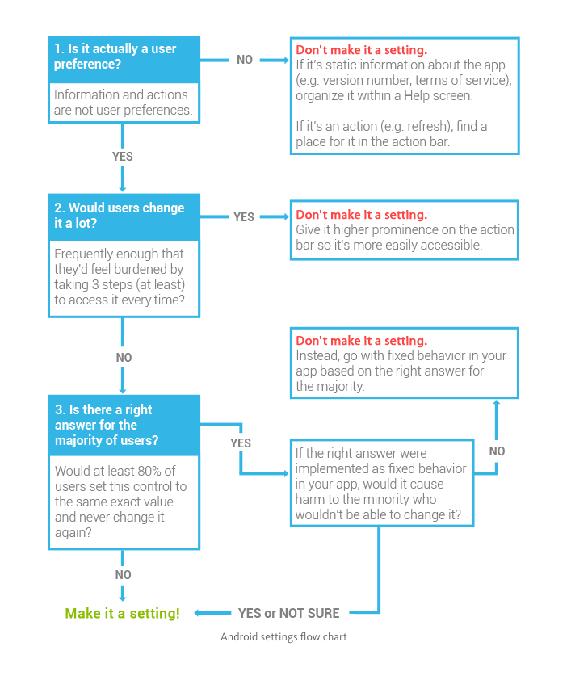

# Lesson 6 - Preferences

## Data Persistence

SavedInstanceState : allows to save key- value pairs, to store the state of one of the views.
It's usually used to save the state during things like app rotation or if the system destroys the activity because of memory constraints.
Should only be used if the user is still actively using the app.


If we need data available across app restarts and turning the phone off and on again :

1. SharedPreferences class : specify a file and it saves simple key value pairs to that file
=> to save single text or numerical value about the user.


2. Databases :  for complexe data with relations

3. Internal/External storage (to save files): store multimedia or large amounts of text. 

4. In the Cloud (database on a server or service like Google's Firebase) : save data in a place accessed by multiple devices.


## Preference Fragments

Fragment = a class that represents a modular and reusable piece of an Activity


PreferenceFragment = 


## Setting up the Settings Activity

- Add a new Activity SettingsActivity.
- Add a new Resource Folder Menu.
- In this directory, add a new File my_menu.xml
- Add one item 
```xml
<item 
  android:id="@+id/action_settings"
  android:orderInCategory="100"
  android:title="@string/action_settings"
  app:showAsAction="never"  />
```
- in the main activity, ovveride onCreateOptionsMenu(Menu menu)
```java
@Override
public boolean onCreateOptionsMenu(Menu menu) {
    MenuInflater inflater = getMenuInflater();
    inflater.inflate(R.menu.my_menu, menu);
    return true;
}
```

- override onOptionsItemsSelected
```java
@Override
public boolean onOptionsItemSelected(MenuItem item) {
    int id = item.getItemId();
    if (id == R.id.action_settings) {
        Intent startSettingsActivity = new Intent(this, SettingsActivity.class);
        return true;
    }
    return super.onOptionsItemSelected(item);
}
```
- in AndroidManifest.xml
```xml
<activity
    android:name=".MainActivity"
    android:launchMode="singleTop">
    ...
</activity>
<activity
    android:name=".SettingsActivity"
    android:label="@string/action_settings"
    android:parentActivityName=".MainActivity">
    <meta-data
        android:name="android.support.PARENT_ACTIVITY"
        android:value=".MainActivity" />
</activity>
```
- In SettingsActivity
```java
    @Override
    protected vois onCreate(Bundle savedInstanceState) {
        super.onCreate(savedInstanceState);
        setContentView(R.layout.activity_settings);
        ActionBar actionBar = this.getSupportActionBar();

        if (actionBar != null) {
            actionBar.setDisplayHomeAsUpEnabled(true);
        }
    }

    @Override
    public boolean onOptionsItemSelected(MenuItem item) {
        int id = item.getItemId();
        if (id == android.R.id.home) {
            NavUtils.navigateUpFromSameTask(this);
        }
        return super.onOptionsItemsSelected(item);
    }

```

## Making a PreferenceFragment

- In the gradle file :
```
compile 'com.android.support:preference-v7:25.0.0'
```
- Create a new class SettingsFragment
```java
public class SettingsFragment extends PreferenceFragmentCompat {
    @Override
    public void onCreatePreference(Bundle savedInstanceState, String rootKey) {
        addPreferenceFromResource(R.xml.pref_main);
    }
}
```
- Create a new Directory xml
-  In this folder, create a new xml file pref_main.xml
```xml
<PreferenceScreen xmlns:android="http://schemas.android.com/apk/res/android">
    <CheckBoxPreference
        android:defaultValue="true"
        android:key="show_bass"
        android:summaryOff="Hidden"
        android:summaryOn="Shown"
        android:title="Show Bass" />
</PreferenceScreen>
```
- Replace the activity_settings.xml
```xml
<fragment xmlns="http://schemas.android.com/apk/res/android"
    android:id="@+id/activity_settings"
    android:name="android.example.com.mainpreferences.SettngsFragment"
    android:layout_width="match_parent"
    android:layout_height="match_parent" />
```
- In styles.xml, add a theme
```xml
    <item name="preferenceTheme">Style/PreferenceThemeOverlay</item>
```


## Reading from SharedPreferences

- Use the preference manager method called getDefaultSharedPreferences (in MainActivity)
```java
@Override
protected void onCreate(Bundle savedInstancceState) {
    ...
    setupSharedPreferences();
    ...
}
private void setupSharedPreferences() {

    SharedPreferences sharedPreferences = PreferenceManager.getDefaultSharedPreferences(this);

    // to read the checkbox, we need to use getBoolean
    mVisualizerView.setShowBass(sharedPreferences.getBoolean("show_bass", true));
    ...
}
```
- To write in the share preferences :
```java
SharedPreferences.Editor editor = sharedPreferences.edit();
editor.putBoolean("show_bass", true);
editor.apply();

```

**getDefaultSharedPreferences** : Gets a SharedPreferences instance that points to the default file that is used by the preference framework in the given context!

**getSharedPreferences**: Gets a specific SharedPreferences instance by name in case you have more than one preference in the same context!

For more information on how to use either of them check out the documentation [here](https://developer.android.com/reference/android/preference/PreferenceManager.html)

## Preference Change Listener

One option for loading up our preferences would be to read from SharedPreferences in the onResume or onStart callback.
But there a better way.


1. Determine Activity that needs to get called when the preferences changed
2. Implement OnSharedPreferencesChangeListener
3. Link the OnSharedPreferencesChangeListener with the sharedPreferenceObject it should be listening to (registerOnSharedPreferenceChangeListener).
4. Cleanup : unregister the listener when the activity is shut down (unrefisterOnSharedPreferenceListener)

In MainActivity : 
```java
public class MainActivity extends AppCompatActivity implements SharedPreferences.OnSharedPreferenceChangeListener {
    ...
    @Override
    protected void onDestroy() {
        super.onDestroy();
        PreferenceManager.getDefaultSharedPreferences(this).unregisterOnSharedPreferenceChangeListener(this);

    }

    private void setupSharedPreferences() {
        SharedPreferences sharedPreferences = PreferenceManager.getDefaultSharedPreferences(this);
        mVisualizerView.setShowBass(sharedPreferences.getBoolean(getString(R.string.pref_show_bass_key),
                getResources().getBoolean(R.bool.pref_show_bass_default)));
        mVisualizerView.setShowMid(sharedPreferences.getBoolean(getString(R.string.pref_show_mid_range_key),
                getResources().getBoolean(R.bool.pref_show_mid_range_default)));
        mVisualizerView.setShowTreble(sharedPreferences.getBoolean(getString(R.string.pref_show_treble_key),
                getResources().getBoolean(R.bool.pref_show_treble_default)));
        mVisualizerView.setMinSizeScale(1);
        mVisualizerView.setColor(getString(R.string.pref_color_red_value));
        // Register the listener
        sharedPreferences.registerOnSharedPreferenceChangeListener(this);
    }

    @Override
    public void onSharedPreferenceChanged(SharedPreferences sharedPreferences, String key) {
        if (key.equals(getString(R.string.pref_show_bass_key))) {
            mVisualizerView.setShowBass.getBoolean(key, getResources().getBoolean(R.bool.pref_show_bass_default))
        }
    }
}
```

## List Preference

Define a ListPreference in PreferenceScreen :
```xml
<ListPreference
        android:defaultValue="@string/pref_color_red_value"
        android:entries="@array/pref_color_option_labels"
        android:entryValues="@array/pref_color_option_values"
        android:key="@string/pref_color_key"
android:title="@string/pref_color_label" />
```

In string.xml :
```xml
<string name="pref_color_label">Shape Color</string>
<string name="pref_color_key" translatable="false">color</string>
<string name="pref_color_red_value" translatable="false">red</string>
```
In the values folder, create a new resource file arrays.xml :
```xml
<?xml version="1.0" encoding="utf-8"?>
<resources>
    <!-- Label ordering must match values -->
    <array name="pref_color_option_labels">
        <item>@string/pref_color_label_red</item>
        <item>@string/pref_color_label_blue</item>
        <item>@string/pref_color_label_green</item>
    </array>

    <!-- values associated-->
    <array name="pref_color_option_values">
        <item>@string/pref_color_red_value</item>
        <item>@string/pref_color_blue_value</item>
        <item>@string/pref_color_green_value</item>
    </array>
</resources>
```

In MainActivity :
```java
private void setupSharedPreferences() {
    ...
    loadColorFromPreferences(sharedPreferences);
}
private void loadColorFromPreferences(SharedPreferences sharedPreferences) {
        mVisualizerView.setColor(sharedPreferences.getString(getString(R.string.pref_color_key),getString(R.string.pref_color_red_value)));
}
 @Override
public void onSharedPreferenceChanged(SharedPreferences sharedPreferences, String key) {
    ...
    } else if (key.equals(getString(R.string.pref_color_key))) {
        loadColorFromPreferences(sharedPreferences);
    }
}
```
## Preference Summary


In SettingsFragment :
```java
public class SettingsFragment extends PreferenceFragmentCompat implements
OnSharedPreferenceChangeListener {
    @Override
        public void onCreatePreferences(Bundle bundle, String s) {

        addPreferencesFromResource(R.xml.pref_visualizer);

        // all of the preferences if it is not a checkbox preference, call the setSummary method
        // passing in a preference and the value of the preference

        SharedPreferences sharedPreferences = getPreferenceScreen().getSharedPreferences();
        PreferenceScreen prefScreen = getPreferenceScreen();
        int count = prefScreen.getPreferenceCount();

        // Go through all of the preferences, and set up their preference summary.
        for (int i = 0; i < count; i++) {
            Preference p = prefScreen.getPreference(i);
            // You don't need to set up preference summaries for checkbox preferences because
            // they are already set up in xml using summaryOff and summary On
            if (!(p instanceof CheckBoxPreference)) {
                String value = sharedPreferences.getString(p.getKey(), "");
                setPreferenceSummary(p, value);
            }
        }
    }

    @Override
    public void onSharedPreferenceChanged(SharedPreferences sharedPreferences, String key) {
        // Figure out which preference was changed
        Preference preference = findPreference(key);
        if (null != preference) {
            // Updates the summary for the preference
            if (!(preference instanceof CheckBoxPreference)) {
                String value = sharedPreferences.getString(preference.getKey(), "");
                setPreferenceSummary(preference, value);
            }
        }
    }
    // Updates the summary for the preference
    private void setPreferenceSummary(Preference preference, String value) {
        if (preference instanceof ListPreference) {
            // For list preferences, figure out the label of the selected value
            ListPreference listPreference = (ListPreference) preference;
            int prefIndex = listPreference.findIndexOfValue(value);
            if (prefIndex >= 0) {
                // Set the summary to that label
                listPreference.setSummary(listPreference.getEntries()[prefIndex]);
            }
        }
    }

    @Override
    public void onCreate(Bundle savedInstanceState) {
        super.onCreate(savedInstanceState);
        getPreferenceScreen().getSharedPreferences()
        .registerOnSharedPreferenceChangeListener(this);
    }

    @Override
    public void onDestroy() {
        super.onDestroy();
        getPreferenceScreen().getSharedPreferences()
        .unregisterOnSharedPreferenceChangeListener(this);
}
}
```
## Edit Text Preference

In pref_visualizer.xml :
```xml
<EditTextPreference
    android:defaultValue="@string/pref_size_default"
    android:key="@string/pref_size_key"
    android:title="@string/pref_size_label" />
```

In stringx.xml :
```xml
<!-- Label for the size preference -->
    <string name="pref_size_label">Size Multiplier</string>

    <!-- Key name for storing size in SharedPreferences -->
    <string name="pref_size_key" translatable="false">size</string>

    <!-- Default for size preference -->
    <string name="pref_size_default" translatable="false">1</string>
```

In MainActivity : 
```java
private void setupSharedPreferences() {
    ...
    loadColorFromPreferences(sharedPreferences);
    loadSizeFromSharedPreferences(sharedPreferences);
    ...
}
private void loadSizeFromSharedPreferences(SharedPreferences sharedPreferences) {
    float minSize = Float.parseFloat(sharedPreferences.getString(getString(R.string.pref_size_key),
            getString(R.string.pref_size_default)));
    mVisualizerView.setMinSizeScale(minSize);
}
```

In SettingsFragment :
```java
private void setPreferenceSummary(Preference preference, String value) {
    if (preference instanceof ListPreference) {
        // For list preferences, figure out the label of the selected value
        ListPreference listPreference = (ListPreference) preference;
        int prefIndex = listPreference.findIndexOfValue(value);
        if (prefIndex >= 0) {
            // Set the summary to that label
            listPreference.setSummary(listPreference.getEntries()[prefIndex]);
        }
    } else if (preference instanceof EditTextPreference) {
        // For EditTextPreferences, set the summary to the value's simple string representation.
        preference.setSummary(value);
    }
}
```

## Edit Text Preference Constraints

### Setting an acceptable range

To limit the acceptable values between 0 (non inclusive) and 3 (inclusive) we opted to use a **PreferenceChangeListener** - this is not the same as a **SharedPreferenceChangeListener**. The differences are:

- **SharedPreferenceChangeListener** is triggered after any value is saved to the SharedPreferences file.
- **PreferenceChangeListener** is triggered before a value is saved to the SharedPreferences file. Because of this, it can prevent an invalid update to a preference. **PreferenceChangeListeners** are also attached to a single preference.

Generally the flow goes like this:

1. User updates a preference.
2. **PreferenceChangeListener** triggered for that preference.
3. The new value is saved to the SharedPreference file.
4. **onSharedPreferenceChanged** listeners are triggered.

Otherwise they act very similarly. In your activity you implement the **Preference.OnPreferenceChangeListener**, override the **onPreferenceChange(Preference preference, Object newValue)**. The **onPreferenceChange** method will return either true or false, depending on whether the preference should actually be saved.

Okay, so let’s take a look at the code.

#### Step 1: Implement the OnPreferenceChangeListener:

```java
public class SettingsFragment extends PreferenceFragmentCompat implements OnSharedPreferenceChangeListener, Preference.OnPreferenceChangeListener
```

#### Step 2: Attach the listener to the size preference in onCreatePreferences

```java
@Override
public void onCreatePreferences(Bundle bundle, String s) {
    /* Other preference setup code code */
    //...
    Preference preference = findPreference(getString(R.string.pref_size_key));
    preference.setOnPreferenceChangeListener(this);
}
```

#### Step 3: Implement onPreferenceChange

This code will first try to convert the preference into a number and then checks that the number is between 0 and 3. If either of these fail, a toast will be show and false is returned. By returning false, the incorrect value is not saved to shared preferences.

```java
public boolean onPreferenceChange(Preference preference, Object newValue) {
   Toast error = Toast.makeText(getContext(), "Please select a number between 0.1 and 3", Toast.LENGTH_SHORT);

   String sizeKey = getString(R.string.pref_size_key);
   if (preference.getKey().equals(sizeKey)) {
       String stringSize = (String) newValue;
       try {
           float size = Float.parseFloat(stringSize);
           if (size > 3 || size <= 0) {
               error.show();
               return false;
           }
       } catch (NumberFormatException nfe) {
           error.show();
           return false;
       }
   }
   return true;
}
```

## Should it be a Setting

Material Design Guidelines are the new standard for anything android, [here](https://material.io/guidelines/patterns/settings.html)'s a link to the guidelines for how to create settings pages

Here's a handy flowchart to help you decide if something is worth being a settings or should you just decide for the user a default value for: 



