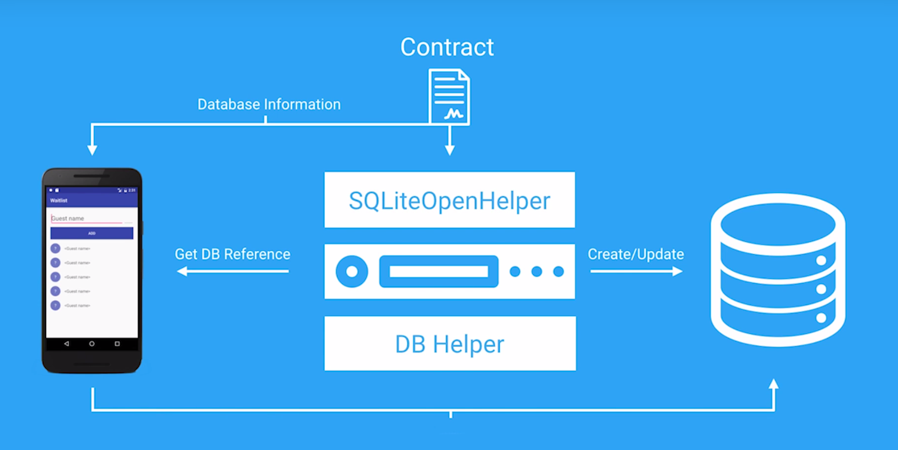

## Lesson 7  - Storing Data in SQlite

## Creating the Contract

Design what the database will look like.
Define the tables and the columns for each table.

The **contract** is a class, then we need to create an **inner class for each table**. 

The **constructor** needs to be private : you should never neef to create an instance of the contract class because the contract is simply a class filled with DB related constants thar are all static.

The inner class can (not mandatory) implements the interface **BaseColumns**.
The BaseColumns interface **automatically includes** a constant representing the primary key field called **_ID**.

In WaitlistContract class :
```java
public static final class WaitlistEntry implements BaseColumns {
    public static final String TABLE_NAME = "waitlist";
    public static final String COLUMN_GUEST_NAME = "guestName";
    public static final String COLUMN_PARTY_SIZE = "partySize";
    public static final String COLUMN_TIMESTAMP = "timestamp";
}
```

## Creating the database



Create a class DB Helper.

```java
public class WaitlistDbHelper extends SQLiteOpenHelper {
    // The database name
    private static final String DATABASE_NAME = "waitlist.db";

    // If you change the database schema, you must increment the database version
    private static final int DATABASE_VERSION = 1;

    public WaitlistDbHelper(Context context) {
        super(context, DATABASE_NAME, null, DATABASE_VERSION);
    }

    @Override
    public void onCreate(SQLiteDatabase sqLiteDatabase) {

        // Create a table to hold waitlist data
        final String SQL_CREATE_WAITLIST_TABLE = "CREATE TABLE " + WaitlistEntry.TABLE_NAME + " (" +
                WaitlistEntry._ID + " INTEGER PRIMARY KEY AUTOINCREMENT," +
                WaitlistEntry.COLUMN_GUEST_NAME + " TEXT NOT NULL, " +
                WaitlistEntry.COLUMN_PARTY_SIZE + " INTEGER NOT NULL, " +
                WaitlistEntry.COLUMN_TIMESTAMP + " TIMESTAMP DEFAULT CURRENT_TIMESTAMP" +
                "); ";

        // Execute the query by calling execSQL on sqLiteDatabase and pass the string query SQL_CREATE_WAITLIST_TABLE
        sqLiteDatabase.execSQL(SQL_CREATE_WAITLIST_TABLE);
    }

    @Override
    public void onUpgrade(SQLiteDatabase sqLiteDatabase, int i, int i1) {
        // For now simply drop the table and create a new one. This means if you change the
        // DATABASE_VERSION the table will be dropped.
        // In a production app, this method might be modified to ALTER the table
        // instead of dropping it, so that existing data is not deleted.
        sqLiteDatabase.execSQL("DROP TABLE IF EXISTS " + WaitlistEntry.TABLE_NAME);
        onCreate(sqLiteDatabase);
    }
}
```

## Querying all guests

**getWritableDatabase** => create/write in the DB

**getReadableDatabase** => read in the DB

Write fake data, in MainActivity : 
```java
 private GuestListAdapter mAdapter;

 @Override
    protected void onCreate(Bundle savedInstanceState) {
        ...
        // Create a DB helper (this will create the DB if run for the first time)
        WaitlistDbHelper dbHelper = new WaitlistDbHelper(this);

        // Keep a reference to the mDb until paused or killed. Get a writable database
        // because you will be adding restaurant customers
        mDb = dbHelper.getWritableDatabase();

        // call insertFakeData in TestUtil and pass the database reference mDb
        //Fill the database with fake data
        TestUtil.insertFakeData(mDb);

        // Run the getAllGuests function and store the result in a Cursor variable
        Cursor cursor = getAllGuests();

        // Create an adapter for that cursor to display the data
        mAdapter = new GuestListAdapter(this, cursor.getCount());

        // Link the adapter to the RecyclerView
        waitlistRecyclerView.setAdapter(mAdapter);

}

private Cursor getAllGuests() {
        // COMPLETED (6) Inside, call query on mDb passing in the table name and projection String [] order by COLUMN_TIMESTAMP
        return mDb.query(
                WaitlistContract.WaitlistEntry.TABLE_NAME,
                null,
                null,
                null,
                null,
                null,
                WaitlistContract.WaitlistEntry.COLUMN_TIMESTAMP
        );
}
```

In GuestListAdpater : 
```java
// Add a new local variable mCount to store the count of items to be displayed in the recycler view
private int mCount;

public GuestListAdapter(Context context, int count) {
        this.mContext = context;
        // Set the local mCount to be equal to count
        mCount = count;
}

@Override
    public int getItemCount() {
        return mCount;
}
```

## Updating the Adapter

In GuestListAdapter :

```java
 // Replace the mCount with a new Cursor field called mCursor
// Holds on to the cursor to display the waitlist
private Cursor mCursor;

public GuestListAdapter(Context context, Cursor cursor) {
        this.mContext = context;
        // COMPLETED (3) Set the local mCursor to be equal to cursor
        this.mCursor = cursor;
}

@Override
    public void onBindViewHolder(GuestViewHolder holder, int position) {
    //  Move the cursor to the passed in position, return if moveToPosition returns false
    // Move the mCursor to the position of the item to be displayed
    if (!mCursor.moveToPosition(position))
        return; // bail if returned null
    // Call getString on the cursor to get the guest's name
    String name = mCursor.getString(mCursor.getColumnIndex(WaitlistContract.WaitlistEntry.COLUMN_GUEST_NAME));
    // Call getInt on the cursor to get the party size
    int partySize = mCursor.getInt(mCursor.getColumnIndex(WaitlistContract.WaitlistEntry.COLUMN_PARTY_SIZE));
    // Set the holder's nameTextView text to the guest's name
    // Display the guest name
    holder.nameTextView.setText(name);
    // Set the holder's partySizeTextView text to the party size
    // Display the party count
    holder.partySizeTextView.setText(String.valueOf(partySize));
}

@Override
    public int getItemCount() {
        // Update the getItemCount to return the getCount of the cursor
        return mCursor.getCount();
}

```
In MainActivity :

```java
@Override
protected void onCreate(Bundle savedInstanceState) {
    ...
    Cursor cursor = getAllGuests();

    // Pass the entire cursor to the adapter rather than just the count
            // Create an adapter for that cursor to display the data
    mAdapter = new GuestListAdapter(this, cursor);

     waitlistRecyclerView.setAdapter(mAdapter);
```

## Adding Guests


