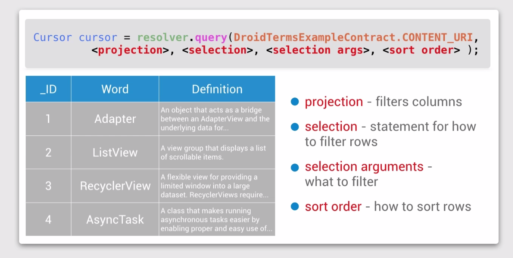
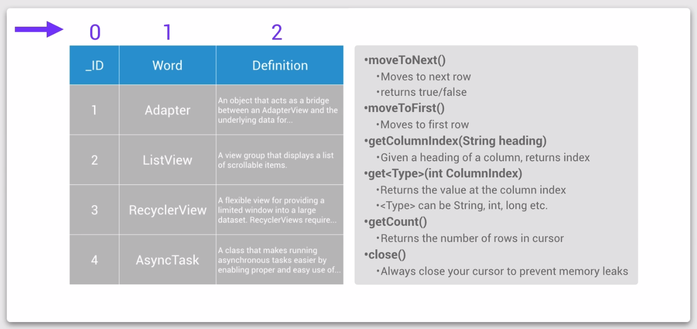
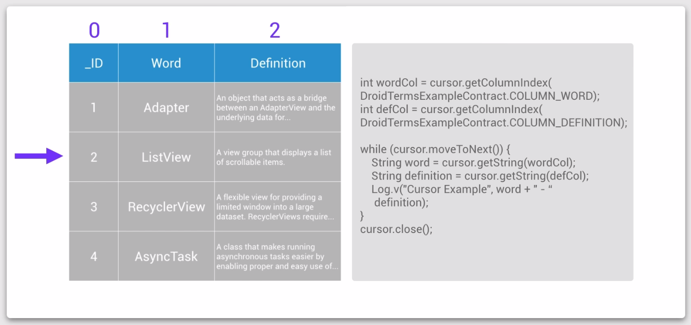

# Lesson 8 - Content Provider

## Content Provider

A content provider is a class that sits between an application and its data source. Its job is to provide easily managed access to the underlying data source.


## Content Provider Advantages 

- Allow developers to change the underlying data source without needing to change any code in the applications that access the content provider.


- 


- 


## DroidTermExample


General Steps for Using a ContentProvider

You will take the following steps:

1. Get permission to use the ContentProvider.
2. Get the ContentResolver
3. Pick one of four basic actions on the data: query, insert, update, delete
4. Identify the data you are reading or manipulating to create a URI
5. In the case of reading from the ContentProvider, display the information in the UI

## Content Provider Permissions

In AndroidManifest.xml : 
```xml
<uses-permission android:name="com.example.udacity.droidtermexample.TERMS_READ" />
```

## Content Resolver


## Steps for using a Content Provider

```java
ContentResolver resolver = getContentResolver();
Cursor cursor = Resolver.query(DroidTermsExampleContract.
CONTENT_URI, null, null, null, null);
```

### Four basic actions
- read from the data: **query()**
- add a row or rows to the data: **insert()**
- update the data: **update()**
- delete a row or rows from the data: **delete()**

## Uniform Resource Identifier


## Calling the ContentProvider

### Make an AsyncTask

The goal is to make an **AsyncTask** that loads the data on a background thread in a Cursor object. It then updates a variable called **mData** in the MainActivity to store the returned **Cursor**.

#### Steps to get the data from the Content Provider and save it into an instance variable :

1. Create an **AsyncTask** with the following generic types **<Void, Void, Cursor>**
2. In the **doInBackground** method, write the code to access the DroidTermsExample provider and return the **Cursor** object.
3. Create an instance variable **Cursor mData**.
4. In the **onPostExecute** method, store the **Cursor** object in **mData**.
5. Create and execute the **AsyncTask** in **onCreate**.

```java
// Create an instance variable storing a Cursor called mData
private Cursor mData;

// Use an async task to do the data fetch off of the main thread.
public class WordFetchTask extends AsyncTask<Void, Void, Cursor> {

    // Invoked on a background thread
    @Override
    protected Cursor doInBackground(Void... params) {
        // Make the query to get the data

        // Get the content resolver
        ContentResolver resolver = getContentResolver();

        // Call the query method on the resolver with the correct Uri from the contract class
        Cursor cursor = resolver.query(DroidTermsExampleContract.CONTENT_URI,
                null, null, null, null);
        return cursor;
    }

    // Invoked on UI thread
    @Override
    protected void onPostExecute(Cursor cursor) {
        super.onPostExecute(cursor);

        // Set the data for MainActivity
        mData = cursor;
    }
}

@Override
protected void onCreate(Bundle savedInstanceState) {
    super.onCreate(savedInstanceState);
    setContentView(R.layout.activity_main);

    // Get the views
    mButton = (Button) findViewById(R.id.button_next);

    // Run the database operation to get the cursor off of the main thread
    // Create and execute your AsyncTask here
    new WordFetchTask().execute();
}
```

## Structure of the Data



## Working with Cursors 





```java
// Invoked on UI thread
@Override
protected void onPostExecute(Cursor cursor) {
    super.onPostExecute(cursor);
    // Initialize anything that you need the cursor for, such as setting up
    // the screen with the first word and setting any other instance variables

    //Set up a bunch of instance variables based off of the data

    // Set the data for MainActivity
    mData = cursor;
    // Get the column index, in the Cursor, of each piece of data
    mDefCol = mData.getColumnIndex(DroidTermsExampleContract.COLUMN_DEFINITION);
    mWordCol = mData.getColumnIndex(DroidTermsExampleContract.COLUMN_WORD);

    // Set the initial state
    nextWord();
}

public void showDefinition() {
    // Show the definition
    if (mData != null) {
        // Show the definition TextView
        mDefinitionTextView.setVisibility(View.VISIBLE);

        // Change button text
        mButton.setText(getString(R.string.next_word));

        mCurrentState = STATE_SHOWN;
    }
}


public void nextWord() {
    // Go to the next word in the Cursor, show the next word and hide the definition
    // Note that you shouldn't try to do this if the cursor hasn't been set yet.
    // If you reach the end of the list of words, you should start at the beginning again.

    // First, it checks if the cursor has been set. 
    // If it has, it tries to move the cursor to the next value, using moveToNext. 
    // This will return false if it cannot, in which case, 
    // we call moveToFirst to go back to the first row in the Cursor.

    if (mData != null) {
        // Move to the next position in the cursor, if there isn't one, move to the first
        if (!mData.moveToNext()) {
            mData.moveToFirst();
        }
        // At this point, the cursor is positioned at the correct row, 
        // so we set the definition view to invisible, 
        // change the button text to "Show Definition"
        mDefinitionTextView.setVisibility(View.INVISIBLE);

        // Change button text
        mButton.setText(getString(R.string.show_definition));

        // Finally we setup the correct values for the word and 
        // the hidden definition text, using the Cursors' getString method.
        mWordTextView.setText(mData.getString(mWordCol));
        mDefinitionTextView.setText(mData.getString(mDefCol));

        mCurrentState = STATE_HIDDEN;
    }
}

 @Override
protected void onDestroy() {
    super.onDestroy();
    // Remember to close your cursor!
    mData.close();
}
```

