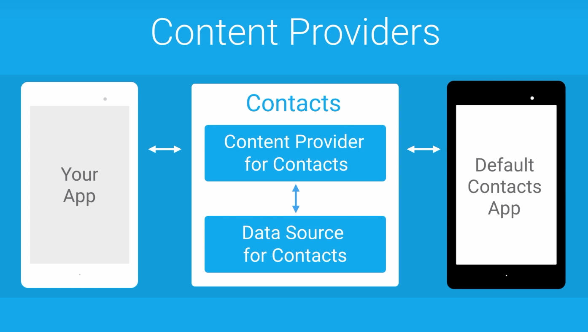
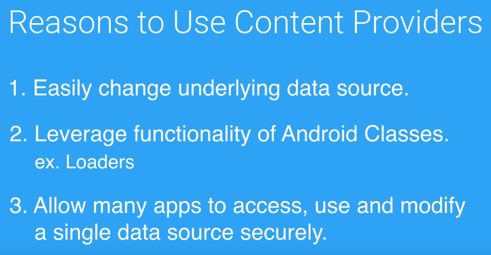

# Lesson 8 - Content Provider

## Content Provider

A content provider is a class that sits between an application and its data source. Its job is to provide easily managed access to the underlying data source.



## Content Provider Advantages 

- Allow developers to change the underlying data source without needing to change any code in the applications that access the content provider.


- 


- 


## DroidTermExample


General Steps for Using a ContentProvider

You will take the following steps:

1. Get permission to use the ContentProvider.
2. Get the ContentResolver
3. Pick one of four basic actions on the data: query, insert, update, delete
4. Identify the data you are reading or manipulating to create a URI
5. In the case of reading from the ContentProvider, display the information in the UI

## Content Provider Permissions

In AndroidManifest.xml : 
```xml
<uses-permission android:name="com.example.udacity.droidtermexample.TERMS_READ" />
```

## Content Resolver


## Steps for using a Content Provider

```java
ContentResolver resolver = getContentResolver();
Cursor cursor = Resolver.query(DroidTermsExampleContract.
CONTENT_URI, null, null, null, null);
```

### Four basic actions
- read from the data: **query()**
- add a row or rows to the data: **insert()**
- update the data: **update()**
- delete a row or rows from the data: **delete()**

## Uniform Resource Identifier


## Calling the ContentProvider

