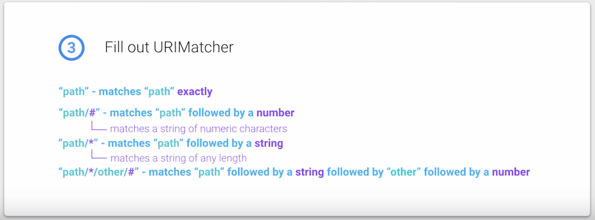
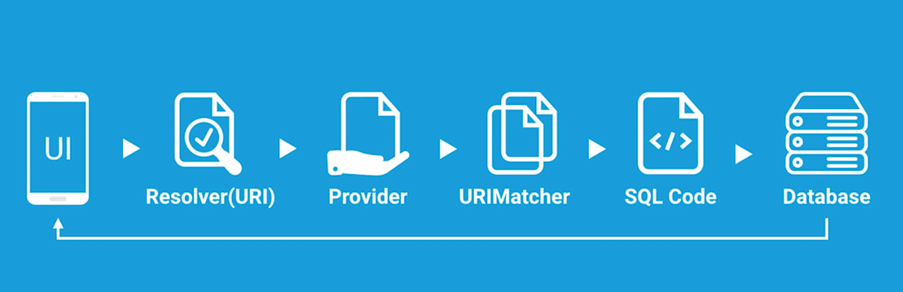
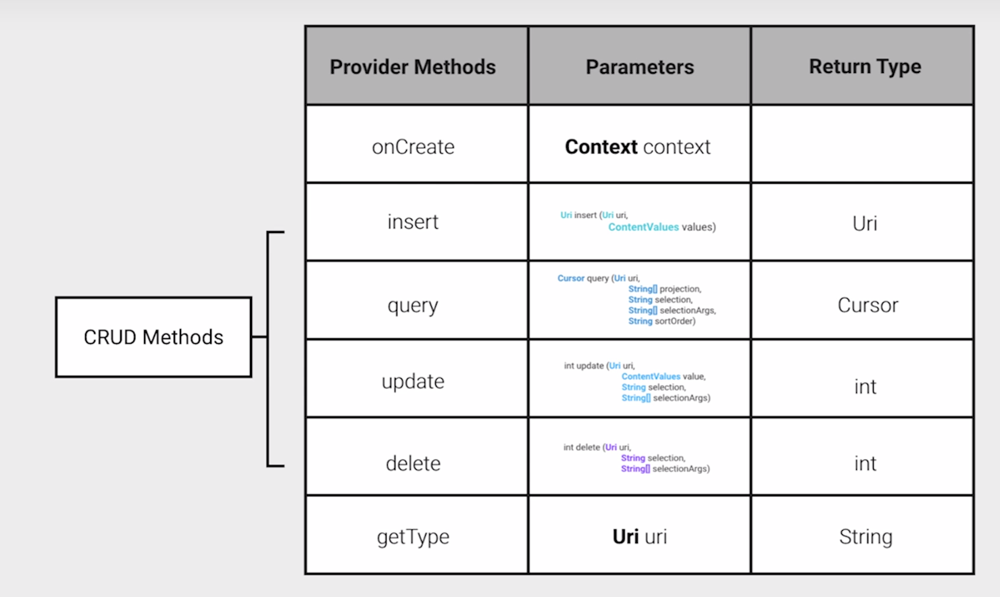
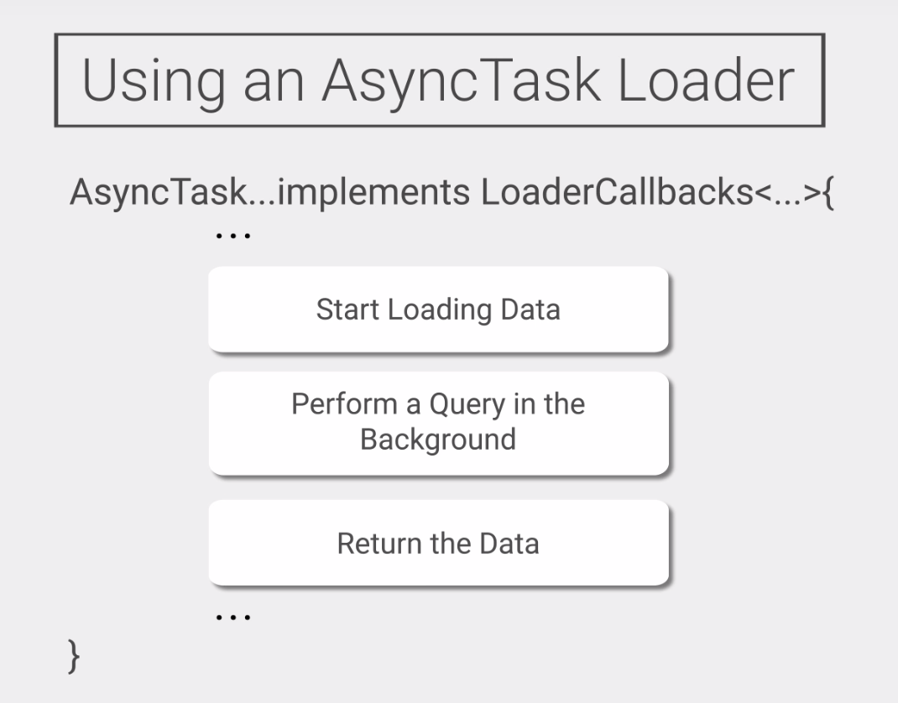

# Lesson 9 - Building a Content Provider
https://github.com/udacity/ud851-Exercises
## Steps to create a Provider

[Content Provider Documentation](https://developer.android.com/guide/topics/providers/content-providers.html)

1. Create a class that extends from the content provider and implements the onCreate() function.
2. Register the content provider in the Manifest.
3. Define URI's that identify the TaskContentProvider and the different data types that it can return.
4. Add these URI's to the Contract class.
5. Build a URIMatcher to match URI patterns to integers.
6. Implement the required CRUD methods.

## Create TaskContentProvider

```java
public class TaskContentProvider extends ContentProvider {

    // Member variable for a TaskDbHelper that's initialized in the onCreate() method
    private TaskDbHelper mTaskDbHelper;

    /* onCreate() is where you should initialize anything you’ll need to setup
    your underlying data source.
    In this case, you’re working with a SQLite database, so you’ll need to
    initialize a DbHelper to gain access to it.
     */
    @Override
    public boolean onCreate() {
        Context context = getContext();
        mTaskDbHelper = new TaskDbHelper(context);
        return true;
    }


    @Override
    public Uri insert(@NonNull Uri uri, ContentValues values) {

        throw new UnsupportedOperationException("Not yet implemented");
    }


    @Override
    public Cursor query(@NonNull Uri uri, String[] projection, String selection,
                        String[] selectionArgs, String sortOrder) {

        throw new UnsupportedOperationException("Not yet implemented");
    }


    @Override
    public int delete(@NonNull Uri uri, String selection, String[] selectionArgs) {

        throw new UnsupportedOperationException("Not yet implemented");
    }


    @Override
    public int update(@NonNull Uri uri, ContentValues values, String selection,
                      String[] selectionArgs) {

        throw new UnsupportedOperationException("Not yet implemented");
    }


    @Override
    public String getType(@NonNull Uri uri) {

        throw new UnsupportedOperationException("Not yet implemented");
    }

}
```

## Create and Register a ContentProvider

In the **Manifest** :

```xml
<!-- Exported = false limits access to this ContentProvider to only this app -->
<provider 
    android:name="com.example.android.todolist.data.TaskContentProvider"
    android:authorites="com.example.android.todolist"
    android:exported="false" />
```

## Define the URI Structure

```<scheme>//<authority>/<path>```

content://com.android.example.todolist/tasks

Example : **CalendarContentProvider** => content://com.android.calendar/```<path to calendars>```

- content://com.android.calendar/events

- content://com.android.calendar/attendees

Example : access the second task in the table Tasks

- content://com.udacity.example.todolist/tasks/2

Access a task - # stands for any integer number
- content://com.udacity.example.todolist/tasks/#



## Change the Contract

- Scheme= content:// 
- Content authority = reference to the provider (com.example.android.todolist)
- Base content URI = content_scheme + authority => a unique reference to the provider
- Path = to specific data
- Content URI = base content URI + path

```java
public class TaskContract {

    // The authority, which is how your code knows which Content Provider to access
    public static final String AUTHORITY = "com.example.android.todolist";

    // The base content URI = "content://" + <authority>
    public static final Uri BASE_CONTENT_URI = Uri.parse("content://" + AUTHORITY);

    // Define the possible paths for accessing data in this contract
    // This is the path for the "tasks" directory
    public static final String PATH_TASKS = "tasks";

    /* TaskEntry is an inner class that defines the contents of the task table */
    public static final class TaskEntry implements BaseColumns {

        // TaskEntry content URI = base content URI + path
        public static final Uri CONTENT_URI =
                BASE_CONTENT_URI.buildUpon().appendPath(PATH_TASKS).build();

        // Task table and column names
        public static final String TABLE_NAME = "tasks";

        // Since TaskEntry implements the interface "BaseColumns", it has an automatically produced
        // "_ID" column in addition to the two below
        public static final String COLUMN_DESCRIPTION = "description";
        public static final String COLUMN_PRIORITY = "priority";
    }
}
```

## Build the URIMatcher

**UriMatcher** : Determines what king of URI the provider receives and match it to an integer constant. 

We can easily make a switch statement instead of using a series of long if statements that check for equality.

- Create the integer constants that these URIs will match to
```java
// Define final integer constants for the directory of tasks and a single item.
// It's convention to use 100, 200, 300, etc for directories,
// and related ints (101, 102, ..) for items in that directory.
public static final int TASKS = 100;
public static final int TASK_WITH_ID = 101;
```
- Write a helper function called UriMatcher
```java
// Define a static buildUriMatcher method that associates URI's with their int match
/**
Initialize a new matcher object without any matches,
then use .addURI(String authority, String path, int match) to add matches
*/
public static UriMatcher buildUriMatcher() {

    // Initialize a UriMatcher with no matches by passing in NO_MATCH to the constructor
    UriMatcher uriMatcher = new UriMatcher(UriMatcher.NO_MATCH);

    /*
    All paths added to the UriMatcher have a corresponding int.
    For each kind of uri you may want to access, add the corresponding match with addURI.
    The two calls below add matches for the task directory and a single item by ID.
    */
    // addURI(String authority, String path, int code)
    // directory
    uriMatcher.addURI(TaskContract.AUTHORITY, TaskContract.PATH_TASKS, TASKS);
    // single item
    uriMatcher.addURI(TaskContract.AUTHORITY, TaskContract.PATH_TASKS + "/#", TASK_WITH_ID);

    return uriMatcher;
}
```
- Declare a static variable for the Uri matcher that you construct
```java
// begin with s like static
private static final UriMatcher sUriMatcher = buildUriMatcher();
```
- then we can create the switch statements like this
```java
int match = sUriMatcher.match(uri);

switch(match) {
    // handle different integer matches
    case TASKS:
        retCursor = db.query(TABLE_NAME,
                        projection,
                        selection,
                        selectionArgs,
                        null,
                        null,
                        sortOrder);
        break;
    case TASK_WITH_ID:
    // handle single task case
        break;
    // default exception
    default:
        throw new UnsupportedOperationException("Unknow uri: " + uri);
}
```

## Resolver to Database Flow



## Overview of Provider Functions



## Insert

```java
@Override
public Uri insert(@NonNull Uri uri, ContentValues values) {
    // 1. Get access to the task database (to write new data to)
    final SQLiteDatabase db = mTaskDbHelper.getWritableDatabase();

    // 2. Write URI matching code to identify the match for the tasks directory
    int match = sUriMatcher.match(uri);
    Uri returnUri; // URI to be returned

    switch (match) {
        case TASKS:
            // 3. Insert new values into the database
            // Inserting values into tasks table
            long id = db.insert(TABLE_NAME, null, values);
            if ( id > 0 ) {
                returnUri = ContentUris.withAppendedId(TaskContract.TaskEntry.CONTENT_URI, id);
            } else {
                throw new android.database.SQLException("Failed to insert row into " + uri);
            }
            break;
        // 4. Set the value for the returnedUri and write the default case for unknown URI's
        // Default case throws an UnsupportedOperationException
        default:
            throw new UnsupportedOperationException("Unknown uri: " + uri);
    }

    // 5. Notify the resolver if the uri has been changed, and return the newly inserted URI
    getContext().getContentResolver().notifyChange(uri, null);

    // Return constructed uri (this points to the newly inserted row of data)
    return returnUri;
}
```

## Hook it up to the UI

In AddTaskActivity : 
```java
/**
    * onClickAddTask is called when the "ADD" button is clicked.
    * It retrieves user input and inserts that new task data into the underlying database.
    */
public void onClickAddTask(View view) {
    // Not yet implemented
    // 1. Check if EditText is empty, if not retrieve input and store it in a ContentValues object
    // If the EditText input is empty -> don't create an entry
    String input = ((EditText) findViewById(R.id.editTextTaskDescription)).getText().toString();
    if (input.length() == 0) {
        return;
    }

    // 2. Insert new task data via a ContentResolver
    // Create new empty ContentValues object
    ContentValues contentValues = new ContentValues();
    // Put the task description and selected mPriority into the ContentValues
    contentValues.put(TaskContract.TaskEntry.COLUMN_DESCRIPTION, input);
    contentValues.put(TaskContract.TaskEntry.COLUMN_PRIORITY, mPriority);
    // Insert the content values via a ContentResolver
    Uri uri = getContentResolver().insert(TaskContract.TaskEntry.CONTENT_URI, contentValues);

    // 3.  Display the URI that's returned with a Toast
    // [Hint] Don't forget to call finish() to return to MainActivity after this insert is complete
    if(uri != null) {
        Toast.makeText(getBaseContext(), uri.toString(), Toast.LENGTH_LONG).show();
    }

    // Finish activity (this returns back to MainActivity)
    finish();
}
```

## Query

### What Does the CustomCursorAdapter do?

```java
// Implement query to handle requests for data by URI
@Override
public Cursor query(@NonNull Uri uri, String[] projection, String selection,
                    String[] selectionArgs, String sortOrder) {

    //  1. Get access to underlying database (read-only for query)
    final SQLiteDatabase db = mTaskDbHelper.getReadableDatabase();

    // 2. Write URI match code and set a variable to return a Cursor
    int match = sUriMatcher.match(uri);
    Cursor retCursor;

    // 3. Query for the tasks directory and write a default case
    switch (match) {
        // Query for the tasks directory
        case TASKS:
            retCursor =  db.query(TABLE_NAME,
                    projection,
                    selection,
                    selectionArgs,
                    null,
                    null,
                    sortOrder);
            break;
        // Default exception
        default:
            throw new UnsupportedOperationException("Unknown uri: " + uri);
    }

    // 4. Set a notification URI on the Cursor and return that Cursor
    retCursor.setNotificationUri(getContext().getContentResolver(), uri);

    // Return the desired Cursor
    return retCursor;
}
```
The **CustomCursorAdapter** will inflate views using the xml layout file **task_layout**, and create **ViewHolders** that will fill the main **RecyclerView**.

Each **ViewHolder** includes data about a single task: it’s text description and priority level. The **priorityView** will actually be a small colored circle that indicates the priority level 1-3 (1 is high and 3 is low).

The priority circle is a drawable resource, and its color is assigned to red, yellow, or green based on the priority level.

All of this code was included in your starter code, so no need to change anything in here.

## Display the Tasks

We need to retrieve the data on a background thread, because a query can be unreliable or slow.



```java
/**
* This method is called after this activity has been paused or restarted.
* Often, this is after new data has been inserted through an AddTaskActivity,
* so this restarts the loader to re-query the underlying data for any changes.
*/
@Override
protected void onResume() {
    super.onResume();

    // re-queries for all tasks
    getSupportLoaderManager().restartLoader(TASK_LOADER_ID, null, this);
}


/**
* Instantiates and returns a new AsyncTaskLoader with the given ID.
* This loader will return task data as a Cursor or null if an error occurs.
*
* Implements the required callbacks to take care of loading data at all stages of loading.
*/
@Override
public Loader<Cursor> onCreateLoader(int id, final Bundle loaderArgs) {

    return new AsyncTaskLoader<Cursor>(this) {

        // Initialize a Cursor, this will hold all the task data
        Cursor mTaskData = null;

        // onStartLoading() is called when a loader first starts loading data
        @Override
        protected void onStartLoading() {
            if (mTaskData != null) {
                // Delivers any previously loaded data immediately
                deliverResult(mTaskData);
            } else {
                // Force a new load
                forceLoad();
            }
        }

        // loadInBackground() performs asynchronous loading of data
        @Override
        public Cursor loadInBackground() {
            // Will implement to load data

            // COMPLETED (5) Query and load all task data in the background; sort by priority
            // [Hint] use a try/catch block to catch any errors in loading data

            try {
                return getContentResolver().query(TaskContract.TaskEntry.CONTENT_URI,
                        null,
                        null,
                        null,
                        TaskContract.TaskEntry.COLUMN_PRIORITY);

            } catch (Exception e) {
                Log.e(TAG, "Failed to asynchronously load data.");
                e.printStackTrace();
                return null;
            }
        }

        // deliverResult sends the result of the load, a Cursor, to the registered listener
        public void deliverResult(Cursor data) {
            mTaskData = data;
            super.deliverResult(data);
        }
    };

}


/**
* Called when a previously created loader has finished its load.
*
* @param loader The Loader that has finished.
* @param data The data generated by the Loader.
*/
@Override
public void onLoadFinished(Loader<Cursor> loader, Cursor data) {
    // Update the data that the adapter uses to create ViewHolders
    mAdapter.swapCursor(data);
}


/**
* Called when a previously created loader is being reset, and thus
* making its data unavailable.
* onLoaderReset removes any references this activity had to the loader's data.
*
* @param loader The Loader that is being reset.
*/
@Override
public void onLoaderReset(Loader<Cursor> loader) {
        mAdapter.swapCursor(null);
    }

}
```


### What Does the CustomCursorAdapter do?

The CustomCursorAdapter will inflate views using the xml layout file task_layout, and create ViewHolders that will fill the main RecyclerView.

Each ViewHolder includes data about a single task: it’s text description and priority level. The priorityView will actually be a small colored circle that indicates the priority level 1-3 (1 is high and 3 is low).

The priority circle is a drawable resource, and its color is assigned to red, yellow, or green based on the priority level.

All of this code was included in your starter code, so no need to change anything in here.

## Query for One Item

```java
// Implement query to handle requests for data by URI
@Override
public Cursor query(@NonNull Uri uri, String[] projection, String selection,
                    String[] selectionArgs, String sortOrder) {

    // Get access to underlying database (read-only for query)
    final SQLiteDatabase db = mTaskDbHelper.getReadableDatabase();

    // Write URI match code
    // Write a query for the tasks directory and default case

    int match = sUriMatcher.match(uri);
    Cursor retCursor;

    switch (match) {
        // Query for the tasks directory
        case TASKS:
            retCursor =  db.query(TABLE_NAME,
                    projection,
                    selection,
                    selectionArgs,
                    null,
                    null,
                    sortOrder);
            break;

        // Add a case to query for a single row of data by ID
        // Use selections and selectionArgs to filter for that ID
        case TASK_WITH_ID:
            // using selection and selectionArgs
            // URI: content://<authority>/tasks/#
            // Get the id from the URI
            String id = uri.getPathSegments().get(1);

            // Selection is the _ID column = ?, and the Selection args = the row ID from the URI
            String mSelection = "_id=?";
            String[] mSelectionArgs = new String[]{id};

            // Construct a query as you would normally, passing in the selection/args
            retCursor =  db.query(TABLE_NAME,
                    projection,
                    mSelection,
                    mSelectionArgs,
                    null,
                    null,
                    sortOrder);
            break;

        // Default exception
        default:
            throw new UnsupportedOperationException("Unknown uri: " + uri);
    }

    // Set a notification URI on the Cursor
    retCursor.setNotificationUri(getContext().getContentResolver(), uri);

    // Return the desired Cursor
    return retCursor;
}
```

## Implement Delete

```java
// Implement delete to delete a single row of data
@Override
public int delete(@NonNull Uri uri, String selection, String[] selectionArgs) {

    // 1. Get access to the database and write URI matching code to recognize a single item
    final SQLiteDatabase db = mTaskDbHelper.getWritableDatabase();

    int match = sUriMatcher.match(uri);
    // Keep track of the number of deleted tasks
    int tasksDeleted; // starts as 0

    // 2. Write the code to delete a single row of data
    // [Hint] Use selections to delete an item by its row ID
    switch (match) {
        // Handle the single item case, recognized by the ID included in the URI path
        case TASK_WITH_ID:
            // Get the task ID from the URI path
            String id = uri.getPathSegments().get(1);
            // Use selections/selectionArgs to filter for this ID
            tasksDeleted = db.delete(TABLE_NAME, "_id=?", new String[]{id});
            break;
        default:
            throw new UnsupportedOperationException("Unknown uri: " + uri);
    }

    // 3. Notify the resolver of a change and return the number of items deleted
    if (tasksDeleted != 0) {
        // A task was deleted, set notification
        getContext().getContentResolver().notifyChange(uri, null);
    }

    // Return the number of tasks deleted
    return tasksDeleted;
}
```
## Swipe to delete

In MainActivity, in the **onCreate** method :

```java
/*
Add a touch helper to the RecyclerView to recognize when a user swipes to delete an item.
An ItemTouchHelper enables touch behavior (like swipe and move) on each ViewHolder,
and uses callbacks to signal when a user is performing these actions.
*/
    new ItemTouchHelper(new ItemTouchHelper.SimpleCallback(0, ItemTouchHelper.LEFT | ItemTouchHelper.RIGHT) {
        @Override
        public boolean onMove(RecyclerView recyclerView, RecyclerView.ViewHolder viewHolder, RecyclerView.ViewHolder target) {
            return false;
        }

        // Called when a user swipes left or right on a ViewHolder
        @Override
        public void onSwiped(RecyclerView.ViewHolder viewHolder, int swipeDir) {
            // Here is where you'll implement swipe to delete

            // 1. Construct the URI for the item to delete
            //[Hint] Use getTag (from the adapter code) to get the id of the swiped item
            // Retrieve the id of the task to delete
            int id = (int) viewHolder.itemView.getTag();

            // Build appropriate uri with String row id appended
            String stringId = Integer.toString(id);
            Uri uri = TaskContract.TaskEntry.CONTENT_URI;
            uri = uri.buildUpon().appendPath(stringId).build();

            // 2. Delete a single row of data using a ContentResolver
            getContentResolver().delete(uri, null, null);

            // 3. Restart the loader to re-query for all tasks after a deletion
            getSupportLoaderManager().restartLoader(TASK_LOADER_ID, null, MainActivity.this);

        }
}).attachToRecyclerView(mRecyclerView);
```

## Update

```java
// Update won't be used in the final ToDoList app but is implemented here for completeness
// This updates a single item (by it's ID) in the tasks directory
@Override
public int update(@NonNull Uri uri, ContentValues values, String selection,
                    String[] selectionArgs) {

    //Keep track of if an update occurs
    int tasksUpdated;

    // match code
    int match = sUriMatcher.match(uri);

    switch (match) {
        case TASK_WITH_ID:
            //update a single task by getting the id
            String id = uri.getPathSegments().get(1);
            //using selections
            tasksUpdated = mTaskDbHelper.getWritableDatabase().update(TABLE_NAME, values, "_id=?", new String[]{id});
            break;
        default:
            throw new UnsupportedOperationException("Unknown uri: " + uri);
    }

    if (tasksUpdated != 0) {
        //set notifications if a task was updated
        getContext().getContentResolver().notifyChange(uri, null);
    }

    // return number of tasks updated
    return tasksUpdated;
}
```
## getType

It returns a string that tells you the MIME type.

MIME type is just a standard way to define a data type.

It only becomes useful when MIME types are used to organize data or to validate data.

```java
/* getType() handles requests for the MIME type of data
We are working with two types of data:
1) a directory and 2) a single row of data.
This method will not be used in our app, but gives a way to standardize the data formats
that your provider accesses, and this can be useful for data organization.
For now, this method will not be used but will be provided for completeness.
 */
@Override
public String getType(@NonNull Uri uri) {
    int match = sUriMatcher.match(uri);

    switch (match) {
        case TASKS:
            // directory
            return "vnd.android.cursor.dir" + "/" + TaskContract.AUTHORITY + "/" + TaskContract.PATH_TASKS;
        case TASK_WITH_ID:
            // single item type
            return "vnd.android.cursor.item" + "/" + TaskContract.AUTHORITY + "/" + TaskContract.PATH_TASKS;
        default:
            throw new UnsupportedOperationException("Unknown uri: " + uri);
    }
}
```
## Sunshine Content Provider and Query

In this exercise you modified the **WeatherProvider** class so that it could perform a query. This required registering the content provider in the **AndroidManifest**.xml, creating a URIMatcher and finally completing the query.

### Add the Content Provider to the Manifest

First, we add the content provider to the manifest, using a provider tag:

```xml
<provider
    android:name=".data.WeatherProvider"
    android:authorities="@string/content_authority"
    android:exported="false"/>
```

### Setup the URIMatcher

It's important to note that a lot of code was provided for you. The WeatherContract was updated to include the new URIs you needed for this exercise, namely:

- **content://com.example.android.sunshine/weather/** - The directory of all weather data. This is the same as the **CONTENT_URI** for the weather table..
- **content://com.example.android.sunshine/weather/#** - A single item of data. The number here is meant to match a date. For these URIs the **WeatherProvider** includes the [buildWeatherUriWithDate](https://github.com/udacity/ud851-Sunshine/blob/S09.01-Exercise-ContentProviderFoundation/app/src/main/java/com/example/android/sunshine/data/WeatherContract.java) method.

The **URIMatcher** should be set up in such a way that it matches and maps these two types of URI to integer constants.

So first things first, you need to define two integer constants:

```java
public static final int CODE_WEATHER = 100;
public static final int CODE_WEATHER_WITH_DATE = 101;
```

After this you should write a static method to build the URI matcher.

```java
public static UriMatcher buildUriMatcher() {
    final UriMatcher matcher = new UriMatcher(UriMatcher.NO_MATCH);
    final String authority = WeatherContract.CONTENT_AUTHORITY;
    matcher.addURI(authority, WeatherContract.PATH_WEATHER, CODE_WEATHER);
    matcher.addURI(authority, WeatherContract.PATH_WEATHER + "/#", CODE_WEATHER_WITH_DATE);
    return matcher;
}
```

### Initialize the Content Provider

In this case because the underlying data structure is a SQLite database, you need to make a connection to that database in the **onCreate** method:

```java
mOpenHelper = new WeatherDbHelper(getContext());
```

### Code Query

To code query, you'll need to use your URI matcher to take the incoming URI and figure out what it is

```java
public Cursor query(@NonNull Uri uri, String[] projection, String selection,
                        String[] selectionArgs, String sortOrder) {
    Cursor cursor;
    switch (sUriMatcher.match(uri)) {

        case CODE_WEATHER_WITH_DATE: {
            // Code for querying with a date
            break;
        }
        case CODE_WEATHER: {
            // Code for querying the weather table
            break;
        }
        default:
            throw new UnsupportedOperationException("Unknown uri: " + uri);
    }
    cursor.setNotificationUri(getContext().getContentResolver(), uri);
    return cursor;
}
```
The simpler of the two cases is querying the entire directory of weather, seen below:

```java
cursor = mOpenHelper.getReadableDatabase().query(
                    WeatherContract.WeatherEntry.TABLE_NAME,
                    projection,
                    selection,
                    selectionArgs,
                    null,
                    null,
                    sortOrder);
```

When you're querying with a date, you can use getLastPathSegment to get the date string, then pass it in as a selection argument. The selection parameter should reference the date column, as seen below:

```java
String normalizedUtcDateString = uri.getLastPathSegment();

String[] selectionArguments = new String[]{normalizedUtcDateString};

cursor = mOpenHelper.getReadableDatabase().query(
        /* Table we are going to query */
        WeatherContract.WeatherEntry.TABLE_NAME,
        projection,
        WeatherContract.WeatherEntry.COLUMN_DATE + " = ? ",
        selectionArguments,
        null,
        null,
        sortOrder);
break;
```

Finally, it's important to set the notification URI for the cursor. We'll use this later when we implement a class called the CursorLoader.

```java
cursor.setNotificationUri(getContext().getContentResolver(), uri);
```

## BulkInsert


