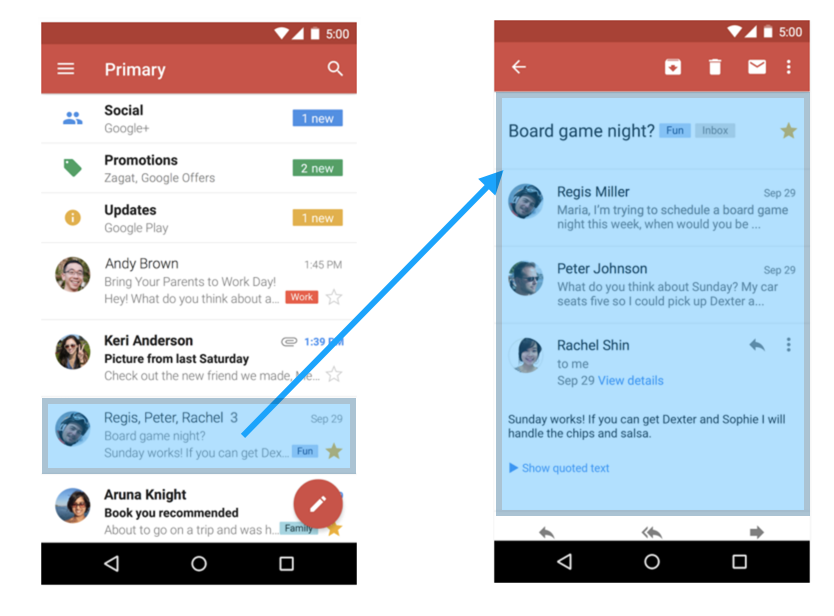
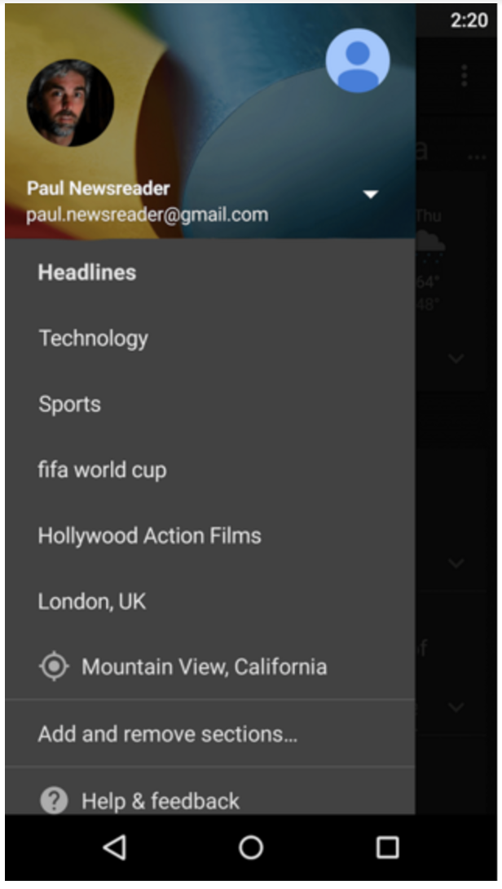
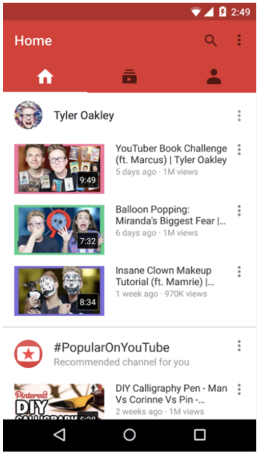
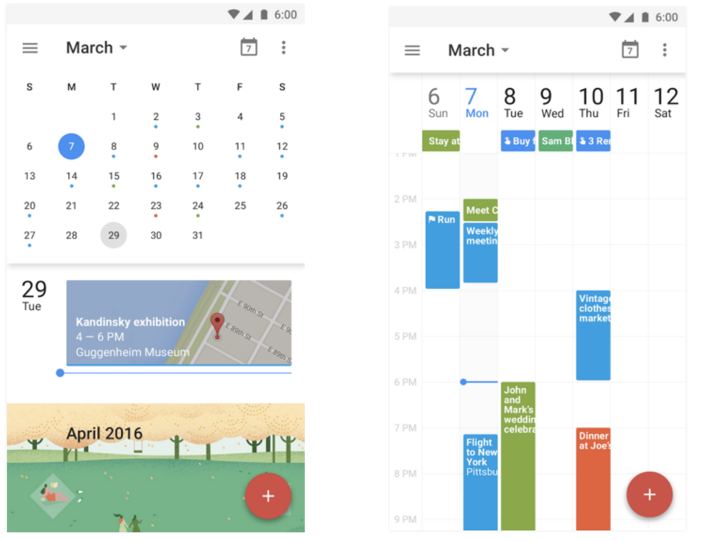
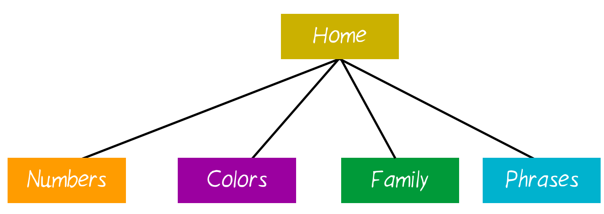
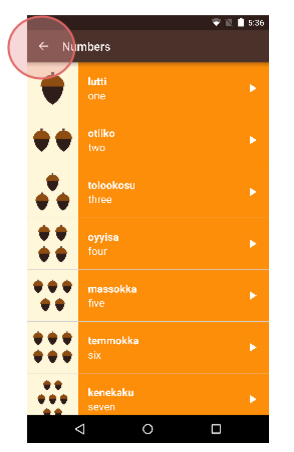
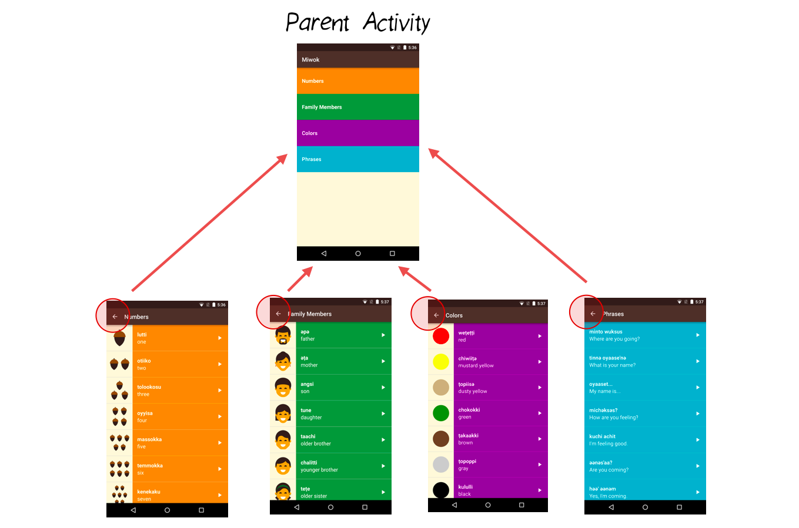
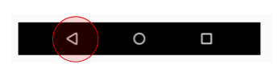
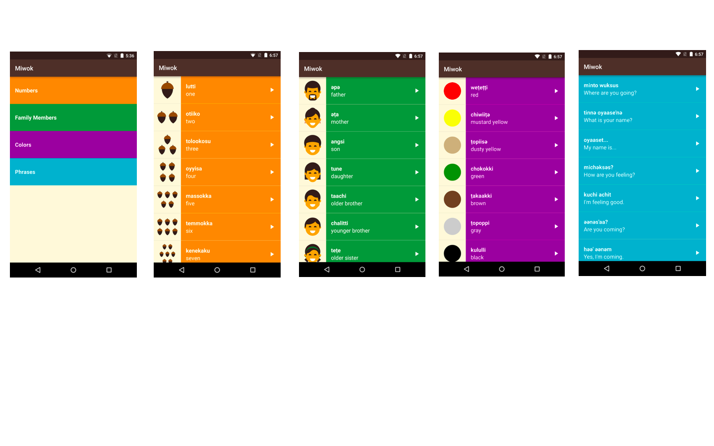
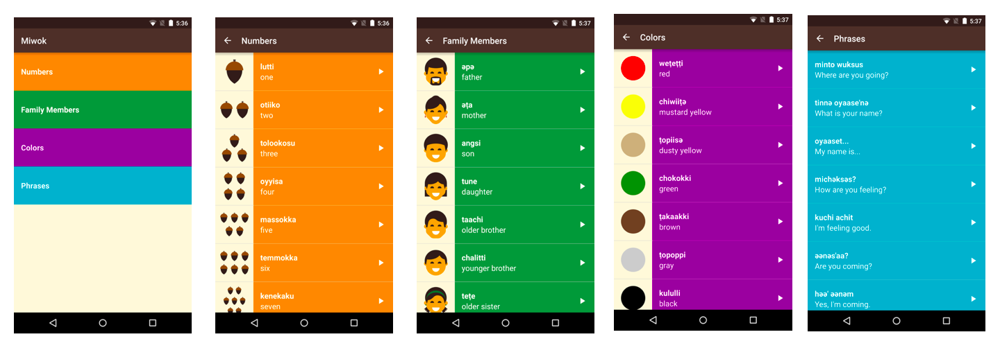

# Android Multiple Screen 

## Fragment

### Navigation Patterns in Android

Navigation guides users between different parts of your app.

There are many ways to navigate around apps, each of which is best suited to the type of data that is being presented to the user. As you view more apps, you’ll notice some common navigation patterns.

The “master detail layout” consists of a master list of data. When you click one of those items of data, a detailed view of that item appears. You can easily adapt this layout to larger screen devices. When there is more screen real estate (meaning, more space on the screen) available, then we can view the master list of data alongside the detailed view of an item, at the same time.

Selecting an item from the Master Screen opens up more Details

Another way to view your data is to use a “Navigation Drawer” pattern. If an app has many screens that are "siblings" to each other, then the different screens can be listed in a "Drawer" that pulls out from the left side of the screen. In the Google News & Weather app, the navigation drawer provides links to different categories of news.

**Example of Navigation Drawer that comes in from the left side of the screen**

Another pattern that you’ll see is “swipeable tabs.” You can swipe horizontally left and right between different screens, or you can tap one of the tabs across the top of the screen. There’s a section on [tabs](https://material.io/guidelines/components/tabs.html)in the Design spec. Here’s an example of the YouTube app, which uses icons for each tab:

**This app contains 3 tabs that users can swipe through**

There are many other types of navigation. For example, the Google Calendar app has a scrolling agenda view, but you can jump to specific days by using the calendar month view. Or you can view different lengths of time like the week view. These interactions are specific to a calendar-based app.

**Google Calendar app contains a variety of user navigation patterns**

As you build your own app, you can learn more about how to structure your app in both the [navigation section](https://material.io/guidelines/patterns/navigation.html) of the Google Material Design spec and this guide on [designing effective navigation](https://developer.android.com/training/design-navigation/index.html). Keep in mind that your app will need to adapt to devices with a variety of screen sizes. This is known as responsive design, which we first talked about in the last course. Android apps must work across phones, tablets, and TVs, as well as watches and cars!

### Navigation Patterns in Other Apps

[http://androidniceties.tumblr.com/](http://androidniceties.tumblr.com/)

[https://pttrns.com/android-patterns](https://pttrns.com/android-patterns?srtby=popularity_desc)

## Up Button

You can create a diagram of the relationships between the screens of an app.

The following diagram shows an example of the relationship between screens in the Miwok app. The home screen (with the four category buttons) is the “parent” activity. It leads to the list of vocab words, which are the “children” activities. This type of parent-child relationship is important because sometimes the user may want to navigate to parent or child activities. It’s another way of navigating around the app, and can come in useful if the user lands somewhere within the app that’s not the home screen. See more details in the [training documentation](https://developer.android.com/training/design-navigation/screen-planning.html?utm_source=udacity&utm_medium=course&utm_campaign=android_basics#diagram-relationships).

When viewing Android apps, you may have noticed a horizontal arrow pointing left in the app bar. This is called the “Up” button. In the upcoming coding task, you will be adding the “Up” button to NumbersActivity, FamilyActivity, ColorsActivity, and PhrasesActivity. 

This button allows the user to navigate to the parent activity, which we will call MainActivity.

#### “Up” Button vs. “Back” Button

Now you might be wondering, doesn’t the “Up” button just do the same thing as the “Back” button?

Well, not exactly. The “Back” button is part of the system navigation bar on Android (leftmost triangle icon). No matter which app you’re in, when you tap the “Back” button, you’ll go back to where you previously came from.

However, there are certain cases where “Back” and “Up” result in different behavior. The “Up” button ALWAYS leads you to the parent activity. The “Back” button can lead you to the parent activity, or the home screen, or to another app, depending on how you arrived at the current screen.

Here’s an example scenario. Say you are browsing the web in an app. You receive notification of a new email. You click the notification, and suddenly you’re in the email app. Once you’re done reading the email, if you tap the “Back” button, you’ll go back to the web app. If you tap the “Up” button, you’ll go to the parent activity, which is the list of all emails.

The distinction between “Up” and “Back” really starts to matter if the user can get directly to a screen in your app without going through the main page (i.e. directly opening a single email without going through the list of all emails). In the Miwok app, the user has to go through the main screen, so “Up” and “Back” have the same effect. However, the ideal thing would be to provide the user with another way to navigate to the MainActivity.

For best practices, we will practice implementing the “Up” button. For information on how to do this, check out [this tutorial](https://developer.android.com/training/implementing-navigation/ancestral.html?utm_source=udacity&utm_medium=course&utm_campaign=android_basics).

This is what the app looks like before the coding task: 

This is what the app looks like after the coding task (look closely at the app bar):

##### Add Up Button to your Activity

- [implementing-navigation](http://developer.android.com/training/implementing-navigation/ancestral.html)

##### Additional Resources on Navigation:

- [design-navigation](http://developer.android.com/design/patterns/navigation.html)

- [navigation](http://developer.android.com/training/design-navigation/ancestral-temporal.html)

### An Alternative Version of the App

The app looks amazingly awesome and beautiful! It looks done! So why change it?

This can happen in app development teams. You build version 1 of an app. Then the team decides to do a design refresh, to have an even better user experience. Then you proceed to build version 2 of the app!

When you talk to any professional Android developer, they can tell you lots of stories of how the user interface for their app has evolved over the last months or even years.

As a developer, being able to **refactor** your code is an important skill to have. This means that the functionality of the app will remain the same, but visually the app will look differently. You can’t break any existing functionality (for example, you can’t lose the images or audio playback capabilities) when switching over to the new design. When you break something, and the user loses the ability to do something in the app compared to earlier versions, this is called **regression**.

To make sure that we don’t break anything, let’s move in small stages at a time. Try to make the app run on your device as often as possible. You don’t want to spend 5 days writing new code, and then realize that it doesn’t run on your device anymore.

Here are the new designs. We want to swipe between the word lists. This saves us an extra tap from having to open the vocab word lists. When we launch the app, we can immediately see the word lists. 

**New design above with tabs to swipe for different lists of words.**

### Android Development Patterns

Now before we jump into Step 1: Review a Sample App, I’d like you to watch t[his short Android Development Patterns video](https://www.youtube.com/watch?v=zQekzaAgIlQ) on Tabs and ViewPager so that you can become familiar with the Android ViewPager component. After you are done, continue to the next step!

Note: You’ll hear the term “Fragments” in the video. We have not talked about Fragments yet, so don’t worry if you don’t understand everything perfectly.

#### Background context

This video is part of the Android Development Patterns created by Developer Advocates Ian Lake and Joanna Smith. (You saw them in the videos and articles from Lesson 4.)

Android Development Patterns will teach you how to build better apps by explaining the fundamental components of Android development, the reasoning behind them, and best practices for using them in your app. Feel free to check out [these videos](https://www.youtube.com/playlist?list=PLWz5rJ2EKKc-lJo_RGGXL2Psr8vVCTWjM) later.

### Upcoming Changes

