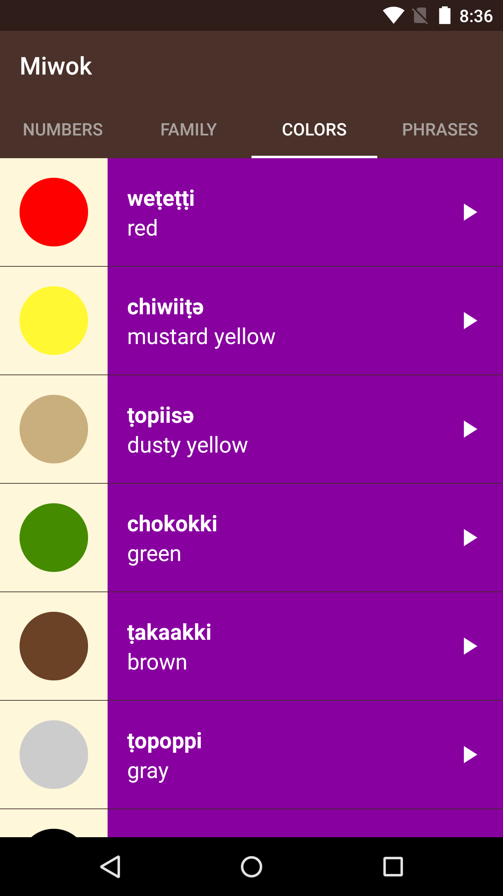
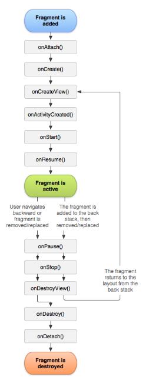

# Android Multiple Screen 

## Fragment

### Navigation Patterns in Android


Navigation guides users between different parts of your app.

There are many ways to navigate around apps, each of which is best suited to the type of data that is being presented to the user. As you view more apps, you’ll notice some common navigation patterns.

The “master detail layout” consists of a master list of data. When you click one of those items of data, a detailed view of that item appears. You can easily adapt this layout to larger screen devices. When there is more screen real estate (meaning, more space on the screen) available, then we can view the master list of data alongside the detailed view of an item, at the same time.


Selecting an item from the Master Screen opens up more Details

Another way to view your data is to use a “Navigation Drawer” pattern. If an app has many screens that are "siblings" to each other, then the different screens can be listed in a "Drawer" that pulls out from the left side of the screen. In the Google News & Weather app, the navigation drawer provides links to different categories of news.


**Example of Navigation Drawer that comes in from the left side of the screen**

Another pattern that you’ll see is “swipeable tabs.” You can swipe horizontally left and right between different screens, or you can tap one of the tabs across the top of the screen. There’s a section on [tabs](https://material.io/guidelines/components/tabs.html)in the Design spec. Here’s an example of the YouTube app, which uses icons for each tab:


**This app contains 3 tabs that users can swipe through**

There are many other types of navigation. For example, the Google Calendar app has a scrolling agenda view, but you can jump to specific days by using the calendar month view. Or you can view different lengths of time like the week view. These interactions are specific to a calendar-based app.


**Google Calendar app contains a variety of user navigation patterns**

As you build your own app, you can learn more about how to structure your app in both the [navigation section](https://material.io/guidelines/patterns/navigation.html) of the Google Material Design spec and this guide on [designing effective navigation](https://developer.android.com/training/design-navigation/index.html). Keep in mind that your app will need to adapt to devices with a variety of screen sizes. This is known as responsive design, which we first talked about in the last course. Android apps must work across phones, tablets, and TVs, as well as watches and cars!

### Navigation Patterns in Other Apps

[http://androidniceties.tumblr.com/](http://androidniceties.tumblr.com/)

[https://pttrns.com/android-patterns](https://pttrns.com/android-patterns?srtby=popularity_desc)

## Up Button

You can create a diagram of the relationships between the screens of an app.

The following diagram shows an example of the relationship between screens in the Miwok app. The home screen (with the four category buttons) is the “parent” activity. It leads to the list of vocab words, which are the “children” activities. This type of parent-child relationship is important because sometimes the user may want to navigate to parent or child activities. It’s another way of navigating around the app, and can come in useful if the user lands somewhere within the app that’s not the home screen. See more details in the [training documentation](https://developer.android.com/training/design-navigation/screen-planning.html?utm_source=udacity&utm_medium=course&utm_campaign=android_basics#diagram-relationships).


When viewing Android apps, you may have noticed a horizontal arrow pointing left in the app bar. This is called the “Up” button. In the upcoming coding task, you will be adding the “Up” button to NumbersActivity, FamilyActivity, ColorsActivity, and PhrasesActivity. 


This button allows the user to navigate to the parent activity, which we will call MainActivity.


#### “Up” Button vs. “Back” Button

Now you might be wondering, doesn’t the “Up” button just do the same thing as the “Back” button?

Well, not exactly. The “Back” button is part of the system navigation bar on Android (leftmost triangle icon). No matter which app you’re in, when you tap the “Back” button, you’ll go back to where you previously came from.


However, there are certain cases where “Back” and “Up” result in different behavior. The “Up” button ALWAYS leads you to the parent activity. The “Back” button can lead you to the parent activity, or the home screen, or to another app, depending on how you arrived at the current screen.

Here’s an example scenario. Say you are browsing the web in an app. You receive notification of a new email. You click the notification, and suddenly you’re in the email app. Once you’re done reading the email, if you tap the “Back” button, you’ll go back to the web app. If you tap the “Up” button, you’ll go to the parent activity, which is the list of all emails.

The distinction between “Up” and “Back” really starts to matter if the user can get directly to a screen in your app without going through the main page (i.e. directly opening a single email without going through the list of all emails). In the Miwok app, the user has to go through the main screen, so “Up” and “Back” have the same effect. However, the ideal thing would be to provide the user with another way to navigate to the MainActivity.

For best practices, we will practice implementing the “Up” button. For information on how to do this, check out [this tutorial](https://developer.android.com/training/implementing-navigation/ancestral.html?utm_source=udacity&utm_medium=course&utm_campaign=android_basics).

This is what the app looks like before the coding task: 


This is what the app looks like after the coding task (look closely at the app bar):


##### Add Up Button to your Activity

- [implementing-navigation](http://developer.android.com/training/implementing-navigation/ancestral.html)

##### Additional Resources on Navigation:

- [design-navigation](http://developer.android.com/design/patterns/navigation.html)

- [navigation](http://developer.android.com/training/design-navigation/ancestral-temporal.html)

### An Alternative Version of the App

The app looks amazingly awesome and beautiful! It looks done! So why change it?

This can happen in app development teams. You build version 1 of an app. Then the team decides to do a design refresh, to have an even better user experience. Then you proceed to build version 2 of the app!

When you talk to any professional Android developer, they can tell you lots of stories of how the user interface for their app has evolved over the last months or even years.

As a developer, being able to **refactor** your code is an important skill to have. This means that the functionality of the app will remain the same, but visually the app will look differently. You can’t break any existing functionality (for example, you can’t lose the images or audio playback capabilities) when switching over to the new design. When you break something, and the user loses the ability to do something in the app compared to earlier versions, this is called **regression**.

To make sure that we don’t break anything, let’s move in small stages at a time. Try to make the app run on your device as often as possible. You don’t want to spend 5 days writing new code, and then realize that it doesn’t run on your device anymore.

Here are the new designs. We want to swipe between the word lists. This saves us an extra tap from having to open the vocab word lists. When we launch the app, we can immediately see the word lists. 



**New design above with tabs to swipe for different lists of words.**

### Android Development Patterns

Now before we jump into Step 1: Review a Sample App, I’d like you to watch t[his short Android Development Patterns video](https://www.youtube.com/watch?v=zQekzaAgIlQ) on Tabs and ViewPager so that you can become familiar with the Android ViewPager component. After you are done, continue to the next step!

Note: You’ll hear the term “Fragments” in the video. We have not talked about Fragments yet, so don’t worry if you don’t understand everything perfectly.

#### Background context

This video is part of the Android Development Patterns created by Developer Advocates Ian Lake and Joanna Smith. (You saw them in the videos and articles from Lesson 4.)

Android Development Patterns will teach you how to build better apps by explaining the fundamental components of Android development, the reasoning behind them, and best practices for using them in your app. Feel free to check out [these videos](https://www.youtube.com/playlist?list=PLWz5rJ2EKKc-lJo_RGGXL2Psr8vVCTWjM) later.

### Upcoming Changes

We’re going to approach this change in multiple stages through the remainder of this lesson.

- Step 1: Review a Sample App
- Step 2: Refactor the logic for the four activities to use Fragments
- Step 3: Modify Main Activity so that it uses a ViewPager
- Step 4: Add Tabs

Here's an overview of what we'll do at each step:

#### Step 1: Review a Sample App

First you’ll experiment with a sample app that contains a something called a ViewPager. You’ll see how a FragmentPagerAdapter will provide a different Fragment for each “page” that you swipe to. Then we’ll learn a little more about Fragments, to prepare you for the next coding step.


#### Step 2: Refactor the logic for the four activities to use Fragments

Next, you’re going to refactor the current Miwok app from the 4 activities (numbers, colors, family, phrases) into the 4 fragments. The user-facing app will look the same, but all the logic to display the list of words will be in the fragments instead of the activity files. Once the logic is inside fragments, we can move to the next step.

- NumbersActivity will contain the NumbersFragment
- FamilyActivity will contain the FamilyFragment
- ColorsActivity will contain the ColorsFragment
- PhrasesActivity will contain the PhrasesFragment


#### Step 3: Modify Main Activity so that it uses a ViewPager

A ViewPager allows you to swipe between different “pages” or screens. We’re going to modify the MainActivity so it contains a ViewPager with 4 pages, where each page is a Fragment. We can swipe between each Fragment to see a different list of words.

At this point, we’re removing the layout that had a button for each category. We will also delete the category activities (NumbersActivity, FamilyActivity, ColorsActivity, PhrasesActivity) because the app only has 1 activity now (MainActivity). You can tell that we’re in the MainActivity because the app bar says “Miwok” across all the screens.


#### Step 4: Add Tabs

Lastly, once the ViewPager is working, we’ll add tabs across the top of the ViewPager, so you can tap to jump to a specific page.


### Sample ViewPager

#### Step 1: Review a Sample App

Let’s play with a sample app to explore how a ViewPager works in a simple scenario.

1. Download this sample app from the [GitHub link](https://github.com/udacity/ud839_ViewPager_Example/tree/quiz) by clicking on the “Download zip” (make sure you are on the "quiz" branch). 


2. Import this project into Android Studio and run the app on your device.

3. When you open the app, there should be 3 pages to swipe between in this ViewPager. First it should say “Monday”, then “Tuesday”, then “Wednesday.


4. Browse around the codebase and see how the layout and Java files are working together. Prepare for the quiz, which will ask you to modify this sample app.
How does it work?

The ViewPager works by getting its data from an adapter - called a FragmentPagerAdapter.

In our case, we want to customize the adapter to display our own fragments, so we have to use inheritance to subclass the FragmentPagerAdapter. By inheriting, we get all the functionality from the FragmentPagerAdapter for free, and we can add our own customization on top of it. We create the SimpleFragmentPagerAdapter class and extend from the FragmentPagerAdapter class.

When you launch the app on your device, first the ViewPager asks the adapter how many pages there will be. In our case, the adapter says there will be 3 pages. See the SimpleFragmentPagerAdapter getCount() method.

In order for the ViewPager to display page 0, the ViewPager asks the adapter for the 0th fragment. See the SimpleFragmentPagerAdapter getItem(int position) method. When the user swipes leftward, we move onto page 1, which means the ViewPager asks the adapter for the fragment at position 1. When we get to page 2, the ViewPager asks the adapter for the fragment at position 2. Thus, depending on which page (also known as position), the user has swiped to, the corresponding fragment gets shown.

### Intro to Fragments
A fragment is just a part of an activity. You can have a fragment that takes up part of a screen or a whole screen. Or you can show multiple fragments at the same time to make up a whole screen. Within an activity, you can also swap out different fragments with each other. (You can also have invisible fragments as well, that do some work related to the activity, but we won’t cover those in this course.)

Fragments were introduced in Android when we started building for larger screen devices like tablets. Let me show you an example.

In the master/detail pattern, a list fragment is on the left-side of the screen, while the detail fragment on the right swaps out depending on the list item selected.


[image source](https://developer.android.com/guide/components/fragments.html?utm_source=udacity&utm_medium=course&utm_campaign=android_basics#Design%22%20target=%22_blank%22%3ESource%3C/a)

In this case, using fragments is convenient when adapting the app to smaller devices like phones. When the user opens the app on a phone, they can see the list fragment. If they tap on an item in the list, they can navigate to the detail fragment. 


On the phone, only 1 fragment is shown at a time. On the tablet, 2 fragments are shown beside each other at the same time, to take advantage of the larger screen real estate available. 


This is just one use case for fragments. You can split up the logic of your app into as many fragments as you want. However, splitting it up into too many fragments can cause extra overhead because your Activity will need to manage communication between the fragments.

A Fragment is a Java class. You create your own Fragment, just like you created your own activities. You subclass the Fragment class in the Android framework.

#### Review Inheritance

Remember earlier we discussed the concept of inheritance in Java in which subclasses are derived from a superclass. In our original code, the Activity class created by the Android framework is the superclass and classes we created such as the MainActivity or NumbersActivity are subclasses that inherit from the Activity class.


Similarly, the Fragment class is a class provided by the Android framework. The fragments we've create - NumbersFragment, ColorsFragment, etc - are subclasses that inherit from the Fragment super class. 


### Fragment Lifecycle

Because a Fragment can be created, added to the screen, then removed from the screen, it has its own lifecycle. And guess what? Android provides asynchronous callbacks where you can get notified of these state changes. The style of these callbacks is similar to the Activity.

Imagine an Activity containing a Fragment that takes up the whole screen. When the Activity is created, the Fragment is created as well. When the Activity is resumed and active, the Fragment is resumed and active as well. There is a close relationship between the Activity lifecycle and the Fragment lifecycle.

The Fragment also has additional callbacks where you, as the developer, can get notified when it is attached to the enclosing Activity, or detached from the Activity.

If multiple fragments make up a whole screen, then they all need to tie into the same activity. They need to know when the activity is resumed / paused, so they can resume or pause what they’re doing within the fragment. If you swap out and replace different fragments throughout the lifetime of the app, the Fragments need to be created and destroyed properly too.

Remember this is the activity lifecycle.


[image source](https://developer.android.com/guide/components/activities/index.html?utm_source=udacity&utm_medium=course&utm_campaign=android_basics)

Similarly, the fragment has a lifecycle that is tied to the stages of the activity lifecycle.



[image source](https://developer.android.com/guide/components/fragments.html?utm_source=udacity&utm_medium=course&utm_campaign=android_basics)

Fragment is a tricky topic. You’ll encounter Fragments more as you advance in your journey as an Android developer. If you’re curious for more details now, see the [Fragment developer guide](https://developer.android.com/guide/components/fragments.html?utm_source=udacity&utm_medium=course&utm_campaign=android_basics) on how to [handle the Fragment lifecycle](https://developer.android.com/guide/components/fragments.html?utm_source=udacity&utm_medium=course&utm_campaign=android_basics#Lifecycle) or how to [build a dynamic UI with Fragments](https://developer.android.com/guide/components/fragments.html?utm_source=udacity&utm_medium=course&utm_campaign=android_basics). There are also plenty of other tutorials on Fragments written by developers in the community.

### Refactor Category Activities

#### Step 2: Refactor the Logic for the Four activities to Use Fragments

We won’t use a ViewPager yet. Let’s prepare our fragments first. Currently, we have 4 category activities and 0 fragments.


By the end of this coding task, we want 4 category activities with 4 fragments. Each activity will contain a fragment.


In order to move the logic into the fragment java files, we’re going to have to copy/paste a lot of code. The code is mostly the same. However, any code that assumed we were inside an Activity class will have to be slightly tweaked to take into account that now the code is inside a Fragment class. For example, the Activity lifecycle callbacks (onCreate, onStop) don’t exist when we’re inside a Fragment class. There are similar methods though (onCreateView, onStop), so we just need small modifications to adjust to the Fragment lifecycle callbacks.


Don’t worry if the table is confusing. Let’s go step by step through the code changes for the NumbersActivity, and then hopefully the process will become clearer to you. As shown in the diagram below, we’re going to go from having a NumbersActivity (before state) to having a NumbersActivity with a NumbersFragment contained inside it (after state). Then for the upcoming quiz, you’ll convert the rest of the category activities on your own following the same process.


##### Create NumbersFragment class

1) To start, create a new Java file for the NumbersFragment. Right click on the “com.example.android.miwok” folder. Go to New > Fragment > Fragment (Blank).


2) Fill out the wizard. Give the fragment a name: NumbersFragment. Uncheck all the boxes because we’ll be adding code to the file on our own.


3) Android Studio will auto-generate a new Fragment class for you in a file called NumbersFragment.java. It will look something like this:

```java
import android.os.Bundle;
import android.support.v4.app.Fragment;
import android.view.LayoutInflater;
import android.view.View;
import android.view.ViewGroup;
import android.widget.TextView;

/**
* A simple {@link Fragment} subclass.
*/
public class NumbersFragment extends Fragment {

    public NumbersFragment() {
       // Required empty public constructor
   }

   @Override
   public View onCreateView(LayoutInflater inflater, ViewGroup container,
                        Bundle savedInstanceState) {
   TextView textView = new TextView(getActivity());
   textView.setText(R.string.hello_blank_fragment);
   return textView;
   }
}
```

#### Copy code from the NumbersActivity and paste it into the NumbersFragment

4) Start by copying over the global variables from the NumbersActivity over to the NumbersFragment. (Delete them from the NumbersActivity as you do this.) Code should look like [this](https://gist.github.com/udacityandroid/3a2fdbf1e487a292d199bebe51c2d4e6).

5) Copy over the releaseMediaPlayer() helper method from the NumbersActivity into the NumbersFragment. Code [code for releaseMediaPlayer()](https://gist.github.com/udacityandroid/17851f0932e58eed13dc27d8267bc4ea).

#### Adapt the code for the Fragment Lifecycle (instead of the Activity Lifecycle)

6) Override the Fragment’s onStop() method.

You can’t copy the exact onStop() method over from the NumbersActivity because the Fragment onStop() method has a slightly different method signature. In case you’re wondering, the Activity class uses the “protected” modifier on the method, while the Fragment class has the “public” modifier on the method. But don’t worry about the details of those modifiers now.

Move your cursor to an empty space in the class, where you can add a new method. Use the keyboard shortcut Ctl + O to pop up a dialog and select a method to override. Type in “onStop” and when you find that result, hit OK.


Android Studio will automatically add this method to your NumbersFragment class for you:

```java
    @Override
    public void onStop() {
        super.onStop();
    }
```

Modify the onStop() method so that it calls the releaseMediaPlayer method:

```java
    @Override
    public void onStop() {
        super.onStop();

        // When the activity is stopped, release the media player resources because we won't
        // be playing any more sounds.
        releaseMediaPlayer();
}
```

7) Override the Fragment’s onCreateView() method.

The Activity’s onCreate() method is slightly different from the Fragment’s onCreateView() method. Within the Activity’s onCreate() method, we can call setContentView() to set the layout for the activity. In the Fragment, we need to inflate the view from the XML layout resource ID and return that view in the onCreateView() method. Note that the layout for the Fragment will use the word_list XML layout resource because it will be displaying a list of words.

```java
@Override
public View onCreateView(LayoutInflater inflater, ViewGroup container,
                    Bundle savedInstanceState) {
   View rootView = inflater.inflate(R.layout.word_list, container, false);

   /** TODO: Insert all the code from the NumberActivity’s onCreate() method after the setContentView method call */

   return rootView;
}
```

Once you copy over the code from the NumbersActivity’s onCreate() method, you will get a bunch of errors in Android Studio because the code assumed that it would be run inside an Activity class, not a Fragment class. Below are instructions on how you would resolve each of these errors. If you don’t want to fix each error one by one, you can skip to the code snippet below that shows you what your NumbersFragment onCreateView() should look like when you’re done.

Error #1: You will get get an error saying cannot resolve method “findViewById(int)” because the Fragment does not have a findViewById method, whereas the Activity did have that method (see [link](https://developer.android.com/reference/android/app/Activity.html?utm_source=udacity&utm_medium=course&utm_campaign=android_basics#findViewById(int)) ).

```ListView listView = (ListView) findViewById(R.id.list);```

Fix the error by calling findViewById(int) on the rootView object, which should contain children views such as the ListView. ```ListView listView = (ListView) rootView.findViewById(R.id.list);```

Error #2: You will get an error saying cannot resolve method “getSystemService(String)” because the Fragment does not have access to system services, whereas the Activity does (see [link](https://developer.android.com/reference/android/app/Activity.html?utm_source=udacity&utm_medium=course&utm_campaign=android_basics#getSystemService(java.lang.String))). ```mAudioManager = (AudioManager) getSystemService(Context.AUDIO_SERVICE);```

Fix the error by getting the Activity object instance first. This is the Activity that encloses the current Fragment, which will be the NumbersActivity for the NumbersFragment. Then call getSystemService(String) on that Activity object.

```mAudioManager = (AudioManager) getActivity().getSystemService(Context.AUDIO_SERVICE);```

Error #3: There’s a problem with the arguments passed into the WordAdapter constructor because the first parameter “this” refers to this class (which is the NumbersFragment), and a Fragment is not a valid Context. However, the code used to work when “this” referred the NumbersActivity because an Activity is a valid Context. ```WordAdapter adapter = new WordAdapter(this, words, R.color.category_numbers);```

Fix the error by passing in a reference to the Activity that encloses this Fragment as the context. 
```WordAdapter adapter = new WordAdapter(getActivity(), words, R.color.category_numbers);```

Error #4: When creating a MediaPlayer object, we need to pass in a context. Again, “this” refers to the NumbersFragment (and not the NumbersActivity), and the Fragment is not a valid Context. 
```mMediaPlayer = MediaPlayer.create(NumbersActivity.this, word.getAudioResourceId());```

Fix the error by passing in the activity for the first input parameter. 
```mMediaPlayer = MediaPlayer.create(getActivity(), word.getAudioResourceId());```

After fixing these 4 cases, there should be no more errors in this file! The NumbersFragment onCreateView() method should look like [this](https://gist.github.com/udacityandroid/5808ce6e0c0b816bcf9a3125e8eeced0).

As a sanity check, this is the end result of the [NumbersFragment](https://github.com/udacity/ud839_Miwok/blob/d7effcef3bf7fdccdd045c974d67abd5b960fae7/app/src/main/java/com/example/android/miwok/NumbersFragment.java) class.

#### Update NumbersActivity

8) Under the res/layout directory, create a new layout file called activity_category.xml. The important part is that the view has an ID. We chose to give the view an ID called “container”.

```xml
<?xml version="1.0" encoding="utf-8"?>
<LinearLayout xmlns:android="http://schemas.android.com/apk/res/android"
   android:id="@+id/container"
   android:layout_width="match_parent"
   android:layout_height="match_parent"
   android:orientation="vertical"/>

```
9) Now we need to update the NumbersActivity to use the NumbersFragment, otherwise there will be duplicate code that does the same thing in both classes.

Replace the NumbersActivity code with this entire code snippet. We’re going to use this simplified activity that sets the activity_category XML layout resource as the content view. Then a new NumbersFragment is created and inserted it into the container view, using a [FragmentTransaction](https://developer.android.com/guide/components/fragments.html?utm_source=udacity&utm_medium=course&utm_campaign=android_basics#Transactions) (no need to understand the details of this now). Since the container has “match_parent” for width and height, the NumbersFragment will take up the whole width and height of the screen.

```java
import android.support.v7.app.AppCompatActivity;
import android.os.Bundle;

public class NumbersActivity extends AppCompatActivity {

   @Override
   protected void onCreate(Bundle savedInstanceState) {
   super.onCreate(savedInstanceState);
   setContentView(R.layout.activity_category);
   getSupportFragmentManager().beginTransaction()
           .replace(R.id.container, new NumbersFragment())
           .commit();
   }
}
```

10) To clarify, the NumbersActivity used to display the word_list.xml layout. Now, the NumbersActivity displays the activity_category.xml layout, and the NumbersFragment displays the word_list.xml layout.


Now the NumbersActivity is using a NumbersFragment! Run the app to make sure the numbers list still works. It should look the same because this is just a midpoint along the way to our goal, as explained earlier.

Great work! In the upcoming quiz, you’re going to repeat the same steps #1 - 9 for the other categories. All category activities can use the activity_category.xml layout resource.

At the end, your app should look the same, but each category activity will contain a different fragment. Test your app to make sure the right activity is showing the right fragment. Make sure each fragment has the right theme color. (These were both bugs in my app when I first implemented the solution.) Also ensure that the audio playback still works.

### ViewPager and FragmentPagerAdapter

#### Step 3: Modify Main Activity So That It Uses A ViewPager

Now that the logic to display word lists is in the Fragment, you can move over to using a ViewPager in the MainActivity.

You will complete this task on your own, but feel free to refer to the Android Development Patterns video that you watched earlier. You can also review the earlier ViewPager sample app too.

This is what the app should look like when you’re done. When the app opens, you immediately see the list of number words. Then you can swipe horizontally between the lists of words. Behind the scenes, we have a single activity (MainActivity) that contains a ViewPager with 4 different Fragments. You can tell it’s a single activity because the name “Miwok” stays in the app bar as you swipe between screens.


### Add Tabs to ViewPager

#### Step 4: Add Tabs

Now let’s add tabs so the user can tell that there are more pages to swipe to.

First you’ll need to use the Android Design Support Library. This helps you create a Material Design app that runs even on older versions of Android. Learn more about the support library in this [blogpost](https://android-developers.googleblog.com/2015/05/android-design-support-library.html?utm_source=udacity&utm_medium=course&utm_campaign=android_basics). There are periodic updates to the support library, so you can check this [site](https://developer.android.com/topic/libraries/support-library/index.html?utm_source=udacity&utm_medium=course&utm_campaign=android_basics) for the latest updates or subscribe to the [Android Developers blog](https://android-developers.googleblog.com/?utm_source=udacity&utm_medium=course&utm_campaign=android_basics).


##### Add Android Design Support Library to Your Project

1) In Android Studio, within the Project Directory pane, navigate to Miwok > app > build.gradle and open the build.gradle file.

Gradle is the tool that Android Studio uses to generate the apk (app file) that goes onto the device. For more info on configuring the build.gradle file, see this [article](https://developer.android.com/studio/build/build-variants.html?utm_source=udacity&utm_medium=course&utm_campaign=android_basics). There’s also an advanced [Udacity course](https://eu.udacity.com/course/gradle-for-android-and-java--ud867) on this topic, so don’t worry if you don’t understand it now.


2) This build.gradle file contains information about how your app should be packaged. Go to the dependencies section, and add a line that includes the Android Support Design Library. This indicates that our app depends on the Android Design Library, and that our Miwok app code can now refer to components within the design library.

```compile 'com.android.support:design:23.3.0'```

Afterwards, it should look similar to this:

```
dependencies {
   compile fileTree(dir: 'libs', include: ['*.jar'])
   testCompile 'junit:junit:4.12'
   compile 'com.android.support:appcompat-v7:23.2.1'
   compile 'com.android.support:support-v4:23.2.1'
   compile 'com.android.support:design:23.3.0'
}
```

3) You will see a yellow warning at the top of your file saying that the Gradle file has changed and a project sync is needed. Click the “Sync Now” button.


Now you can start using components from the Android Design Support Library, such as the TabLayout for the Viewpager!

In this next coding task, modify the app to add tabs to your ViewPager in the MainActivity. This is what the app should look like when you’re done. You can consult this [Codepath tutorial](https://guides.codepath.com/android/google-play-style-tabs-using-tablayout#sliding-tabs-layout) for help. 


